# Technical Requirements Document (TRD)

## News App — Flutter Mobile Application

| Field | Value |
|-------|-------|
| **Project Name** | News App |
| **Platform** | Flutter (iOS & Android) |
| **Version** | 1.0.0 |
| **Author** | Nunu Nugraha |
| **Created** | 2026-04-01 |
| **Last Updated** | 2026-04-29 |
| **Status** | In Development |

---

## Table of Contents

1. [Overview](#1-overview)
2. [System Architecture](#2-system-architecture)
3. [Technology Stack and Library Selection](#3-technology-stack-and-library-selection)
4. [Architecture Pattern](#4-architecture-pattern)
5. [Project Structure](#5-project-structure)
6. [Layer Specification](#6-layer-specification)
7. [API Specification](#7-api-specification)
8. [Error Handling Strategy](#8-error-handling-strategy)
9. [State Management Strategy](#9-state-management-strategy)
10. [Storage Strategy](#10-storage-strategy)
11. [Network Layer Design](#11-network-layer-design)
12. [Security Considerations](#12-security-considerations)
13. [Navigation and Routing](#13-navigation-and-routing)
14. [Dependency Injection](#14-dependency-injection)
15. [UI/UX Design System](#15-uiux-design-system)
16. [Testing Strategy](#16-testing-strategy)
17. [Non-Functional Requirements](#17-non-functional-requirements)

---

## 1. Overview

### 1.1 Purpose

News App adalah aplikasi mobile berbasis Flutter yang mengkonsumsi REST API untuk manajemen berita. Dokumen ini mendefinisikan keseluruhan arsitektur, spesifikasi teknis, dan keputusan desain yang diambil dalam pembangunan aplikasi.

### 1.2 Scope

| Module | Features | Priority | Status |
|--------|----------|----------|--------|
| **Auth** | Register, Login (Regular & Google OAuth), Forgot Password (Firebase OTP), Profile Update (Avatar/Bio/Phone), Logout, Token Refresh | P0 - Core | 🔄 In Progress |
| **Dashboard** | Shell BottomNavigationBar (5 tabs: Berita, Jelajah, Cari, Simpan, Profil) | P0 - Core | ✅ Done |
| **News Feed** | Browse artikel, filter kategori, trending, refresh | P0 - Core | ✅ Done |
| **Explore** | Browse artikel per kategori dengan pagination | P1 - Core | ✅ Done |
| **Search** | Pencarian artikel dengan debounce & pagination | P1 - Core | ✅ Done |
| **Bookmarks** | Simpan/hapus artikel dengan optimistic updating & local cache | P1 - Core | ✅ Done |
| **Article Detail** | Baca artikel full dengan bookmark toggle | P1 - Core | ✅ Done |

### 1.3 Backend API

- **Base URL:** `http://103.181.143.73:8081`
- **Protocol:** REST over HTTP
- **Format:** JSON
- **Auth Mechanism:** JWT Bearer Token with Refresh Token rotation

---

## 2. System Architecture

### 2.1 High-Level Architecture

```
+-----------------------------------------------------+
|                    FLUTTER APP                       |
|                                                     |
|  +-----------+  +----------+  +---------------+    |
|  |Presentation|->|  Domain  |<-|     Data      |    |
|  |  (BLoC)    |  | (Entity, |  | (Model, Repo  |    |
|  |  (Pages)   |  |  UseCase,|  |  Impl, DS)    |    |
|  |  (Widgets) |  |  Repo)   |  |               |    |
|  +-----------+  +----------+  +-------+-------+    |
|                                       |             |
|                  +--------------------+             |
|                  |       Core         |             |
|                  |  +------------+    |             |
|                  |  |  ApiClient |    |             |
|                  |  |  (Dio wrap)|    |             |
|                  |  +------+-----+    |             |
|                  |         |          |             |
|                  |  +------+-----+    |             |
|                  |  |Interceptor |    |             |
|                  |  |(Auth+Log)  |    |             |
|                  |  +------------+    |             |
|                  +--------------------+             |
+-------------------------+---------------------------+
                          | HTTPS / HTTP
                          v
              +-----------------------+
              |   Backend REST API    |
              |  (Go + PostgreSQL)    |
              +-----------------------+
```

### 2.2 Dependency Rule

```
Presentation -> Domain <- Data
                 ^
               Core
```

- **Domain** layer tidak bergantung pada layer lain (pure Dart)
- **Data** layer mengimplementasi contract dari Domain
- **Presentation** layer hanya berkomunikasi via UseCase/Repository interface
- **Core** menyediakan utilities yang digunakan seluruh layer

---

## 3. Technology Stack and Library Selection

### 3.1 Core Framework

| Technology | Version | Justification |
|-----------|---------|---------------|
| **Flutter** | 3.38.x | Cross-platform framework, single codebase iOS dan Android |
| **Dart SDK** | ^3.6.1 | Stable SDK, sound null safety |

### 3.2 Dependencies

#### Network

| Library | Version | Justification | Alternatif yang Dipertimbangkan |
|---------|---------|---------------|-------------------------------|
| **dio** | ^5.7.0 | HTTP client dengan interceptor support, request cancellation, FormData, dan fine-grained error handling. Interceptor pattern krusial untuk auto token injection dan refresh. | `http` — terlalu basic, tidak ada interceptor. `chopper` — overkill, butuh code generation. |

#### State Management

| Library | Version | Justification | Alternatif yang Dipertimbangkan |
|---------|---------|---------------|-------------------------------|
| **flutter_bloc** | ^9.1.0 | Predictable state management dengan clear separation antara event dan state. Mendukung `BlocListener`, `BlocBuilder`, `BlocProvider` untuk reactive UI. Testable by design. | `riverpod` — bagus tapi team lebih familiar dengan BLoC. `provider` — kurang structured untuk complex state. `cubit` — subset dari BLoC, dipilih full BLoC untuk event traceability. |
| **equatable** | ^2.0.7 | Value equality untuk Entity, State, dan Event tanpa boilerplate `==` dan `hashCode`. | Manual override — error-prone dan verbose. |

#### Dependency Injection

| Library | Version | Justification | Alternatif yang Dipertimbangkan |
|---------|---------|---------------|-------------------------------|
| **get_it** | ^8.0.3 | Service locator pattern yang simple dan performant. Lazy singleton untuk memory efficiency. Tidak butuh code generation untuk setup basic. | `injectable` — auto-generated DI, tapi menambah build step. `riverpod` — built-in DI tapi couple dengan state management. |

#### Local Storage

| Library | Version | Use Case | Justification |
|---------|---------|----------|---------------|
| **flutter_secure_storage** | ^9.2.4 | Token storage - sensitive | Menggunakan **Keychain** di iOS dan **EncryptedSharedPreferences** di Android. Data terenkripsi at-rest. |
| **shared_preferences** | ^2.5.3 | Profile cache - non-sensitive | Key-value storage ringan untuk data non-sensitif seperti cache nama dan email. |

#### Authentication

| Library | Version | Justification | Alternatif yang Dipertimbangkan |
|---------|---------|---------------|-------------------------------|
| **google_sign_in** | ^6.2.1 | Official plugin untuk integrasi Google OAuth. Mengamankan alur login sosial langsung dengan native credential manager Android/iOS. | Manual OAuth WebView — rentan keamanan dan pengalaman pengguna kurang mulus. |
| **firebase_auth** | ^5.3.4 | Untuk otentikasi Firebase, utamanya verifikasi OTP nomor telepon pada fitur Lupa Password. Mengambil beban validasi SMS dari backend. | Membuat infrastruktur SMS Gateway sendiri (Twilio, dll) — terlalu mahal dan butuh manajemen bot spam yang rumit. |
| **firebase_core** | ^3.8.1 | Library wajib untuk menginisialisasi layanan Firebase (termasuk Auth) di Flutter. | Tidak ada. |

#### Functional Programming

| Library | Version | Justification | Alternatif yang Dipertimbangkan |
|---------|---------|---------------|-------------------------------|
| **dartz** | ^0.10.1 | `Either<Failure, T>` untuk error handling tanpa exception di layer domain-repository. Membuat error menjadi explicit return value, bukan hidden control flow. | `fpdart` — maintained alternative, tapi API kurang stable. Raw try-catch — implicit error handling, mudah terlewat. |

#### Navigation

| Library | Version | Justification | Alternatif yang Dipertimbangkan |
|---------|---------|---------------|-------------------------------|
| **go_router** | ^14.8.1 | Declarative routing dengan _auth-aware redirect_, _deep linking_, dan _nested navigation_ (via ShellRoute). Sangat kuat untuk membatasi akses URL berdasarkan _state_ BLoC via `refreshListenable`. | **Default Navigation (Navigator 1.0 / `push`/`pop`)**: Walaupun sederhana tanpa package luar, Navigator 1.0 sangat rapuh dan imperatif; sulit melacak _stack_ rute, tidak mendukung URL/Deep Linking otomatis, dan membuat kode _redirection auth_ berantakan karena disisipkan acak ke dalam Builder UI. <br><br>**Navigator 2.0 (Raw)**: Mendukung segala fitur _Declarative_ namun sintaks dan strukturnya (RouterDelegate/RouteInformationParser) ribet luar biasa bertele-tele. <br><br>**`auto_route`**: Kuat namun mengandalkan Code Generation (memperlambat waktu build Flutter). |

#### UI

| Library | Version | Justification |
|---------|---------|---------------|
| **google_fonts** | ^6.2.1 | Akses ke 1000+ Google Fonts tanpa bundling manual. Runtime font loading. |
| **cupertino_icons** | ^1.0.8 | iOS-style icons untuk platform-consistent UI. |
| **shimmer** | ^3.0.0 | Efek loading skeleton (placeholder animasi) saat data belum tersedia. |
| **cached_network_image** | ^3.4.1 | Cache gambar dari network secara otomatis dengan placeholder dan error widget. |
| **image_picker** | ^1.1.2 | Memilih gambar dari galeri atau kamera untuk upload avatar profil. |
| **image** | ^4.3.0 | Pemrosesan gambar (resize, compress) sebelum upload ke server, dijalankan di Isolate terpisah. |
| **pinput** | ^5.0.0 | Komponen UI input OTP profesional yang mensupport *obscuring* karakter (hide PIN), autofill SMS, dan transisi fokus per-kotak (digit). |

#### Local Notifications

| Library | Version | Justification |
|---------|---------|---------------|
| **flutter_local_notifications** | ^21.0.0 | Plugin untuk memunculkan notifikasi Heads-Up lokal di Android (dengan channel) dan iOS. Dikelola melalui `NotificationRepository` di Core Layer untuk memenuhi prinsip Clean Architecture. |

#### Testing

| Library | Version | Justification |
|---------|---------|---------------|
| **bloc_test** | ^10.0.0 | Standar emas untuk menguji state transitions pada BLoC dengan format `build`, `act`, `expect`. |
| **mocktail** | ^1.0.4 | Null-safety friendly mocking library (alternatif modern untuk mockito). |
| **http_mock_adapter** | ^0.6.1 | Untuk simulasi (mocking) respons HTTP dari Dio tanpa butuh koneksi internet. |

---

## 4. Architecture Pattern

### 4.1 Clean Architecture

Aplikasi mengikuti **Clean Architecture** (Robert C. Martin) yang diadaptasi untuk Flutter:

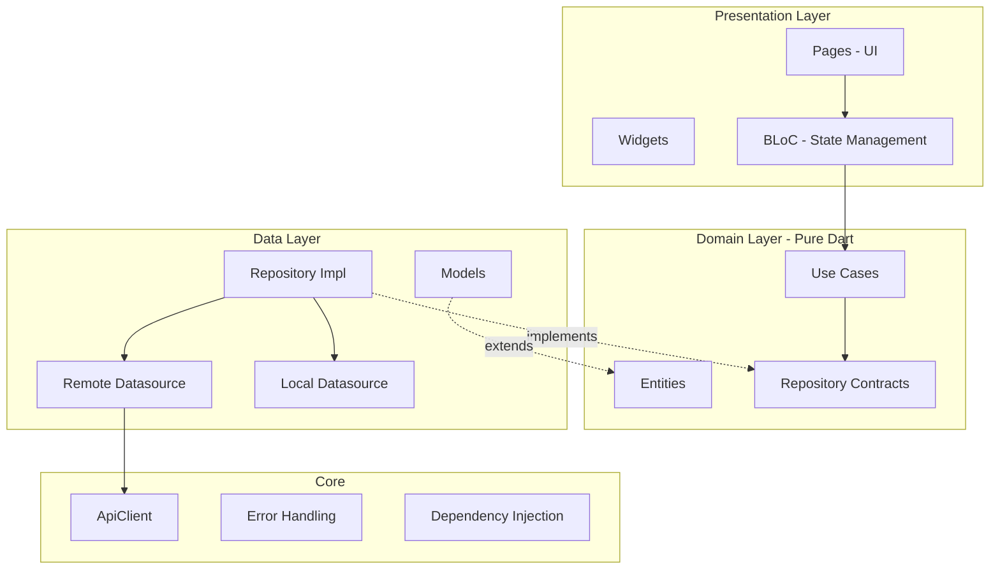

### 4.2 Kenapa Clean Architecture?

| Keuntungan | Penjelasan |
|-----------|-----------|
| **Testability** | Domain layer bisa di-test tanpa framework dependency |
| **Separation of Concerns** | Tiap layer punya tanggung jawab jelas |
| **Scalability** | Feature baru tinggal tambah folder di `features/` |
| **Flexibility** | Ganti Dio ke package lain? Cukup ubah `ApiClient`, domain layer tidak berubah |
| **Team scalability** | Developer bisa kerja paralel di layer berbeda |

### 4.3 Trade-offs

| Kekurangan | Mitigasi |
|-----------|---------|
| Boilerplate lebih banyak | Consistent patterns, code snippets |
| Learning curve | Dokumentasi TRD ini + template per layer |
| Over-engineering untuk app kecil | Justified karena app akan scale dengan news features, user management, dll |

### 4.4 Lapisan Infrastruktur (External Dependencies)

Dalam Clean Architecture, semua hal yang **berada di luar kendali kode Dart murni** disebut **Infrastructure** atau **External Dependencies**. Ini adalah "dunia luar" yang dipisahkan secara tegas dari logika bisnis.

#### Dua Jenis "Dunia Luar":

| Kategori | Contoh | Kenapa Disebut "Luar"? |
|----------|--------|------------------------|
| **OS / Hardware** | Notifikasi, Kamera, GPS, File System, Biometric | Dikontrol langsung oleh Android/iOS, bukan oleh kode Flutter |
| **Network / Third Party** | REST API (Dio), Firebase, Analytics SDK | Berada di server cloud, di luar batas HP pengguna |

#### Prinsip Inti — "Siapa yang Mengonsumsi, Menentukan Cara Membungkusnya":

Ini adalah aturan paling penting dalam menentukan pola pembungkusan *External Dependency*:

```
Siapa yang memakai?          Dibungkus menjadi apa?
─────────────────────────    ─────────────────────────────
RepositoryImpl (Data Layer)  → Datasource  (Detail implementasi)
UseCase (Domain Layer)       → Repository  (Domain Contract / Interface)
```

**Visualisasi Tembok Perbatasan:**

```
╔══════════════════════════════════════╗
║        DOMAIN (Pure Dart)            ║
║   UseCase ──→ Repository Interface   ║  ← Tembok perbatasan
╚══════════════════════════════════════╝
                    │
                    ▼
╔══════════════════════════════════════╗
║          DATA LAYER                  ║
║   RepositoryImpl                     ║
║     ├── RemoteDatasource (Dio/API)   ║  ← Jembatan ke dunia luar
║     └── LocalDatasource (Hive/DB)   ║  ← Jembatan ke dunia luar
╚══════════════════════════════════════╝
                    │
                    ▼
╔══════════════════════════════════════╗
║   INFRASTRUKTUR / DUNIA LUAR         ║
║   OS (Notif, GPS, Camera)            ║
║   Network (Server, Firebase)         ║
╚══════════════════════════════════════╝
```

**Contoh nyata dalam proyek ini:**

| External Dependency | Dipakai Oleh | Pola Pembungkus | Alasan |
|---------------------|--------------|-----------------|--------|
| `flutter_local_notifications` | `UpdateProfileUseCase` (Domain) | `NotificationRepository` (interface) | UseCase butuh kontrak langsung ke Domain |
| `FlutterSecureStorage` | `AuthRepositoryImpl` (Data) | `AuthLocalDatasource` | Repository sudah jadi kontraknya untuk UseCase |
| `Dio` (HTTP Client) | `AuthRepositoryImpl` (Data) | `AuthRemoteDatasource` | Repository sudah jadi kontraknya untuk UseCase |
| `SharedPreferences` | `AuthRepositoryImpl` (Data) | `AuthLocalDatasource` | Repository sudah jadi kontraknya untuk UseCase |
| `FirebaseAuth` (OTP & Social) | `AuthRepositoryImpl` (Data) | `FirebaseOTPService` / `OAuthService` | Repository bertugas sebagai orkestrator multi-sumber |

> [!IMPORTANT]
> **Domain Layer tidak pernah boleh tahu bahwa infrastruktur itu ada.** `UpdateProfileUseCase` tidak mengenal `FlutterLocalNotificationsPlugin`. Ia hanya mengenal `NotificationRepository` — sebuah antarmuka murni Dart. Ketika *library*-nya diganti atau diperbaharui, **tidak ada satu baris kode domain yang perlu diubah**.

### 4.5 Studi Kasus: Mengapa `FirebaseOTPService` Diakses oleh Repository?

Dalam implementasi otentikasi (Lupa Password & Login), SDK Firebase dibungkus dalam `FirebaseOTPService` dan diakses langsung oleh `AuthRepositoryImpl`. Sering muncul pertanyaan: **Mengapa tidak diakses oleh UseCase, atau dimasukkan ke dalam Datasource?**

1. **Mengapa BUKAN oleh UseCase?**
   `UseCase` berada di Domain Layer (inti bisnis yang murni). Ia tidak boleh tahu soal hal-hal berbau infrastruktur seperti "Google Firebase" atau "SMS SMS Code". Jika `VerifyOTPUseCase` memanggil layanan Firebase secara langsung (meski lewat interface), *usecase* tersebut akan dipaksa melakukan **orkestrasi**.
   *Contoh salah di UseCase*: "Minta Firebase Token -> Kirim Token ke Backend API -> Simpan Token ke Local Storage".
   Orkestrasi yang rumit seperti ini adalah tugas mutlak dari **Repository**. UseCase cukup memanggil `repository.verifyOTP(...)` dan menerima hasilnya.
   
2. **Mengapa BUKAN oleh Datasource?**
   Tugas utama sebuah *Datasource* adalah membungkus operasi CRUD (Create, Read, Update, Delete) ke sebuah medium penyimpanan spesifik (seperti HTTP API backend kita, atau database lokal SQLite). Firebase OTP bukanlah database backend kita, melainkan sebuah SDK pihak ketiga yang menyediakan kapabilitas spesifik.
   Memasukkan logika Firebase ke dalam `AuthRemoteDatasource` akan merusak prinsip *Single Responsibility*. `AuthRemoteDatasource` murni untuk komunikasi ke Go Backend kita, sedangkan `FirebaseOTPService` murni untuk komunikasi ke server Google.

Oleh karena itu, **`AuthRepositoryImpl` bertindak sebagai Sang Dirigen (Orkestrator)**. Ia menerima *request* dari UseCase, lalu berkoordinasi dengan `FirebaseOTPService` (untuk verifikasi HP), meneruskan hasilnya ke `AuthRemoteDatasource` (untuk menukar token di backend), lalu menyimpannya lewat `AuthLocalDatasource` (ke dalam *secure storage*). Inilah wujud asli dan tujuan utama diciptakannya *Repository Pattern*!

---

## 5. Project Structure

```
lib/
|-- main.dart                                    # Entry point
|-- injection_container.dart                     # GetIt DI registration
|
|-- core/                                        # Shared utilities
|   |-- bloc/
|   |   +-- global_alert/
|   |       +-- global_alert_bloc.dart           # Global network error alert BLoC
|   |-- constants/
|   |   +-- api_constants.dart                   # Base URL, endpoints, storage keys
|   |-- data/
|   |   +-- repositories/
|   |       +-- notification_repository_impl.dart # Impl: flutter_local_notifications plugin
|   |-- domain/
|   |   +-- repositories/
|   |       +-- notification_repository.dart     # Kontrak global notifikasi (initialize, show)
|   |-- error/
|   |   |-- exceptions.dart                      # ServerException, CacheException, dll
|   |   +-- failures.dart                        # ServerFailure, UnauthorizedFailure, dll
|   |-- network/
|   |   |-- api_client.dart                      # Dio wrapper, single request method
|   |   |-- auth_interceptor.dart                # Token injection + refresh with lock
|   |   +-- token_provider.dart                  # Interface, implemented by AuthLocalDS
|   |-- router/
|   |   +-- app_router.dart                      # GoRouter + auth-aware redirects
|   |-- theme/
|   |   +-- app_theme.dart                       # Dark theme, color palette, typography
|   +-- usecase/
|       +-- usecase.dart                         # Base UseCase<T, Params>
|
+-- features/                                    # Feature-based modules
    |-- auth/
    |   |-- data/
    |   |   |-- datasources/
    |   |   |   |-- auth_local_datasource.dart   # SecureStorage + SharedPrefs
    |   |   |   +-- auth_remote_datasource.dart  # API calls via ApiClient
    |   |   |-- models/
    |   |   |   |-- auth_tokens_model.dart       # JSON to AuthTokens
    |   |   |   +-- user_model.dart              # JSON to User (incl. avatarUrl, bio, phone)
    |   |   +-- repositories/
    |   |       +-- auth_repository_impl.dart    # Combines remote + local DS
    |   |-- domain/
    |   |   |-- entities/
    |   |   |   |-- auth_tokens.dart             # Pure Dart, Equatable
    |   |   |   +-- user.dart                    # Pure Dart (id, name, email, avatarUrl, bio, phone, preferences)
    |   |   |-- repositories/
    |   |   |   +-- auth_repository.dart         # Abstract contract
    |   |   +-- usecases/
    |   |       |-- get_profile_usecase.dart
    |   |       |-- login_usecase.dart
    |   |       |-- logout_usecase.dart
    |   |       |-- register_usecase.dart
    |   |       +-- update_profile_usecase.dart  # ✅ UPDATE PROFILE
    |   +-- presentation/
    |       |-- bloc/
    |       |   |-- auth_bloc.dart               # Global singleton BLoC
    |       |   |-- auth_event.dart
    |       |   +-- auth_state.dart
    |       |-- cubit/
    |       |   |-- profile_cubit.dart           # ✅ Local cubit for edit profile form
    |       |   +-- profile_state.dart
    |       |-- pages/
    |       |   |-- login_page.dart
    |       |   |-- register_page.dart
    |       |   +-- profile_page.dart            # ✅ Profile Screen (avatar, bio, phone)
    |       +-- widgets/
    |           |-- auth_text_field.dart
    |           +-- edit_profile_bottom_sheet.dart  # ✅ Edit form bottom sheet
    |
    |-- dashboard/
    |   +-- presentation/pages/
    |       +-- dashboard_page.dart              # Shell: IndexedStack + BottomNavigationBar (5 tabs)
    |
    |-- news/
    |   |-- data/
    |   |   |-- datasources/
    |   |   |   |-- news_remote_datasource.dart  # API: news feed, categories, article detail
    |   |   |   +-- news_local_datasource.dart   # SharedPrefs: bookmark cache, feed cache
    |   |   |-- models/
    |   |   |   +-- news_models.dart             # ArticleModel, CategoryModel
    |   |   +-- repositories/
    |   |       +-- news_repository_impl.dart
    |   |-- domain/
    |   |   |-- entities/
    |   |   |   |-- article.dart                 # Article entity
    |   |   |   +-- category.dart               # Category entity
    |   |   |-- repositories/
    |   |   |   +-- news_repository.dart         # Abstract contract
    |   |   +-- usecases/
    |   |       |-- get_news_feed_usecase.dart
    |   |       |-- get_categories_usecase.dart
    |   |       |-- get_article_usecase.dart
    |   |       |-- get_bookmarks_usecase.dart
    |   |       |-- toggle_bookmark_usecase.dart
    |   |       +-- check_bookmark_status_usecase.dart
    |   +-- presentation/
    |       |-- cubit/
    |       |   |-- news_feed_cubit.dart         # Feed: load, refresh, filter by category
    |       |   |-- category_cubit.dart          # Load category list
    |       |   |-- trending_cubit.dart          # Load trending articles
    |       |   |-- explore_cubit.dart           # Explore: category browsing + pagination
    |       |   |-- search_cubit.dart            # Search with debounce + pagination
    |       |   |-- bookmark_cubit.dart          # Bookmark state + optimistic updating
    |       |   +-- article_detail_cubit.dart    # Load single article + bookmark toggle
    |       +-- pages/
    |           |-- news_feed_page.dart          # Tab 0: Home (Berita)
    |           |-- explore_page.dart            # Tab 1: Jelajah
    |           |-- news_search_page.dart        # Tab 2: Cari
    |           |-- bookmark_page.dart           # Tab 3: Simpan
    |           +-- news_detail_page.dart        # Full article reader (push route)
    |
    +-- splash/
        +-- presentation/pages/
            +-- splash_page.dart
```

---

## 6. Layer Specification

### 6.1 Domain Layer

Domain layer berisi business logic murni. **Tidak boleh** import Flutter, Dio, atau library external manapun (kecuali `dartz` dan `equatable`).

#### Entities

```dart
// Pure value objects, no serialization logic
class User extends Equatable {
  final int id;
  final String name;
  final String email;
  final DateTime? createdAt;
}

class AuthTokens extends Equatable {
  final String accessToken;
  final String refreshToken;
}
```

#### Repository Contracts

```dart
abstract class AuthRepository {
  Future<Either<Failure, User>> register({...});
  Future<Either<Failure, AuthTokens>> login({...});
  Future<Either<Failure, User>> getProfile();
  Future<Either<Failure, void>> logout();
  Future<bool> isAuthenticated();
}
```

> [!IMPORTANT]
> Return type selalu `Either<Failure, T>` — error handling explicit, tidak pakai exception di boundary domain.
> `isAuthenticated()` return `bool` karena ini pure check, bukan operasi yang bisa gagal secara meaningful.

#### Use Cases

Setiap use case merepresentasikan **satu business action**:

#### Auth Use Cases

| UseCase | Input | Output |
|---------|-------|--------|
| `LoginUseCase` | `LoginParams(email, password)` | `Either<Failure, AuthTokens>` |
| `RegisterUseCase` | `RegisterParams(name, email, password)` | `Either<Failure, User>` |
| `GetProfileUseCase` | `NoParams` | `Either<Failure, User>` |
| `UpdateProfileUseCase` | `User` (updated entity) | `Either<Failure, User>` |
| `LogoutUseCase` | `NoParams` | `Either<Failure, void>` |

#### News Use Cases

| UseCase | Input | Output |
|---------|-------|--------|
| `GetCategoriesUseCase` | `NoParams` | `Either<Failure, List<Category>>` |
| `GetNewsFeedUseCase` | `FeedParams(categoryId?, page)` | `Either<Failure, List<Article>>` |
| `GetArticleUseCase` | `String slug` | `Either<Failure, Article>` |
| `GetBookmarksUseCase` | `NoParams` | `Either<Failure, List<Article>>` |
| `ToggleBookmarkUseCase` | `Article` | `Either<Failure, bool>` (isBookmarked) |
| `CheckBookmarkStatusUseCase` | `String slug` | `Either<Failure, bool>` |

### 6.2 Data Layer

#### Models

Model extends Entity dan menambahkan serialization:

```dart
class UserModel extends User {
  factory UserModel.fromJson(Map<String, dynamic> json);
  Map<String, dynamic> toJson();
}
```

**Kenapa Model extends Entity?**
- Repository bisa return `UserModel` as `User` tanpa mapping manual
- Serialization logic tetap di data layer, domain layer tidak tahu JSON

#### Datasources

**Prinsip: Datasource di-group by source, bukan by operation.**

| Datasource | Source | Methods |
|-----------|--------|---------|
| `AuthRemoteDatasource` | REST API via `ApiClient` | `register()`, `login()`, `getProfile()`, `updateProfile()`, `logout()` |
| `AuthLocalDatasource` | SecureStorage + SharedPrefs | Token CRUD, Profile cache, `clearAll()` |
| `NewsRemoteDatasource` | REST API via `ApiClient` | `getCategories()`, `getNewsFeed()`, `getArticle()`, `uploadAvatar()` |
| `NewsLocalDatasource` | SharedPreferences | Bookmark CRUD (read/write/clear), Feed cache |

> [!NOTE]
> **Kenapa tidak pisah jadi `LoginDatasource`, `RegisterDatasource`?**
> Semua endpoint ada di domain `/auth/*`. Pisah per-operation = class-class kecil dengan 1 method, itu over-engineering. Grouping by source lebih natural dan scalable.

#### Repository Implementation

```dart
class AuthRepositoryImpl implements AuthRepository {
  final AuthRemoteDatasource remoteDatasource;  // API
  final AuthLocalDatasource localDatasource;    // Local storage
}
```

**Orchestration logic:**

**Auth Repository orchestration:**

| Method | Flow |
|--------|------|
| `login()` | Remote: call API → Local: save tokens |
| `getProfile()` | Remote: call API → Local: cache profile → Fallback: return cached if API fails |
| `updateProfile()` | Remote: `PUT /api/v1/auth/me` → Local: update profile cache |
| `logout()` | Remote: call API → Local: `clearAll()` always, even if API fails |
| `isAuthenticated()` | Local: check token exists |
| `requestPasswordResetOTP()` | Remote: Firebase OTP Service `verifyPhoneNumber` |
| `verifyPasswordResetOTP()` | Remote: Firebase OTP Service `signInWithCredential` → returns ID Token |
| `resetPassword()` | Remote: `POST /api/v1/auth/password/forgot` (mengirimkan Firebase ID Token dan password baru) |

**News Repository orchestration:**

| Method | Flow |
|--------|------|
| `getNewsFeed()` | Remote: call API → Local: cache to SharedPrefs → Fallback: return cached |
| `getCategories()` | Remote: call API → return list |
| `getArticle()` | Remote: call API → return Article |
| `toggleBookmark()` | Local: optimistic update SharedPrefs → propagate to UI → sync |
| `getBookmarks()` | Local: read from SharedPrefs cache |

### 6.3 Presentation Layer

Menggunakan BLoC pattern. Detail di Section 9.

### 6.4 Core Layer

Cross-cutting concerns yang digunakan oleh semua feature:

#### Utils (RepositoryHelper & ExceptionMapper)
Untuk mengurangi boilerplate *try-catch* di seluruh Repository, aplikasi menggunakan utility `RepositoryHelper`. Kelas ini bertugas membungkus pemanggilan data source (API/Local) ke dalam format fungsional (Dartz `Either`) dan melakukan standarisasi *mapping* Exception ke Failure menggunakan `ExceptionMapper`.

```dart
// Contoh penggunaan di Repository
@override
Future<Either<Failure, Profile>> getProfile() {
  return RepositoryHelper.execute(() => remoteDatasource.getProfile());
}
```
| Module | Responsibility |
|--------|----------------|
| `ApiClient` | Wrap Dio, centralized error handling |
| `AuthInterceptor` | Token injection, auto refresh with race condition prevention |
| `TokenProvider` | Interface agar `ApiClient` tidak depend ke auth feature |
| `NotificationRepository` | Kontrak global untuk local notifications (initialize + show) — dipakai oleh UseCase |
| `NotificationRepositoryImpl` | Implementasi `flutter_local_notifications` plugin, Android Channel config, iOS Darwin config |
| `AppRouter` | Auth-aware routing |
| `AppTheme` | Design system tokens |

### 6.5 Aturan Pembungkusan External Dependency

Proyek ini mengikuti satu aturan konsisten untuk menentukan **bagaimana cara membungkus** semua *library* atau *plugin* eksternal:

> **"Layer yang mengonsumsi, menentukan cara membungkusnya."**

#### Kapan Menjadi Datasource?

Jika sebuah *library* eksternal dipakai oleh **`RepositoryImpl` (Data Layer)**, maka cukup dibungkus sebagai **`Datasource`**. Ini karena `Repository` sudah berperan sebagai kontrak untuk `UseCase`.

```dart
// UseCase hanya tahu AuthRepository (domain contract)
class LoginUseCase {
  final AuthRepository repository; // ← UseCase tidak tahu Hive/SecureStorage ada
}

// AuthRepositoryImpl yang "kotor" — boleh tahu Datasource
class AuthRepositoryImpl implements AuthRepository {
  final AuthLocalDatasource localDatasource; // ← Hive/SecureStorage dibungkus di sini
  final AuthRemoteDatasource remoteDatasource; // ← Dio/API dibungkus di sini
}
```

#### Kapan Menjadi Repository (Interface Domain)?

Jika sebuah *library* eksternal dipakai langsung oleh **`UseCase` (Domain Layer)**, maka **wajib** dibungkus sebagai **`Repository` interface** agar Domain tidak bergantung pada infrastruktur.

```dart
// UseCase ini butuh dua alat sekaligus → dua Repository
class UpdateProfileUseCase {
  final AuthRepository repository;               // ← Untuk save data ke API
  final NotificationRepository notifRepository;  // ← Untuk trigger notifikasi OS
  // UseCase tidak tahu FlutterLocalNotificationsPlugin ada!
}

// Implementasinya (Data Layer) yang "kotor" — boleh tahu plugin
class NotificationRepositoryImpl implements NotificationRepository {
  final FlutterLocalNotificationsPlugin _plugin = ...; // ← Detail infrastruktur
}
```

#### Decision Tree:

```
Ada external library/plugin yang mau dipakai?
            │
            ▼
  Siapa yang butuh pakainya?
       │              │
       ▼              ▼
  RepositoryImpl   UseCase
  (Data Layer)     (Domain Layer)
       │              │
       ▼              ▼
  Datasource      Repository Interface
  (cukup)         (wajib buat kontrak)
```

---

## 7. API Specification

### 7.1 Base Configuration

```
Base URL:     http://103.181.143.73:8081
Content-Type: application/json
Accept:       application/json
```

### 7.2 Endpoints

#### Health Check

```
GET /health
Auth: None
```

#### Register

```
POST /api/v1/auth/register

Request Body:
{
    "name": "string",
    "email": "string",
    "password": "string"   // min 8 chars
}

Success Response (200):
{
    "success": true,
    "data": {
        "id": 1,
        "name": "Nunu Nugraha",
        "email": "nunu@gmail.com",
        "created_at": "2026-04-01T00:00:00Z"
    }
}
```

#### Login

```
POST /api/v1/auth/login

Request Body:
{
    "email": "string",
    "password": "string"
}

Success Response (200):
{
    "success": true,
    "data": {
        "access_token": "eyJhbG...",
        "refresh_token": "eyJhbG..."
    }
}
```

#### OAuth Google Login

```
POST /api/v1/auth/oauth/google

Request Body:
{
    "id_token": "string"
}

Success Response (200):
{
    "success": true,
    "data": {
        "access_token": "eyJhbG...",
        "refresh_token": "eyJhbG..."
    }
}
```

#### Forgot Password (OTP)

```
POST /api/v1/auth/password/forgot

Request Body:
{
    "firebase_id_token": "eyJhbG...",
    "new_password": "newSecurePassword123"
}

Success Response (200):
{
    "success": true,
    "message": "Password changed successfully"
}
```

#### Refresh Token

```
POST /api/v1/auth/refresh

Request Body:
{
    "refresh_token": "string"
}

Success Response (200):
{
    "success": true,
    "data": {
        "access_token": "eyJhbG...(new)",
        "refresh_token": "eyJhbG...(new)"
    }
}
```

#### Get Profile

```
GET /api/v1/auth/me
Auth: Bearer {access_token}

Success Response (200):
{
    "success": true,
    "data": {
        "id": 1,
        "name": "Nunu Nugraha",
        "email": "nunu@gmail.com",
        "created_at": "2026-04-01T00:00:00Z"
    }
}
```

#### Logout

```
POST /api/v1/auth/logout
Auth: Bearer {access_token}

Request Body:
{
    "refresh_token": "string"
}
```

### 7.3 Standard Error Response

```json
{
    "success": false,
    "message": "error description"
}
```

#### Update Profile

```
PUT /api/v1/auth/me
Auth: Bearer {access_token}

Request Body:
{
    "name": "string",
    "avatar_url": "string",
    "bio": "string",
    "phone": "string",
    "preferences": "string"
}

Success Response (200):
{
    "success": true,
    "data": {
        "id": 1,
        "name": "Nunu Nugraha",
        "email": "nunu@gmail.com",
        "avatar_url": "https://...",
        "bio": "Flutter Developer",
        "phone": "+62xxx",
        "preferences": "{}",
        "created_at": "2026-04-01T00:00:00Z"
    }
}
```

#### Upload Avatar

```
POST /api/v1/upload
Auth: Bearer {access_token}
Content-Type: multipart/form-data

Form field: file (image)

Success Response (200):
{
    "success": true,
    "data": {
        "url": "https://cdn.example.com/avatars/uuid.jpg"
    }
}
```

#### Get News Feed

```
GET /api/v1/news?page=1&limit=10&category_id=2
Auth: Bearer {access_token}

Success Response (200):
{
    "success": true,
    "data": [ { Article objects } ],
    "meta": { "total": 100, "page": 1, "limit": 10 }
}
```

#### Get Categories

```
GET /api/v1/categories
Auth: Bearer {access_token}

Success Response (200):
{
    "success": true,
    "data": [ { "id": 1, "name": "Teknologi", "slug": "teknologi" } ]
}
```

#### Get Trending Articles

```
GET /api/v1/news/trending
Auth: Bearer {access_token}
```

#### Get Article Detail

```
GET /api/v1/news/:slug
Auth: Bearer {access_token}
```

### 7.4 Endpoint Summary

| Method | Endpoint | Auth | Purpose |
|--------|----------|------|---------|
| GET | `/health` | No | Server health check |
| POST | `/api/v1/auth/register` | No | Create new account |
| POST | `/api/v1/auth/login` | No | Authenticate user |
| POST | `/api/v1/auth/refresh` | No | Rotate tokens |
| GET | `/api/v1/auth/me` | Yes Bearer | Get user profile |
| PUT | `/api/v1/auth/me` | Yes Bearer | Update user profile (name, avatar, bio, phone) |
| POST | `/api/v1/auth/logout` | Yes Bearer | Invalidate session |
| POST | `/api/v1/upload` | Yes Bearer | Upload avatar image (multipart) |
| GET | `/api/v1/news` | Yes Bearer | Get paginated news feed (filter by category) |
| GET | `/api/v1/categories` | Yes Bearer | Get list of categories |
| GET | `/api/v1/news/trending` | Yes Bearer | Get trending articles |
| GET | `/api/v1/news/:slug` | Yes Bearer | Get single article detail |

---

## 8. Error Handling Strategy

> [!NOTE]
> Panduan lengkap, filosofi *Zero-Leak Policy*, daftar kategori exception, diagram alur error, hingga penggunaan `ExceptionMapper` dan `RepositoryHelper.execute` telah dipisahkan ke dokumen tersendiri agar lebih leluasa.
> 
> 📄 **Buka Dokumen:** [Strategi Penanganan Error (Error Handling Strategy)](./error_handling_strategy.md)

---

## 9. State Management Strategy

### 9.1 Pengantar State Management

**Apa itu State Management dan Kenapa Dibutuhkan?**
*State* adalah kondisi data kotor yang digunakan oleh komponen UI pada saat tertentu (contoh: status *loading*, keranjang tersimpan, token API aktif). Seiring bertambahnya kompleksitas, puluhan *state* tersebar dan wajib dibagikan ke lintas-layar secara sinkron. *State Management* adalah sebuah cara untuk mengelola ruang penyimpanan data-data tersebut agar antarmuka (*UI*) dapat mengetahui kapan harus bereaksi/menggambar ulang dirinya secara terpusat. Hal ini memusnahkan keharusan melempar properti data secara serah-terima manual antar ratusan widget (yang sering memicu *Spaghetti Code*).

**Pendekatan Default Flutter (`setState`)**
Flutter sejatinya memilik mekanisme primitif bernama `setState`. Pendekatan ini hanya bagus untuk skop pergerakan murni lokal yang terisolasi di dalam *satu Class Widget* (misal: merubah warna tombol dan menutup panel). Mengeksploitasi `setState` bagi pergerakan jaringan (spt meletakan fungsi pengambilan API di dalam UI dan mengubah *state*-nya) akan melanggar *Clean Architecture*. Selain mencampuradukkan kode presentasi murni dengan pengambilan data yang menghancurkan struktur *unit-testing*, cara bawaan ini kerap menyebabkan *re-render* / gambar ulang brutal yang tak efisien pada komponen yang tidak terlibat.

**Mengapa Memilih BLoC (Business Logic Component)?**
Proyek ini mengadopsi pilar state management populer Flutter yakni BLoC karena alasan berikut:
1. **Pemisahan Super Tegas**: Konsep "UI is Dumb". UI murni berfokus mendikte tata letak, logika komputasi kompleks dipaksa terisolasi di file BLoC yang tidak mengenal bahasa UI.
2. **Keterlacakan (Traceability Event-Driven)**: Alih-alih fungsi dipanggil diam-diam, BLoC bekerja via lemparan **Event**. Developer lebih mudah melacak "Mengapa State Error terjadi pada detik ketiga?" -> Karena baru saja dilempar "Event Network Failed".
3. **Kepatuhan TDD dan Domain Layer**: BLoC berfungsi layaknya "penerjemah akhir", menyerap return pasif `Either<Failure, T>` dari perlintasan Domain-Layer lalu merubahnya menjadi representasi *State Reaktif* (contoh: Failure = `ErrorState`, Right(data) = `LoadedState`).

### 9.2 BLoC Pattern

```
UI --(Event)--> BLoC --(UseCase)--> Repository
                  |
                  +--(State)--> UI rebuilds
```

### 9.3 BLoC vs Cubit Guidelines

Dalam proyek ini, kita mengkombinasikan penggunaan **BLoC** (dengan Event) dan **Cubit** (tanpa Event) secara spesifik tergantung pada kompleksitas logika.

**Kapan menggunakan BLoC?**
Kapanpun dibutuhkan validasi terpusat (debounce, throttling, switchMap, dll), _multiple inputs_ yang saling memengaruhi, atau adanya _side-effects_ reaktif.
> **Contoh:** `AuthBloc` menggunakan BLoC karena alur _check session_, _login_, _register_, dan _logout_ saling berhubungan, memerlukan transisi via rentetan Event yang rumit, dan dapat dipanggil dari *splash screen* hingga *interceptors*. `GlobalAlertBloc` menggunakan BLoC karena alert muncul berututan dan perlu antrean antarmuka pengguna via *event mapping*.

**Kapan menggunakan Cubit?**
Kapanpun cukup menggunakan pemanggilan fungsi sederhana yang linier ke API atau UseCase. Cubit secara drastis mengurangi boilerplate _Event Class_.
> **Contoh:** `CategoryCubit`, `NewsFeedCubit`, `TrendingCubit`, `ExploreCubit`, `BookmarkCubit`, dan `ArticleDetailCubit`. Fungsi ini hanyalah `load()`, `refresh()`, atau `toggleBookmark()`. Mereka tidak memerlukan pemrosesan Event reaktif (_TransformEvents_), maka dari itu implementasinya direduksi menjadi Cubit agar komponen menjadi sangat tipis.

**Aturan Emas:** *Mulailah dengan Cubit secara default. Promosikan ia menjadi BLoC hanya apabila state logic menyertakan rute alur reaktif/event stream processing tingkat lanjut.*

#### Perbandingan Alur Kerja: BLoC vs Cubit

#### Diagram 1 — BLoC: Alur Event-Driven (AuthBloc `LoginRequested`)

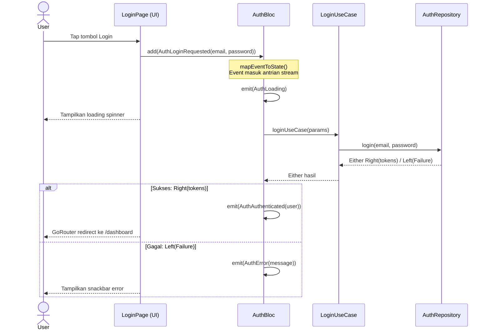

#### Diagram 2 — Cubit: Alur Fungsi Langsung (NewsFeedCubit `load()`)

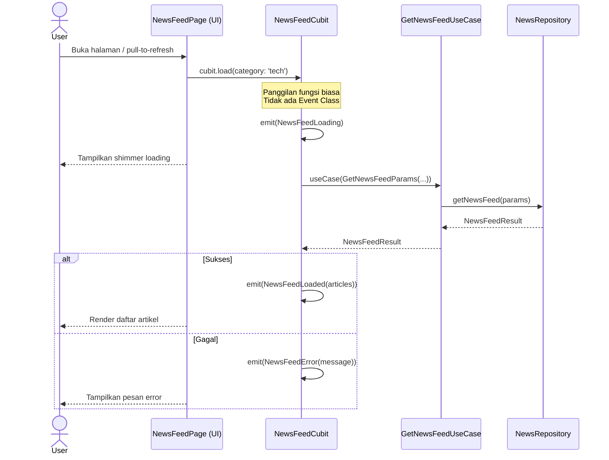

#### Diagram 3 — Perbedaan Struktural: BLoC vs Cubit

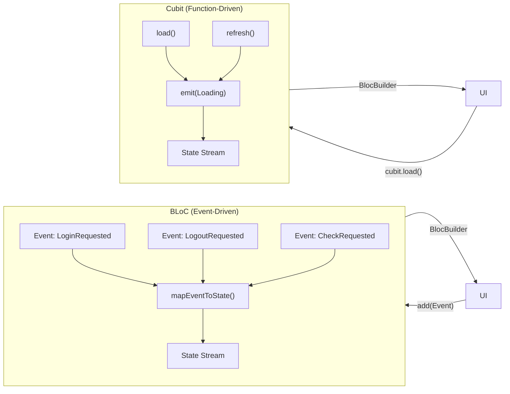

### 9.4 BLoC Skala Global (Di Root/MaterialApp)

Berbeda dengan Cubit abstrak/fungsional lain (seperti `NewsFeedCubit` atau `CategoryCubit`) yang umurnya dibatasi dan hanya diinisialisasi ("di-provide") di layar/rute tempat meraka dipanggil, dalam aplikasi ini terdapat **dua BLoC yang sengaja ditarik secara eksplisit hingga ke level akar absolut (root) pada `MaterialApp`**: yaitu **`AuthBloc`** dan **`GlobalAlertBloc`**.

**1. Mengapa AuthBloc Ditarik ke Root?**
* **Garda Navigasi Otomatis (Auth-Guard Redirection)**: Router utama kita (`GoRouter`) dikonfigurasi untuk secara abadi menyadap state `AuthBloc`. Jika sewaktu-waktu (bahkan saat memuat *background*) token kedaluwarsa dan berstatus *Unauthenticated*, maka GoRouter yang berselimut di lapis akar akan seketika menyedot pengguna kembali ke halaman `/login`, tanpa peduli sedalam apapun layar yang sedang dijangkau pengguna. *(Studi Kasus Analogi: Jika `AuthBloc` hanya di-provide di bawah rute `/dashboard` saja, lalu pengguna masuk ke layar "Article Detail" yang menumpuk rute di atas Dashboard, saat token tiba-tiba expired, antarmuka akan menjadi blank/freeze karena sistem gagal menemukan sinyal state `AuthBloc` yang terputus cakupan route-nya).*
* **Dewa Payung Keamanan & Identitas**: Identitas (Profil User) dari `AuthBloc` adalah data yang akan diakses hampir oleh seluruh sudut aplikasi (merender Avatar, Header, pengaturan). Me-rooting-nya secara *singleton* memastikan seluruh *child widget* bisa memanggil `context.read<AuthBloc>()` seketika secara gratis tanpa pemanggilan ulang API `/me`.

**2. Mengapa GlobalAlertBloc Ditarik ke Root?**
* **Penangkap Sinyal Error Jaringan Secara Universal**: Seringkali pengguna mendapat *Alert* error seperti "No Internet Connection" berbarengan dengan hancurnya layar atau terjadinya *Exception* di *background*. *GlobalAlertBloc* mendengarkan error di lapis Core jaringan tanpa pandang bulu di layar manapun error itu terjadi. Karena ditarik hingga root `MaterialApp`, ia bisa menampilkan antrean peringatan (SnackBar global) tepat di atas layar *apa pun* yang sedang aktif ditatap pengguna. Membatasinya di bawah sebuah rute hanya akan menyebabkan SnackBar Error tidak muncul jika *error* dipicu oleh modul silang.

```dart
// main.dart
MultiBlocProvider(
  providers: [
    BlocProvider<AuthBloc>.value(value: sl<AuthBloc>()),
    BlocProvider<GlobalAlertBloc>.value(value: sl<GlobalAlertBloc>()),
  ],
  child: MaterialApp.router(...)
)
```

#### Visualisasi: Mengapa Harus di Root?

#### Diagram 4 — AuthBloc di Root: Auth-Guard Otomatis

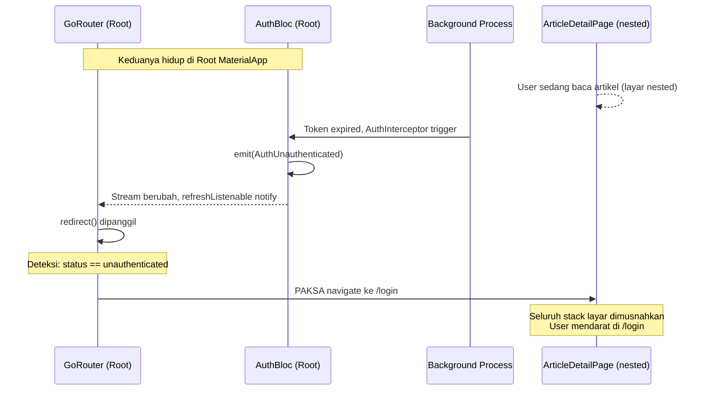

#### Diagram 5 — Skenario TANPA Root: Yang Gagal

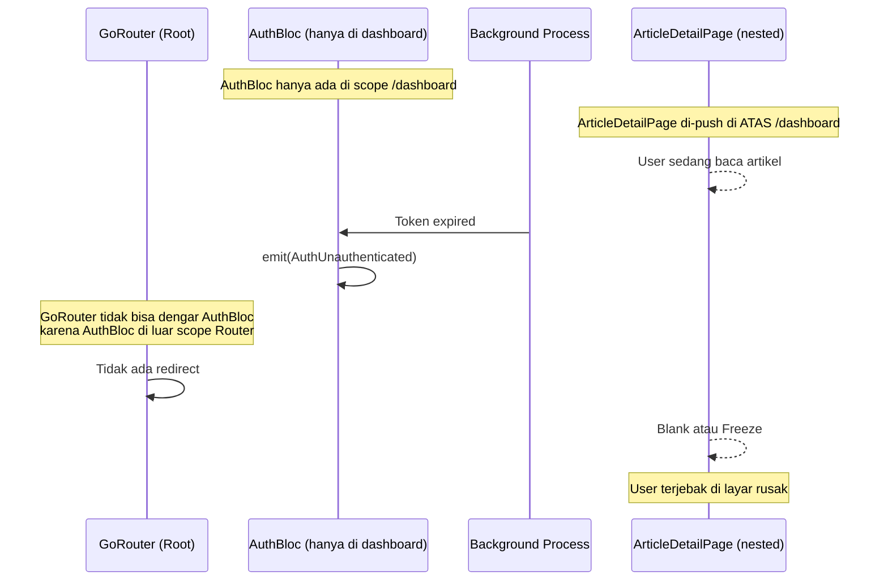

#### Diagram 6 — GlobalAlertBloc di Root: Error Universal

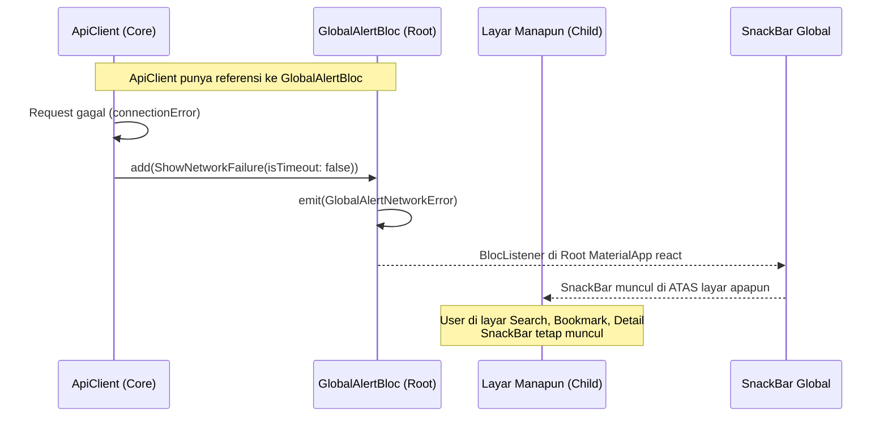

### 9.5 Auth State Machine

```
                     +--------+
           app start | initial|
                     +---+----+
                         | AuthCheckRequested
                         v
              +---- has token? ----+
              | YES                | NO
              v                    v
      call getProfile()    +--------------+
              |            |unauthenticated|<--- AuthLogoutRequested
              |            +------+-------+
              |                   |
         +----+----+             | AuthLoginRequested
         |         |             | AuthRegisterRequested
         v         v             v
   +----------+ +------+   +---------+
   |authenticated| |error | | loading |
   +----------+ +------+   +---------+
```

### 9.6 Events and State

**Events:**

| Event | Trigger | Description |
|-------|---------|-------------|
| `AuthCheckRequested` | App start via splash | Cek token + validate via getProfile |
| `AuthLoginRequested` | Login form submit | Email + password |
| `AuthRegisterRequested` | Register form submit | Name + email + password |
| `AuthProfileRequested` | Dashboard/Profile init | Fetch latest profile |
| `AuthLogoutRequested` | Logout button | Clear session |
| `AuthUserUpdated` | `ProfileCubit` after successful profile update | Update global RAM state dengan User baru |

**State:**

| Field | Type | Description |
|-------|------|-------------|
| `status` | `AuthStatus` enum | `initial`, `loading`, `authenticated`, `unauthenticated`, `registrationSuccess`, `error` |
| `user` | `User?` | Current user data |
| `errorMessage` | `String?` | Error message for UI display |

### 9.7 Feature-Specific Cubits

Semua News Cubits di-provide di `app_router.dart` pada route builder `/dashboard` menggunakan `MultiBlocProvider`, memastikan mereka fresh setiap kali `DashboardPage` dibuka:

| Cubit | Tipe Registrasi | Scope | Purpose |
|-------|----------------|-------|--------|
| `AuthBloc` | `LazySingleton` | Global (MaterialApp) | Auth status + User entity |
| `GlobalAlertBloc` | `LazySingleton` | Global (MaterialApp) | Network error intercept |
| `CategoryCubit` | `Factory` | Dashboard route | Load kategori berita |
| `NewsFeedCubit` | `Factory` | Dashboard route | Load & filter news feed |
| `TrendingCubit` | `Factory` | Dashboard route | Load trending articles |
| `SearchCubit` | `Factory` | Dashboard route | Search dengan debounce |
| `ExploreCubit` | `Factory` | Dashboard route | Browse per kategori |
| `BookmarkCubit` | `Factory` | Dashboard route | Manage bookmark state |
| `ArticleDetailCubit` | `Factory` | `/article/:slug` route | Load detail + bookmark toggle |
| `ProfileCubit` | `Factory` | `EditProfileBottomSheet` | Form state profil (ephemeral) |

```dart
// app_router.dart — /dashboard route
MultiBlocProvider(
  providers: [
    BlocProvider(create: (_) => sl<CategoryCubit>()..load()),
    BlocProvider(create: (_) => sl<TrendingCubit>()..load()),
    BlocProvider(create: (_) => sl<NewsFeedCubit>()..load()),
    BlocProvider(create: (_) => sl<SearchCubit>()),
    BlocProvider(create: (_) => sl<ExploreCubit>()),
    BlocProvider(create: (_) => sl<BookmarkCubit>()..loadBookmarks()),
  ],
  child: const DashboardPage(),
)
```

### 9.8 Peta Hierarki BLoC (Visual Graph)

Untuk memperjelas pemahaman mengenai lapisan (scope) mana saja setiap BLoC hidup dan mati, berikut adalah grafiknya:

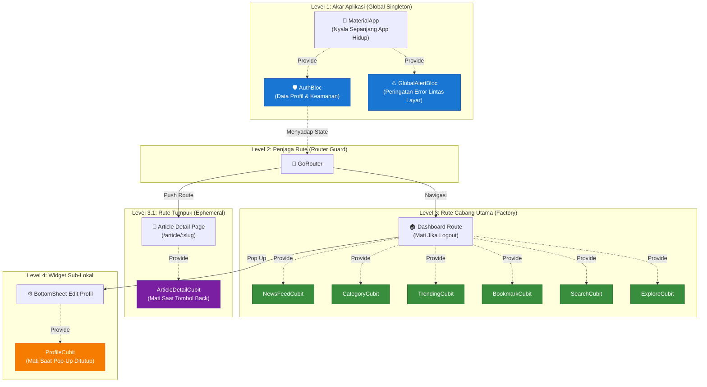

---

## 10. Storage Strategy

### 10.1 Decision Matrix

| Data | Sensitivity | Storage | Encryption | Persistence |
|------|------------|---------|------------|-------------|
| Access Token | HIGH | `FlutterSecureStorage` | AES-256 via Keychain / EncryptedSharedPrefs | Until logout/expiry |
| Refresh Token | HIGH | `FlutterSecureStorage` | AES-256 | Until logout |
| User Profile cache | LOW | `SharedPreferences` | None | Until logout |
| App Settings future | LOW | `SharedPreferences` | None | Permanent |

### 10.2 Platform Implementation

| Platform | FlutterSecureStorage Backend | SharedPreferences Backend |
|----------|------------------------------|---------------------------|
| **iOS** | Keychain Services | NSUserDefaults |
| **Android** | EncryptedSharedPreferences via API 23+ | SharedPreferences |

### 10.3 Cache Strategy for Profile

```
getProfile() called
    |
    +-- API success -> cache to SharedPrefs -> return fresh data
    |
    +-- API failure -> read from SharedPrefs -> return cached data
                          |
                          +-- No cache? -> return Failure
```

### 10.4 Offline Caching Strategy (News Feed)
Selain user profile, aplikasi mengimplementasikan konsep *Offline-First / Graceful Degradation* untuk *news feed* utama menggunakan `SharedPreferences`. Skema dan interaksi *orchestration* dibahas terpisah dan telah dipadukan ke dalam dokumen **[News & Explore Features (Section 3)](features/news_explore.md)**.

---

## 11. Network Layer Design

### 11.1 ApiClient

`ApiClient` membungkus Dio dan menyediakan **satu public method**:

```dart
class ApiClient {
  Future<Map<String, dynamic>> request(
    String method,    // 'GET', 'POST', 'PUT', 'PATCH', 'DELETE'
    String path,
    { dynamic data, Map<String, dynamic>? queryParameters }
  )
}
```

**Design decisions:**
- **Single method** — DRY, tidak ada method wrapper yang repetitif
- **Returns `Map<String, dynamic>`** — response sudah di-parse, datasource terima structured data
- **Throws `ServerException`** — semua `DioException` di-convert, datasource tidak perlu handle Dio errors

### 11.2 Dependency Inversion: TokenProvider

```
core/network/
  TokenProvider (abstract interface)  <-- ApiClient depends on this
  ApiClient
  AuthInterceptor

features/auth/data/
  AuthLocalDatasource implements TokenProvider
```

**Problem:** `ApiClient` (core) butuh baca token, tapi token disimpan oleh `AuthLocalDatasource` (feature).

**Solution:** `TokenProvider` interface di core. `AuthLocalDatasource` implement interface tersebut. Core tidak tahu tentang auth feature — hanya tahu ada sesuatu yang bisa provide token.

### 11.3 Auth Interceptor: Token Refresh with Race Condition Prevention

**Problem:** 5 API request paralel kena 401 -> 5 refresh request -> token invalidation cascade.

**Solution:** `Completer`-based lock mechanism:

```
Request A -> 401 --+
Request B -> 401 --+  A acquires lock, B and C wait on Completer
Request C -> 401 --+
                   |
                   v
             A triggers refresh()
                   |
             +-----+------+
             |  Success    |  Failure
             v             v
   Completer.complete   Completer.complete(null)
      (newToken)        clearTokens()
             |             |
             v             v
    A, B, C retry    A, B, C propagate error
    with new token
```

**Implementation highlights:**

```dart
class AuthInterceptor extends Interceptor {
  bool _isRefreshing = false;
  Completer<String?>? _refreshCompleter;

  void onError(DioException err, ErrorInterceptorHandler handler) {
    if (err.statusCode == 401) {
      if (_isRefreshing) {
        // Wait for ongoing refresh
        final newToken = await _refreshCompleter?.future;
        // Retry with new token
      } else {
        // Acquire lock, do refresh
        _isRefreshing = true;
        _refreshCompleter = Completer<String?>();
        // ... refresh logic ...
        _refreshCompleter?.complete(newAccessToken);
        _resetLock();
      }
    }
  }
}
```

### 11.4 Request Pipeline

```
RemoteDatasource
    |
    v
ApiClient.request('POST', '/api/v1/auth/login', data: {...})
    |
    v
Dio.request()
    |
    +-- AuthInterceptor.onRequest()  ->  Inject Bearer token if needed
    +-- LogInterceptor               ->  Log request/response
    |
    v
HTTP Request -> Server -> HTTP Response
    |
    +-- 200: ApiClient._handleResponse()  ->  Map<String, dynamic>
    +-- 401: AuthInterceptor.onError()    ->  Try refresh -> retry
    +-- 4xx/5xx: ApiClient._handleDioError()  ->  throw ServerException
```

---

## 12. Security Considerations

### 12.1 Token Management

| Concern | Implementation |
|---------|----------------|
| **Storage** | Tokens stored in `FlutterSecureStorage`, encrypted at-rest |
| **Transmission** | Via `Authorization: Bearer` header, auto-injected by interceptor |
| **Refresh** | Auto-refresh on 401 with race condition lock |
| **Revocation** | Server-side invalidation on logout + local `clearAll()` |
| **Cleanup** | Tokens + profile cleared on logout, even if server call fails |

### 12.2 Public vs Protected Paths

Defined in `AuthInterceptor._publicPaths`:

```dart
static const _publicPaths = [
  ApiConstants.login,      // No auth needed
  ApiConstants.register,   // No auth needed
  ApiConstants.health,     // No auth needed
];
```

All other paths automatically get Bearer token injected.

### 12.3 Network Security

| Item | Current | Recommendation for Production |
|------|---------|-------------------------------|
| Protocol | HTTP | **Migrate to HTTPS** |
| Certificate Pinning | No | Implement via Dio adapter |
| API Key | No | Add if backend supports |
| Rate Limiting | Server-side | N/A, handled by backend |

> [!WARNING]
> **Production TODO:** Base URL harus diganti ke HTTPS. HTTP saat ini hanya untuk development.

---

## 13. Navigation and Routing

### 13.1 GoRouter Configuration

`AppRouter` menerima `AuthBloc` sebagai dependency injection dari `main.dart` — bukan mengambilnya sendiri dari GetIt — agar router tetap testable dan decoupled dari service locator.

```dart
// main.dart — inject AuthBloc ke AppRouter
final appRouter = AppRouter(
  authBloc: context.read<AuthBloc>(), // ambil dari MultiBlocProvider di atasnya
);

// app_router.dart
class AppRouter {
  final AuthBloc authBloc;

  late final GoRouter router = GoRouter(
    navigatorKey: rootNavigatorKey, // kunci untuk GlobalAlertBloc
    initialLocation: '/splash',
    refreshListenable: GoRouterRefreshStream(authBloc.stream), // dengarkan AuthBloc
    redirect: (context, state) { ... },
    routes: [ ... ],
  );
}
```

#### GoRouterRefreshStream

Karena GoRouter hanya mengenal `Listenable` (bukan `Stream`), kita gunakan adapter `GoRouterRefreshStream` yang mengubah `Stream<AuthState>` menjadi `ChangeNotifier`. Ia hanya notify GoRouter jika `AuthStatus` benar-benar berubah (bukan setiap emit).

```dart
// Hanya notify jika STATUS berubah, bukan setiap emit
if (_lastStatus != state.status) {
  _lastStatus = state.status;
  notifyListeners(); // → GoRouter terpanggil → redirect() dievaluasi
}
```

#### Redirect Logic (3 Aturan)

| # | Kondisi | Aksi |
|---|---------|------|
| 1 | `AuthStatus.initial` + sedang di `/splash` | Tetap di `/splash` (tunggu cek token selesai) |
| 2 | `AuthStatus.unauthenticated` + bukan di halaman auth | Paksa ke `/login` |
| 3 | `AuthStatus.authenticated` + di `/login`, `/register`, atau `/splash` | Paksa ke `/dashboard` |
| — | Tidak ada pelanggaran | `null` — biarkan navigasi berjalan normal |

### 13.2 Route Map & BLoC Provider Scope

#### Struktur Route Tree

```
GoRouter (initialLocation: /splash)
│
├── /splash          → SplashPage
│     BLoC scope: tidak ada (stateless)
│     Auth guard: Tetap di sini saat AuthStatus.initial
│
├── /login           → LoginPage
│     BLoC scope: tidak ada (AuthBloc dari root)
│     Auth guard: Redirect /dashboard jika sudah authenticated
│
├── /register        → RegisterPage
│     BLoC scope: tidak ada (AuthBloc dari root)
│     Auth guard: Redirect /dashboard jika sudah authenticated
│
├── /dashboard       → MultiBlocProvider → DashboardPage (Shell)
│     BLoC scope: 6 Cubit dibuat di sini (hidup selama /dashboard aktif)
│     │   CategoryCubit    ..load()           (auto-load saat route dibuat)
│     │   TrendingCubit    ..load()           (auto-load saat route dibuat)
│     │   NewsFeedCubit    ..load()           (auto-load saat route dibuat)
│     │   SearchCubit      (lazy, tunggu user search)
│     │   ExploreCubit     (lazy, tunggu user buka tab)
│     │   BookmarkCubit    ..loadBookmarks()  (auto-load saat route dibuat)
│     Auth guard: Redirect /login jika unauthenticated
│     Inside: IndexedStack → 5 tab (lihat Section 13.4)
│
└── /article/:slug   → BlocProvider → NewsDetailPage
      BLoC scope: ArticleDetailCubit (hidup hanya selama halaman ini aktif)
      Auth guard: Redirect /login jika unauthenticated
      Navigation: Di-push di ATAS /dashboard via context.push()
                  → Back button kembali ke /dashboard (state tab tetap)
```

#### Tabel Route

| Path | Named Route | Page | BLoC Provider | Auth | Cara Buka |
|------|-------------|------|---------------|------|-----------|
| `/splash` | `splash` | `SplashPage` | — | — | `initialLocation` |
| `/login` | `login` | `LoginPage` | — | No | GoRouter redirect / `context.go()` |
| `/register` | `register` | `RegisterPage` | — | No | `context.push('/register')` |
| `/dashboard` | `dashboard` | `DashboardPage` | `MultiBlocProvider` 6 Cubit | **Yes** | GoRouter redirect |
| `/article/:slug` | `articleDetail` | `NewsDetailPage` | `BlocProvider` 1 Cubit | **Yes** | `context.push('/article/$slug')` |

> [!NOTE]
> `DashboardPage` adalah **shell/wrapper** yang menampung `BottomNavigationBar` dengan 5 tab:
> - Tab 0: `NewsFeedPage` (Berita)
> - Tab 1: `ExplorePage` (Jelajah)
> - Tab 2: `NewsSearchPage` (Cari)
> - Tab 3: `BookmarkPage` (Simpan)
> - Tab 4: `ProfilePage` (Profil)
>
> `ProfilePage` tidak memiliki route tersendiri — ia di-render via `IndexedStack` di dalam `DashboardPage`.

#### Kenapa `/article/:slug` Setara dengan `/dashboard`, Bukan Child-nya?

`/article/:slug` adalah **sibling** dari `/dashboard`, bukan nested child. Ini intentional:

- **Dibuka dengan `context.push()`** → ditumpuk di atas `/dashboard`
- **Back button** → kembali ke `/dashboard`, state tab tidak hilang
- Jika dijadikan child route dalam `/dashboard`, dia masuk ke dalam `IndexedStack` dan tidak bisa di-push dengan benar

```
Navigation stack saat buka artikel:
┌─────────────────────────────┐  ← /article/:slug (on top)
│ NewsDetailPage              │
└─────────────────────────────┘
┌─────────────────────────────┐  ← /dashboard (tetap ada di bawah)
│ DashboardPage (IndexedStack)│
└─────────────────────────────┘
```


### 13.3 Navigation Flow

```
App Start
    |
    v
  Splash --(AuthCheckRequested)--> Check token
    |                                  |
    |                          +-------+-------+
    |                          | Has token      | No token
    |                          | + valid profile |
    |                          v               v
    |                      /dashboard       /login
    |                                         |
    |                                   +-----+------+
    |                                   |            |
    |                                   v            v
    |                              (login)      push /register
    |                                   |            |
    |                                   |      (register success)
    |                                   |            |
    |                                   |       pop -> /login
    |                                   v
    |                              /dashboard
    |                                   |
    |                            (logout)
    |                                   |
    |                                   |
    +-----------------------------------v
                                    /login
```

### 13.4 Dashboard Navigation (IndexedStack Pattern)

Implementasi navigasi `DashboardPage` menggunakan **`IndexedStack` + `BottomNavigationBar`** (bukan `StatefulShellRoute`). Semua 5 halaman tab di-instantiate sekaligus dan disimpan dalam stack; perpindahan tab hanya mengubah `_currentIndex` sehingga state (scroll position, cubit state) tetap dipertahankan.

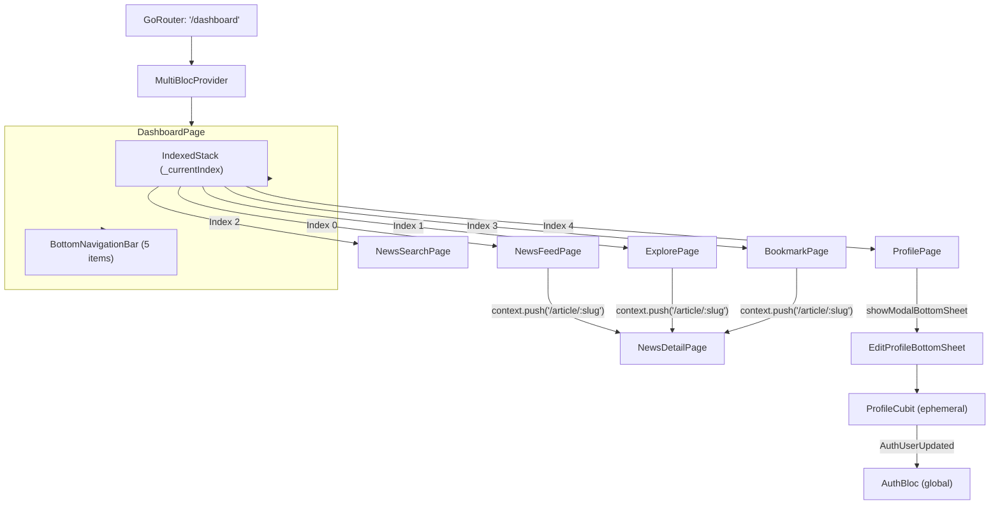

### 13.5 Panduan Metode Navigasi (GoRouter API)

Pengembang diwajibkan untuk memahami kapan menggunakan metode navigasi yang tepat agar struktur tumpukan layar (*route stack*) tetap sehat dan terhindar dari *bocor memori / broken backward navigation*.

| Metode Code | Perilaku & Hasil Tumpukan (Stack) | Contoh Kasus Penggunaan (Use-Case) |
|-------------|-----------------------------------|----------------------------------|
| **`context.push()` / `pushNamed()`** | **Menumpuk layar (Push)** di atas rute saat ini. Pengguna *BISA menekan tombol Back* untuk kembali ke layar asalnya. | Buka layar Detail Berita (dari Dashboard). Dari Login pindah ke Register (agar User bisa mundur batal). |
| **`context.go()` / `goNamed()`** | **Menimpa & Melompat (Replace/Jump)** ke URL tujuan. Mengganti murni rute *Top Level*. Pengguna *TIDAK BISA menekan tombol Back* ke tempat asal. | (Jarang dipanggil manual). Biasanya dipakai untuk Navigasi antar Bottom Navigation menu atau ke halaman akar. |
| **Global Redirect (Automated)** | **Pemusnahan Mutlak (PushAndRemoveUntil)** yang dilakukan sistem router *GoRouter* (di `app_router.dart`) secara rahasia. Semua tumpukan layar yang kacau akan ditebas bersih dan diganti dengan 1 rute _Top Level_. | Ketika User sukses **Login** (berpindah ke `/dashboard`) atau berhasil **Logout** (ditendang ke `/login`). Programmer *TIDAK BOLEH* memanggil `pushReplacement` manual untuk urusan _Auth_, percayakan pada sistem Redirect! |
| **`context.pop()`** | **Membakar 1 Tumpukan teratas (Pop)**. Menggugurkan layar yang sedang aktif dan mundur persis 1 langkah ke belakang. | Menutup form halaman (*Edit Profile*), menutup Alert/Dialog/BottomSheet, atau memencet tombol <- Kembali. |

---

## 14. Dependency Injection

### 14.1 Registration Order

Order matters karena dependency chain:

```
1. External              -> FlutterSecureStorage, SharedPreferences
2. Local DS              -> AuthLocalDatasource (needs SecureStorage + SharedPrefs)
3. TokenProvider         -> Points to AuthLocalDatasource instance
4. ApiClient             -> Needs TokenProvider
5. Remote DS             -> Needs ApiClient
6. Repository (Feature)  -> Needs Remote DS + Local DS
7. Repository (Core)     -> NotificationRepository (LazySingleton, no deps)
8. Use Cases             -> Needs Repository (+ NotificationRepository jika perlu notif)
9. BLoC                  -> Needs Use Cases + Repository
```

### 14.2 Registration Strategy

Sistem menggunakan strategi registrasi spesifik berdasarkan sifat *state* dari masing-masing komponen:

| Tipe Registrasi | Kapan Dibuat | Sifat | Penggunaan | Contoh di Aplikasi |
|-----------------|--------------|-------|------------|---------------------|
| **LazySingleton** | Saat pertama kali diminta | *Persistent / Shared* | Service yang *stateless* atau BLoC yang statusnya wajib bertahan lintas halaman. | `ApiClient`, `AuthLocalDatasource`, `AuthRepository`, `AuthBloc`. |
| **Factory** | Setiap kali diminta | *Fresh / Reset* | BLoC yang datanya wajib kosong otomatis tiap kali *user* membuka halaman baru. | *(Rencana)* `SearchNewsBloc`, `EditProfileBloc`. |
| **Singleton** | Saat `initDependencies()` | *Pre-warmed* | Service yang absolut harus siap menyala sebelum UI Flutter dirender. | *(Rencana)* `FirebaseApp`, `Logger`. |

### 14.3 Dependency Graph

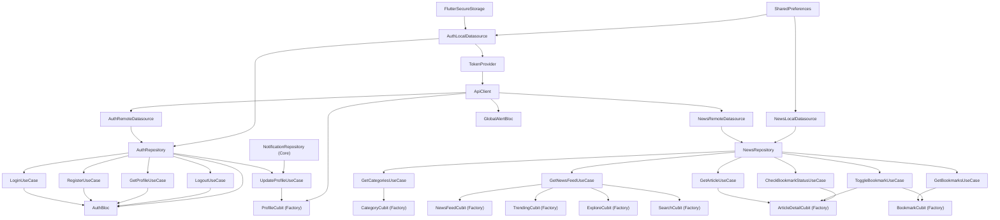

---

## 15. UI/UX Design System

### 15.1 Theme: Dark Mode

| Token | Value | Usage |
|-------|-------|-------|
| `primaryColor` | `#6C5CE7` | Buttons, accents, active states |
| `accentColor` | `#00D2FF` | Links, secondary highlights |
| `backgroundDark` | `#0F1023` | Scaffold background |
| `surfaceCard` | `#222344` | Card backgrounds |
| `surfaceElevated` | `#2A2B4A` | Input fields, elevated surfaces |
| `textPrimary` | `#F5F5F7` | Primary text |
| `textSecondary` | `#B0B0C8` | Secondary text |
| `textMuted` | `#6E6E8A` | Hints, placeholders |
| `success` | `#00E676` | Success states |
| `error` | `#FF5252` | Error states |

### 15.2 Gradients

| Name | Colors | Usage |
|------|--------|-------|
| `primaryGradient` | `#6C5CE7 -> #00D2FF` | Buttons, logo background |
| `cardGradient` | `#222344 -> #1A1B2E` | Profile card |
| `backgroundGradient` | `#0F1023 -> #1A1B2E` | Page backgrounds |

### 15.3 Border Radius Scale

| Token | Value |
|-------|-------|
| `radiusSm` | 8px |
| `radiusMd` | 12px |
| `radiusLg` | 16px |
| `radiusXl` | 24px |

### 15.4 Pages

| Page | Route / Placement | Key Components |
|------|-------------------|---------------|
| **SplashPage** | `/splash` | Logo + fade/scale animation, triggers `AuthCheckRequested` |
| **LoginPage** | `/login` | Email + password fields, gradient CTA button, slide-up animation |
| **RegisterPage** | `/register` | Name + email + password + confirm password |
| **DashboardPage** | `/dashboard` (shell) | `IndexedStack` + `BottomNavigationBar` 5 tab |
| **NewsFeedPage** | Tab 0 | Category filter chips, trending section, article list dengan pull-to-refresh |
| **ExplorePage** | Tab 1 | Browse artikel per kategori dengan pagination |
| **NewsSearchPage** | Tab 2 | Search bar dengan debounce, hasil pencarian |
| **BookmarkPage** | Tab 3 | Daftar artikel tersimpan dari local cache |
| **ProfilePage** | Tab 4 | Avatar, nama, bio, phone info; trigger `EditProfileBottomSheet` |
| **NewsDetailPage** | `/article/:slug` (pushed) | Full article reader, bookmark toggle button |
| **EditProfileBottomSheet** | Modal (from ProfilePage) | Borderless fields untuk name, bio, phone, avatar upload |

---

## 16. Testing Strategy

### 16.1 Test Pyramid

```
        /  \
       / E2E \          Integration / Widget tests
      /-------\
     / Widget   \        BLoC + Page widget tests
    /-------------\
   /    Unit        \    Entities, UseCases, Repository, BLoC logic
  /-------------------\
```

### 16.2 Standard Testing Paths (Skenario Wajib)

Proyek ini mewajibkan **3 Jalur Pengujian (Paths)** untuk seluruh *layer* agar mencapai ketahanan setara *Enterprise*:

1. **Happy Path:** Menguji aliran sukses. (Target: mengembalikan `Right(Data)` atau merender sukses).
2. **Error Path:** Menguji aliran gagal yang *"Sudah Tertebak"*. (Target: melempar `Left(Failure)` akibat 404, 500, salah *password*, tanpa internet).
3. **Edge Path:** Menguji aliran aneh/*blind spots*. (Target: mencegah aplikasi *crash* jika memori HP *corrupt*, format JSON server diam-diam berubah tipe, atau kehilangan koneksi di tengah rentetan operasi berantai BLoC).

### 16.3 Unit Test Targets

| Component | What to Test | Status |
|-----------|-------------|--------|
| **Auth Local Datasource** | Write, Read, Edge Path (Partial Cache / JSON null) | ✅ `auth_local_datasource_test.dart` |
| **Auth Remote Datasource** | Panggilan ApiClient, transformasi HTTP → Model | ✅ `auth_remote_datasource_test.dart` |
| **Auth Repository** | Exception → Failure, Fallback cache saat offline | ✅ `auth_repository_impl_test.dart` |
| **Auth UseCases** | Return Integrity & parameter forwarding | ✅ `login/register/logout/get_profile/update_profile_usecase_test.dart` |
| **AuthBloc** | Event → State transitions, chaining events | ✅ `auth_bloc_test.dart` |
| **ProfileCubit** | Update flow, loading state, error state, AuthUserUpdated dispatch | ✅ `profile_cubit_test.dart` |
| **ApiClient** | DioException → ServerException mapping | ✅ `api_client_test.dart` |
| **AuthInterceptor** | Token inject, refresh lock, race condition | ✅ `auth_interceptor_test.dart` |
| **News Local Datasource** | Bookmark CRUD, feed cache read/write | ✅ `news_local_datasource_test.dart` |
| **News Remote Datasource** | getFeed, getCategories, getArticle | ✅ `news_remote_datasource_test.dart` |
| **News Repository** | Feed cache fallback, bookmark CRUD | ✅ `news_repository_impl_test.dart` |
| **News UseCases** | GetFeed, GetCategories, GetArticle, Bookmark, Toggle, Check | ✅ `*_usecase_test.dart` (6 files) |
| **CategoryCubit** | Load, error, empty state | ✅ `category_cubit_test.dart` |
| **NewsFeedCubit** | Load, filter, refresh, error, pagination | ✅ `news_feed_cubit_test.dart` |
| **TrendingCubit** | Load, error | ✅ `trending_cubit_test.dart` |
| **ExploreCubit** | Parallel load, staggered emit | ✅ `explore_cubit_test.dart` |
| **SearchCubit** | Search, debounce guard, loadMore, race condition | ✅ `search_cubit_test.dart` |
| **BookmarkCubit** | Toggle, load, optimistic update | ✅ `bookmark_cubit_test.dart` |
| **ArticleDetailCubit** | Load detail, bookmark toggle | ✅ `article_detail_cubit_test.dart` |
| **Article Entity** | displayImage getter, equality | ✅ `article_test.dart` |
| **Utilities** | DateHelper, Validators | ✅ `date_helper_test.dart`, `validators_test.dart` |

### 16.4 Cara Menjalankan Test

```bash
# Run all tests
flutter test

# Run with coverage
flutter test --coverage

# Run specific file
flutter test test/features/auth/presentation/bloc/auth_bloc_test.dart
```

**Coverage target:** minimal 80% pada Domain + BLoC/Cubit layer.

### 16.3 Mocking Strategy

| Dependency | Mock Library |
|-----------|-------------|
| Repository | `mocktail` or `mockito` |
| Datasource | `mocktail` or `mockito` |
| Dio | `dio` mock adapter or `http_mock_adapter` |
| SharedPreferences | Built-in `setMockInitialValues` |

---

## 17. Non-Functional Requirements

### 17.1 Performance

| Metric | Target |
|--------|--------|
| App cold start | Less than 3 seconds |
| API response handling | Less than 500ms UI feedback |
| Token refresh | Transparent to user |

### 17.2 Compatibility

| Platform | Minimum Version |
|----------|----------------|
| Android | API 23, Android 6.0 — required by EncryptedSharedPreferences |
| iOS | 12.0 |

### 17.3 Scalability

Adding a new feature (e.g., News) requires:

1. Create `features/news/domain/` — entities, repository contract, usecases
2. Create `features/news/data/` — models, datasource, repository impl
3. Create `features/news/presentation/` — bloc, pages, widgets
4. Register in `injection_container.dart`
5. Add routes to `app_router.dart`

**No existing code needs to be modified** (Open/Closed Principle).

### 17.4 Production Readiness (main.dart)

Aplikasi telah dilengkapi dengan perlindungan standar rilis produksi pada level *bootstrap* (`main.dart`):
1. **AppBlocObserver:** Melakukan jejak (*logging*) otomatis seluruh transisi *State* BLoC (Hanya aktif di Mode Debug).
2. **Orientation Lock:** Layar dikunci statis pada mode *Portrait Up/Down*.
3. **Status Bar Styling:** Mewarnai *bar* atas (baterai, jam, sinyal) menjadi transparan.
4. **Global Error Catcher:** Mencegat semua *Exception* yang gagal ditangkap `try-catch` lewat `FlutterError.onError` dan `PlatformDispatcher.instance.onError` guna mencegah layar abu-abu mengerikan (*Grey Screen of Death*).

### 17.5 Future Considerations

| Item | Priority | Notes |
|------|----------|-------|
| HTTPS migration | P0 | Before production release |
| Certificate pinning | P1 | Prevent MITM attacks |
| Biometric auth | P2 | For sensitive operations |
| Offline mode | P2 | Cache news articles locally |
| Push notifications | P2 | Breaking news alerts |
| Crash reporting | P1 | Connect the Global Error Catcher in main.dart to Firebase Crashlytics |

---

## 18. Profile Management

### 18.1 User Entity Fields

Entity `User` telah di-expand untuk mendukung profile management penuh:

```dart
class User extends Equatable {
  final int id;
  final String name;
  final String email;
  final String avatarUrl;     // URL CDN dari endpoint /upload
  final String bio;           // Deskripsi singkat user
  final String phone;         // Nomor HP
  final String preferences;   // JSON string untuk app settings
  final DateTime? createdAt;
}
```

### 18.2 Architecture Strategy (Global + Local BLoC Hybrid)

Sistem profil menggunakan pola **Global-Local Hybrid BLoC** untuk memecahkan dua masalah sekaligus:
1. Menghindari terlalu banyak fetch API karena data tersimpan global di RAM.
2. Mencegah memory leak — state form Edit Profile tidak disimpan di Global BLoC.

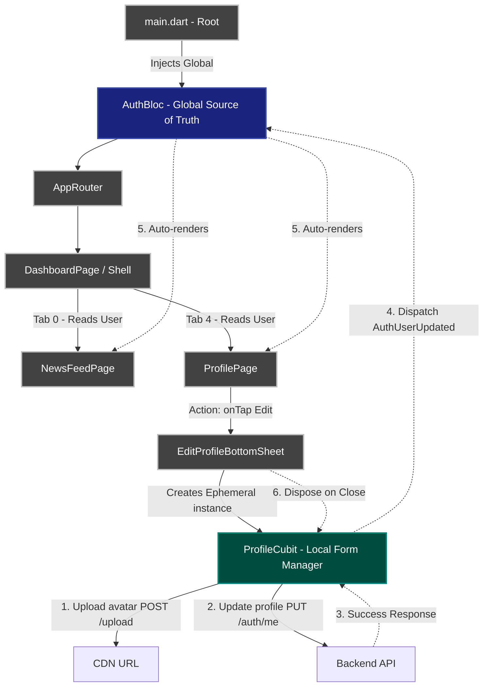

#### Alur Komunikasi
1. **Source of Truth**: `AuthBloc` (Global) meng-host entity `User` di RAM.
2. **Pembaca Data**: `ProfilePage` & `NewsFeedPage` me-render profil dari `AuthBloc` — tidak pernah call API saat navigasi tab.
3. **Pekerja Form (Local)**: `ProfileCubit` + `EditProfileBottomSheet` bersifat ephemeral — mengurus upload gambar, loading spinner, validasi form.
4. **Jembatan Sinkronisasi**: Setelah `ProfileCubit` sukses, dia dispatch event ke Global BLoC:
   ```dart
   context.read<AuthBloc>().add(AuthUserUpdated(updatedUser));
   ```
5. **Zero Memory Footprint**: `ProfileCubit` di-dispose otomatis saat bottom sheet ditutup.

### 18.3 UI Characteristics
- Premium bottom sheet dengan borderless `TextField`
- Avatar picker dengan image upload ke `/api/v1/upload`
- Loading state pada tombol Save
- Animasi smooth open/close bottom sheet

---

## 19. Feature Modules

Dalam upaya menjaga TRD ini agar tidak menjadi terlalu besar (Monolithic), implementasi spesifik dari berbagai modul diletakkan ke dalam panduan (_markdown_) sendiri di dalam folder `docs/features/`.

Dokumen induk (TRD) ini bertindak sebagai Blueprint Global Arsitektur & Aturan Main, sementara fungsi fitur-fiturnya diurus dalam file spesifik berikut:

| Feature Name | Document Resource | Description | Status |
|--------------|-------------------|-------------|--------|
| **Auth** | [features/auth.md](features/auth.md) | Otentikasi, Splash Screen, Storage Token | ✅ Done |
| **Update Profile** | [features/update_profile.md](features/update_profile.md) | Edit profil, upload avatar, local notification trigger via UseCase | ✅ Done |
| **News & Explore** | [features/news_explore.md](features/news_explore.md) | News Feed, Explore Page, API Feed aggregator | ✅ Done |
| **Bookmarks** | [features/bookmarks.md](features/bookmarks.md) | Layar Bookmark, Optimistic updating | ✅ Done |
| **Search** | [features/search.md](features/search.md) | Pencarian dengan Pagination & Debounce | ✅ Done |

---

*End of Technical Requirements Document*
