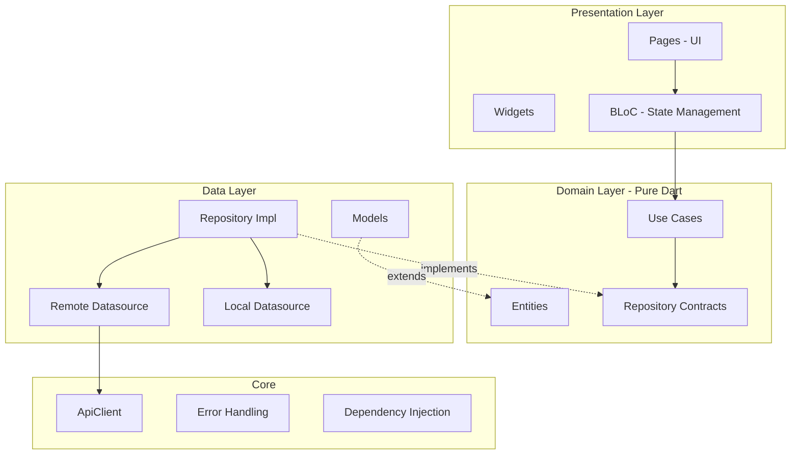
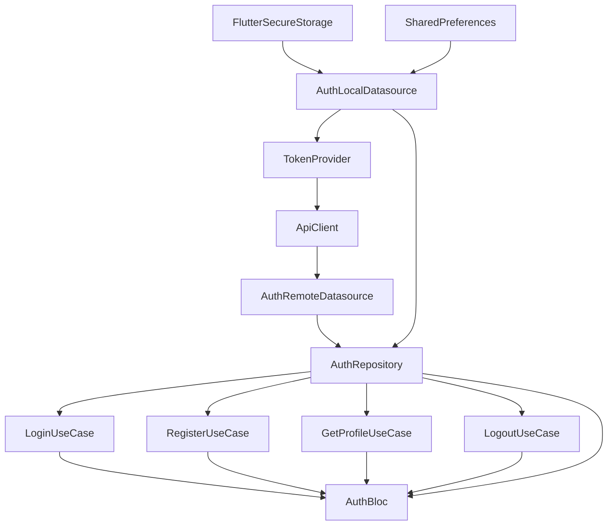
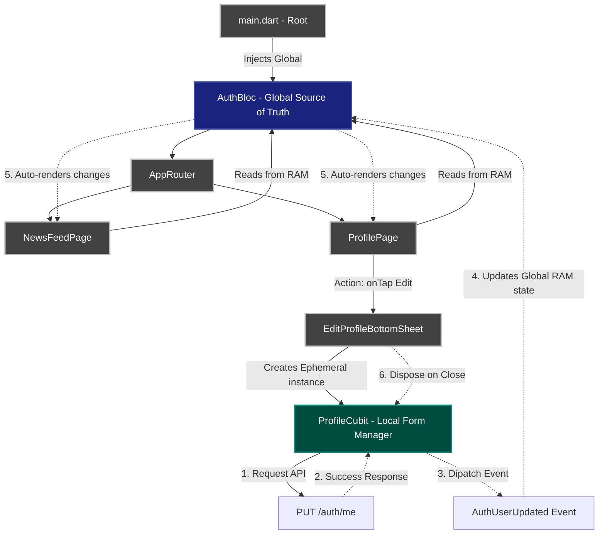

# Technical Requirements Document (TRD)

## News App — Flutter Mobile Application

| Field | Value |
|-------|-------|
| **Project Name** | News App |
| **Platform** | Flutter (iOS & Android) |
| **Version** | 1.0.0 |
| **Author** | Nunu Nugraha |
| **Created** | 2026-04-01 |
| **Status** | In Development |

---

## Table of Contents

1. [Overview](#1-overview)
2. [System Architecture](#2-system-architecture)
3. [Technology Stack and Library Selection](#3-technology-stack-and-library-selection)
4. [Architecture Pattern](#4-architecture-pattern)
5. [Project Structure](#5-project-structure)
6. [Layer Specification](#6-layer-specification)
7. [API Specification](#7-api-specification)
8. [Error Handling Strategy](#8-error-handling-strategy)
9. [State Management Strategy](#9-state-management-strategy)
10. [Storage Strategy](#10-storage-strategy)
11. [Network Layer Design](#11-network-layer-design)
12. [Security Considerations](#12-security-considerations)
13. [Navigation and Routing](#13-navigation-and-routing)
14. [Dependency Injection](#14-dependency-injection)
15. [UI/UX Design System](#15-uiux-design-system)
16. [Testing Strategy](#16-testing-strategy)
17. [Non-Functional Requirements](#17-non-functional-requirements)

---

## 1. Overview

### 1.1 Purpose

News App adalah aplikasi mobile berbasis Flutter yang mengkonsumsi REST API untuk manajemen berita. Dokumen ini mendefinisikan keseluruhan arsitektur, spesifikasi teknis, dan keputusan desain yang diambil dalam pembangunan aplikasi.

### 1.2 Scope

| Module | Features | Priority |
|--------|----------|----------|
| **Auth** | Register, Login, Profile, Logout, Token Refresh | P0 - Core |
| **Dashboard** | User profile display, stats, quick actions | P0 - Core |
| **News** | Browse, read, search, bookmark articles | P1 - Future |

### 1.3 Backend API

- **Base URL:** `http://103.181.143.73:8081`
- **Protocol:** REST over HTTP
- **Format:** JSON
- **Auth Mechanism:** JWT Bearer Token with Refresh Token rotation

---

## 2. System Architecture

### 2.1 High-Level Architecture

```
+-----------------------------------------------------+
|                    FLUTTER APP                       |
|                                                     |
|  +-----------+  +----------+  +---------------+    |
|  |Presentation|->|  Domain  |<-|     Data      |    |
|  |  (BLoC)    |  | (Entity, |  | (Model, Repo  |    |
|  |  (Pages)   |  |  UseCase,|  |  Impl, DS)    |    |
|  |  (Widgets) |  |  Repo)   |  |               |    |
|  +-----------+  +----------+  +-------+-------+    |
|                                       |             |
|                  +--------------------+             |
|                  |       Core         |             |
|                  |  +------------+    |             |
|                  |  |  ApiClient |    |             |
|                  |  |  (Dio wrap)|    |             |
|                  |  +------+-----+    |             |
|                  |         |          |             |
|                  |  +------+-----+    |             |
|                  |  |Interceptor |    |             |
|                  |  |(Auth+Log)  |    |             |
|                  |  +------------+    |             |
|                  +--------------------+             |
+-------------------------+---------------------------+
                          | HTTPS / HTTP
                          v
              +-----------------------+
              |   Backend REST API    |
              |  (Go + PostgreSQL)    |
              +-----------------------+
```

### 2.2 Dependency Rule

```
Presentation -> Domain <- Data
                 ^
               Core
```

- **Domain** layer tidak bergantung pada layer lain (pure Dart)
- **Data** layer mengimplementasi contract dari Domain
- **Presentation** layer hanya berkomunikasi via UseCase/Repository interface
- **Core** menyediakan utilities yang digunakan seluruh layer

---

## 3. Technology Stack and Library Selection

### 3.1 Core Framework

| Technology | Version | Justification |
|-----------|---------|---------------|
| **Flutter** | 3.38.x | Cross-platform framework, single codebase iOS dan Android |
| **Dart SDK** | ^3.6.1 | Stable SDK, sound null safety |

### 3.2 Dependencies

#### Network

| Library | Version | Justification | Alternatif yang Dipertimbangkan |
|---------|---------|---------------|-------------------------------|
| **dio** | ^5.7.0 | HTTP client dengan interceptor support, request cancellation, FormData, dan fine-grained error handling. Interceptor pattern krusial untuk auto token injection dan refresh. | `http` — terlalu basic, tidak ada interceptor. `chopper` — overkill, butuh code generation. |

#### State Management

| Library | Version | Justification | Alternatif yang Dipertimbangkan |
|---------|---------|---------------|-------------------------------|
| **flutter_bloc** | ^9.1.0 | Predictable state management dengan clear separation antara event dan state. Mendukung `BlocListener`, `BlocBuilder`, `BlocProvider` untuk reactive UI. Testable by design. | `riverpod` — bagus tapi team lebih familiar dengan BLoC. `provider` — kurang structured untuk complex state. `cubit` — subset dari BLoC, dipilih full BLoC untuk event traceability. |
| **equatable** | ^2.0.7 | Value equality untuk Entity, State, dan Event tanpa boilerplate `==` dan `hashCode`. | Manual override — error-prone dan verbose. |

#### Dependency Injection

| Library | Version | Justification | Alternatif yang Dipertimbangkan |
|---------|---------|---------------|-------------------------------|
| **get_it** | ^8.0.3 | Service locator pattern yang simple dan performant. Lazy singleton untuk memory efficiency. Tidak butuh code generation untuk setup basic. | `injectable` — auto-generated DI, tapi menambah build step. `riverpod` — built-in DI tapi couple dengan state management. |

#### Local Storage

| Library | Version | Use Case | Justification |
|---------|---------|----------|---------------|
| **flutter_secure_storage** | ^9.2.4 | Token storage - sensitive | Menggunakan **Keychain** di iOS dan **EncryptedSharedPreferences** di Android. Data terenkripsi at-rest. |
| **shared_preferences** | ^2.5.3 | Profile cache - non-sensitive | Key-value storage ringan untuk data non-sensitif seperti cache nama dan email. |

#### Functional Programming

| Library | Version | Justification | Alternatif yang Dipertimbangkan |
|---------|---------|---------------|-------------------------------|
| **dartz** | ^0.10.1 | `Either<Failure, T>` untuk error handling tanpa exception di layer domain-repository. Membuat error menjadi explicit return value, bukan hidden control flow. | `fpdart` — maintained alternative, tapi API kurang stable. Raw try-catch — implicit error handling, mudah terlewat. |

#### Navigation

| Library | Version | Justification | Alternatif yang Dipertimbangkan |
|---------|---------|---------------|-------------------------------|
| **go_router** | ^14.8.1 | Declarative routing dengan _auth-aware redirect_, _deep linking_, dan _nested navigation_ (via ShellRoute). Sangat kuat untuk membatasi akses URL berdasarkan _state_ BLoC via `refreshListenable`. | **Default Navigation (Navigator 1.0 / `push`/`pop`)**: Walaupun sederhana tanpa package luar, Navigator 1.0 sangat rapuh dan imperatif; sulit melacak _stack_ rute, tidak mendukung URL/Deep Linking otomatis, dan membuat kode _redirection auth_ berantakan karena disisipkan acak ke dalam Builder UI. <br><br>**Navigator 2.0 (Raw)**: Mendukung segala fitur _Declarative_ namun sintaks dan strukturnya (RouterDelegate/RouteInformationParser) ribet luar biasa bertele-tele. <br><br>**`auto_route`**: Kuat namun mengandalkan Code Generation (memperlambat waktu build Flutter). |

#### UI

| Library | Version | Justification |
|---------|---------|---------------|
| **google_fonts** | ^6.2.1 | Akses ke 1000+ Google Fonts tanpa bundling manual. Runtime font loading. |
| **cupertino_icons** | ^1.0.8 | iOS-style icons untuk platform-consistent UI. |

#### Testing

| Library | Version | Justification |
|---------|---------|---------------|
| **bloc_test** | ^3.3.0 | Standar emas untuk menguji state transitions pada BLoC dengan format `build`, `act`, `expect`. |
| **mocktail** | ^1.0.4 | Null-safety friendly mocking library (alternatif modern untuk mockito). |
| **http_mock_adapter** | ^0.6.1 | Untuk simulasi (mocking) respons HTTP dari Dio tanpa butuh koneksi internet. |

---

## 4. Architecture Pattern

### 4.1 Clean Architecture

Aplikasi mengikuti **Clean Architecture** (Robert C. Martin) yang diadaptasi untuk Flutter:



### 4.2 Kenapa Clean Architecture?

| Keuntungan | Penjelasan |
|-----------|-----------|
| **Testability** | Domain layer bisa di-test tanpa framework dependency |
| **Separation of Concerns** | Tiap layer punya tanggung jawab jelas |
| **Scalability** | Feature baru tinggal tambah folder di `features/` |
| **Flexibility** | Ganti Dio ke package lain? Cukup ubah `ApiClient`, domain layer tidak berubah |
| **Team scalability** | Developer bisa kerja paralel di layer berbeda |

### 4.3 Trade-offs

| Kekurangan | Mitigasi |
|-----------|---------|
| Boilerplate lebih banyak | Consistent patterns, code snippets |
| Learning curve | Dokumentasi TRD ini + template per layer |
| Over-engineering untuk app kecil | Justified karena app akan scale dengan news features, user management, dll |

---

## 5. Project Structure

```
lib/
|-- main.dart                                    # Entry point
|-- injection_container.dart                     # GetIt DI registration
|
|-- core/                                        # Shared utilities
|   |-- constants/
|   |   +-- api_constants.dart                   # Base URL, endpoints, storage keys
|   |-- error/
|   |   |-- exceptions.dart                      # ServerException, CacheException
|   |   +-- failures.dart                        # ServerFailure, UnauthorizedFailure
|   |-- network/
|   |   |-- api_client.dart                      # Dio wrapper, single request method
|   |   |-- auth_interceptor.dart                # Token injection + refresh with lock
|   |   +-- token_provider.dart                  # Interface, implemented by AuthLocalDS
|   |-- router/
|   |   +-- app_router.dart                      # GoRouter + auth-aware redirects
|   |-- theme/
|   |   +-- app_theme.dart                       # Dark theme, color palette, typography
|   +-- usecase/
|       +-- usecase.dart                         # Base UseCase<T, Params>
|
+-- features/                                    # Feature-based modules
    |-- auth/
    |   |-- data/
    |   |   |-- datasources/
    |   |   |   |-- auth_local_datasource.dart   # SecureStorage + SharedPrefs
    |   |   |   +-- auth_remote_datasource.dart  # API calls via ApiClient
    |   |   |-- models/
    |   |   |   |-- auth_tokens_model.dart       # JSON to AuthTokens
    |   |   |   +-- user_model.dart              # JSON to User
    |   |   +-- repositories/
    |   |       +-- auth_repository_impl.dart    # Combines remote + local DS
    |   |-- domain/
    |   |   |-- entities/
    |   |   |   |-- auth_tokens.dart             # Pure Dart, Equatable
    |   |   |   +-- user.dart                    # Pure Dart, Equatable
    |   |   |-- repositories/
    |   |   |   +-- auth_repository.dart         # Abstract contract
    |   |   +-- usecases/
    |   |       |-- get_profile_usecase.dart
    |   |       |-- login_usecase.dart
    |   |       |-- logout_usecase.dart
    |   |       +-- register_usecase.dart
    |   +-- presentation/
    |       |-- bloc/
    |       |   |-- auth_bloc.dart               # Global singleton BLoC
    |       |   |-- auth_event.dart
    |       |   +-- auth_state.dart
    |       |-- pages/
    |       |   |-- login_page.dart
    |       |   +-- register_page.dart
    |       +-- widgets/
    |           +-- auth_text_field.dart
    |
    |-- dashboard/
    |   +-- presentation/pages/
    |       +-- dashboard_page.dart
    |
    +-- splash/
        +-- presentation/pages/
            +-- splash_page.dart
```

---

## 6. Layer Specification

### 6.1 Domain Layer

Domain layer berisi business logic murni. **Tidak boleh** import Flutter, Dio, atau library external manapun (kecuali `dartz` dan `equatable`).

#### Entities

```dart
// Pure value objects, no serialization logic
class User extends Equatable {
  final int id;
  final String name;
  final String email;
  final DateTime? createdAt;
}

class AuthTokens extends Equatable {
  final String accessToken;
  final String refreshToken;
}
```

#### Repository Contracts

```dart
abstract class AuthRepository {
  Future<Either<Failure, User>> register({...});
  Future<Either<Failure, AuthTokens>> login({...});
  Future<Either<Failure, User>> getProfile();
  Future<Either<Failure, void>> logout();
  Future<bool> isAuthenticated();
}
```

> [!IMPORTANT]
> Return type selalu `Either<Failure, T>` — error handling explicit, tidak pakai exception di boundary domain.
> `isAuthenticated()` return `bool` karena ini pure check, bukan operasi yang bisa gagal secara meaningful.

#### Use Cases

Setiap use case merepresentasikan **satu business action**:

| UseCase | Input | Output |
|---------|-------|--------|
| `LoginUseCase` | `LoginParams(email, password)` | `Either<Failure, AuthTokens>` |
| `RegisterUseCase` | `RegisterParams(name, email, password)` | `Either<Failure, User>` |
| `GetProfileUseCase` | `NoParams` | `Either<Failure, User>` |
| `LogoutUseCase` | `NoParams` | `Either<Failure, void>` |

### 6.2 Data Layer

#### Models

Model extends Entity dan menambahkan serialization:

```dart
class UserModel extends User {
  factory UserModel.fromJson(Map<String, dynamic> json);
  Map<String, dynamic> toJson();
}
```

**Kenapa Model extends Entity?**
- Repository bisa return `UserModel` as `User` tanpa mapping manual
- Serialization logic tetap di data layer, domain layer tidak tahu JSON

#### Datasources

**Prinsip: Datasource di-group by source, bukan by operation.**

| Datasource | Source | Methods |
|-----------|--------|---------|
| `AuthRemoteDatasource` | REST API via `ApiClient` | `register()`, `login()`, `getProfile()`, `logout()` |
| `AuthLocalDatasource` | SecureStorage + SharedPrefs | Token CRUD, Profile cache, `clearAll()` |

> [!NOTE]
> **Kenapa tidak pisah jadi `LoginDatasource`, `RegisterDatasource`?**
> Semua endpoint ada di domain `/auth/*`. Pisah per-operation = class-class kecil dengan 1 method, itu over-engineering. Grouping by source lebih natural dan scalable.

#### Repository Implementation

```dart
class AuthRepositoryImpl implements AuthRepository {
  final AuthRemoteDatasource remoteDatasource;  // API
  final AuthLocalDatasource localDatasource;    // Local storage
}
```

**Orchestration logic:**

| Method | Flow |
|--------|------|
| `login()` | Remote: call API -> Local: save tokens |
| `getProfile()` | Remote: call API -> Local: cache profile -> Fallback: return cached if API fails |
| `logout()` | Remote: call API -> Local: `clearAll()` always, even if API fails |
| `isAuthenticated()` | Local: check token exists |

### 6.3 Presentation Layer

Menggunakan BLoC pattern. Detail di Section 9.

### 6.4 Core Layer

Cross-cutting concerns yang digunakan oleh semua feature:

| Module | Responsibility |
|--------|----------------|
| `ApiClient` | Wrap Dio, centralized error handling |
| `AuthInterceptor` | Token injection, auto refresh with race condition prevention |
| `TokenProvider` | Interface agar `ApiClient` tidak depend ke auth feature |
| `AppRouter` | Auth-aware routing |
| `AppTheme` | Design system tokens |

---

## 7. API Specification

### 7.1 Base Configuration

```
Base URL:     http://103.181.143.73:8081
Content-Type: application/json
Accept:       application/json
```

### 7.2 Endpoints

#### Health Check

```
GET /health
Auth: None
```

#### Register

```
POST /api/v1/auth/register

Request Body:
{
    "name": "string",
    "email": "string",
    "password": "string"   // min 8 chars
}

Success Response (200):
{
    "success": true,
    "data": {
        "id": 1,
        "name": "Nunu Nugraha",
        "email": "nunu@gmail.com",
        "created_at": "2026-04-01T00:00:00Z"
    }
}
```

#### Login

```
POST /api/v1/auth/login

Request Body:
{
    "email": "string",
    "password": "string"
}

Success Response (200):
{
    "success": true,
    "data": {
        "access_token": "eyJhbG...",
        "refresh_token": "eyJhbG..."
    }
}
```

#### Refresh Token

```
POST /api/v1/auth/refresh

Request Body:
{
    "refresh_token": "string"
}

Success Response (200):
{
    "success": true,
    "data": {
        "access_token": "eyJhbG...(new)",
        "refresh_token": "eyJhbG...(new)"
    }
}
```

#### Get Profile

```
GET /api/v1/auth/me
Auth: Bearer {access_token}

Success Response (200):
{
    "success": true,
    "data": {
        "id": 1,
        "name": "Nunu Nugraha",
        "email": "nunu@gmail.com",
        "created_at": "2026-04-01T00:00:00Z"
    }
}
```

#### Logout

```
POST /api/v1/auth/logout
Auth: Bearer {access_token}

Request Body:
{
    "refresh_token": "string"
}
```

### 7.3 Standard Error Response

```json
{
    "success": false,
    "message": "error description"
}
```

### 7.4 Endpoint Summary

| Method | Endpoint | Auth | Purpose |
|--------|----------|------|---------|
| GET | `/health` | No | Server health check |
| POST | `/api/v1/auth/register` | No | Create new account |
| POST | `/api/v1/auth/login` | No | Authenticate user |
| POST | `/api/v1/auth/refresh` | No | Rotate tokens |
| GET | `/api/v1/auth/me` | Yes Bearer | Get user profile |
| POST | `/api/v1/auth/logout` | Yes Bearer | Invalidate session |

---

## 8. Error Handling Strategy

### 8.1 Error Flow

```
Layer          Input Error              Output Error
------         -----------              ------------
Dio            Network/HTTP errors      DioException
ApiClient      DioException             ServerException(msg, code)
Datasource     ServerException          ServerException (pass-through)
Repository     ServerException          Either<Failure, T>
UseCase        Either<Failure, T>       Either<Failure, T> (pass)
BLoC           Either<Failure, T>       AuthState(error: msg)
UI             AuthState                SnackBar / Dialog
```

### 8.2 Exception Types (Data Layer)

Setiap exception merepresentasikan **satu sumber masalah yang berbeda**. Pembagian ini penting karena masing-masing membutuhkan *respon UI yang berbeda* kepada pengguna.

```dart
/// HTTP berhasil terkirim, tapi server menolak/error (400, 404, 500).
/// Selalu punya pesan dari server.
class ServerException implements Exception {
  final String message;
  final int? statusCode;
}

/// Masalah infrastruktur: HP tidak bisa menjangkau server sama sekali.
/// Timeout, mode pesawat, DNS down, kuota habis.
class NetworkException implements Exception {
  final String message;
}

/// Masalah lokal: SharedPreferences / SecureStorage gagal baca/tulis.
/// Storage penuh, OS mengunci, data null.
class CacheException implements Exception {
  final String message;
}

/// Sesi tidak bisa dipulihkan: refresh token expired / dicabut server.
/// AuthInterceptor melempar ini → BLoC bereaksi force-logout.
class UnauthorizedException implements Exception {
  final String message;
}

/// Kontrak JSON rusak: field berubah tipe diam-diam, null tak terduga.
/// Biasanya bug komunikasi Backend-Frontend, kirim ke Crashlytics.
class ParsingException implements Exception {
  final String message;
}
```

**Kenapa dipisah 5, bukan 1 Exception generik?**

| Exception | Sumber Masalah | Respon UI yang Tepat |
|-----------|---------------|----------------------|
| `ServerException` | Logic error di server | Tampilkan pesan dari server (*"Email sudah dipakai"*) |
| `NetworkException` | Infrastruktur/jaringan | *"Periksa koneksi internet Anda"* |
| `CacheException` | Local storage HP | *"Gagal memuat data tersimpan"* |
| `UnauthorizedException` | Sesi token mati total | Auto-redirect ke `/login` |
| `ParsingException` | Format JSON berubah | *"Terjadi kesalahan tak terduga"* + log Crashlytics |

### 8.3 Failure Types (Domain Layer)

```dart
// Returned by Repository as Either Left
abstract class Failure extends Equatable {
  final String message;
  final int? statusCode;
}

class ServerFailure extends Failure { ... }
class NetworkFailure extends Failure { ... }
class CacheFailure extends Failure { ... }
class UnauthorizedFailure extends Failure { ... }
```

### 8.4 ApiClient Centralized Error Mapping

`ApiClient._handleDioError()` memetakan semua `DioException` ke Exception yang sesuai:

| DioExceptionType | Mapped Exception | Mapped Message |
|-----------------|-----------------|----------------|
| `connectionTimeout`, `sendTimeout`, `receiveTimeout` | `NetworkException` | "Connection timed out. Please try again." |
| `connectionError` | `NetworkException` | "No internet connection." |
| `badResponse` (401) | `UnauthorizedException` | Extracted from response atau "Unauthorized" |
| `badResponse` (4xx/5xx) | `ServerException` | Extracted from `response.data['message']` atau "Server error (code)" |
| Default / unknown | `ServerException` | `e.message` atau "Something went wrong" |

### 8.5 Design Decision: Why Either instead of try-catch?

| Aspect | Either | Try-Catch |
|--------|--------|-----------|
| **Explicitness** | Error is in the return type, compiler forces you to handle it | Error is hidden, easy to forget |
| **Composability** | Chain with `.fold()`, `.map()`, `.flatMap()` | Nested try-catch blocks |
| **Domain layer** | No exception imports needed | Need to know which exceptions to catch |
| **Testing** | Verify return value | Need to verify thrown exception |

---

## 9. State Management Strategy

### 9.1 BLoC Pattern

```
UI --(Event)--> BLoC --(UseCase)--> Repository
                  |
                  +--(State)--> UI rebuilds
```

### 9.2 BLoC vs Cubit Guidelines

Dalam proyek ini, kita mengkombinasikan penggunaan **BLoC** (dengan Event) dan **Cubit** (tanpa Event) secara spesifik tergantung pada kompleksitas logika.

**Kapan menggunakan BLoC?**
Kapanpun dibutuhkan validasi terpusat (debounce, throttling, switchMap, dll), _multiple inputs_ yang saling memengaruhi, atau adanya _side-effects_ reaktif.
> **Contoh:** `AuthBloc` menggunakan BLoC karena alur _check session_, _login_, _register_, dan _logout_ saling berhubungan, memerlukan transisi via rentetan Event yang rumit, dan dapat dipanggil dari *splash screen* hingga *interceptors*. `GlobalAlertBloc` menggunakan BLoC karena alert muncul berututan dan perlu antrean antarmuka pengguna via *event mapping*.

**Kapan menggunakan Cubit?**
Kapanpun cukup menggunakan pemanggilan fungsi sederhana yang linier ke API atau UseCase. Cubit secara drastis mengurangi boilerplate _Event Class_.
> **Contoh:** `CategoryCubit`, `NewsFeedCubit`, `TrendingCubit`, `ExploreCubit`, `BookmarkCubit`, dan `ArticleDetailCubit`. Fungsi ini hanyalah `load()`, `refresh()`, atau `toggleBookmark()`. Mereka tidak memerlukan pemrosesan Event reaktif (_TransformEvents_), maka dari itu implementasinya direduksi menjadi Cubit agar komponen menjadi sangat tipis.

**Aturan Emas:** *Mulailah dengan Cubit secara default. Promosikan ia menjadi BLoC hanya apabila state logic menyertakan rute alur reaktif/event stream processing tingkat lanjut.*

### 9.3 Auth BLoC - Global Singleton

Auth BLoC di-provide di **level `MaterialApp`** karena digunakan di:
- `GoRouter` redirect, navigasi otomatis berdasarkan auth state
- `AuthInterceptor`, token injection via `TokenProvider` indirectly
- `DashboardPage`, tampilkan profil
- Any future feature yang perlu auth status

```dart
// main.dart
BlocProvider<AuthBloc>.value(
  value: sl<AuthBloc>(),    // Singleton dari GetIt
  child: MaterialApp.router(...)
)
```

### 9.4 Auth State Machine

```
                     +--------+
           app start | initial|
                     +---+----+
                         | AuthCheckRequested
                         v
              +---- has token? ----+
              | YES                | NO
              v                    v
      call getProfile()    +--------------+
              |            |unauthenticated|<--- AuthLogoutRequested
              |            +------+-------+
              |                   |
         +----+----+             | AuthLoginRequested
         |         |             | AuthRegisterRequested
         v         v             v
   +----------+ +------+   +---------+
   |authenticated| |error | | loading |
   +----------+ +------+   +---------+
```

### 9.5 Events and State

**Events:**

| Event | Trigger | Description |
|-------|---------|-------------|
| `AuthCheckRequested` | App start via splash | Cek token + validate via getProfile |
| `AuthLoginRequested` | Login form submit | Email + password |
| `AuthRegisterRequested` | Register form submit | Name + email + password |
| `AuthProfileRequested` | Dashboard init | Fetch latest profile |
| `AuthLogoutRequested` | Logout button | Clear session |

**State:**

| Field | Type | Description |
|-------|------|-------------|
| `status` | `AuthStatus` enum | `initial`, `loading`, `authenticated`, `unauthenticated`, `registrationSuccess`, `error` |
| `user` | `User?` | Current user data |
| `errorMessage` | `String?` | Error message for UI display |

### 9.6 Future Feature BLoCs/Cubits

Feature-specific BLoCs/Cubits (e.g., `ExploreCubit`) akan di-provide di route level, bukan global:

```dart
// Global for cross-cutting state
BlocProvider<AuthBloc>.value(...)        // Global singleton

// Feature-specific at route builder
BlocProvider(create: (_) => sl<NewsBloc>())  // Not global, scoped
```

---

## 10. Storage Strategy

### 10.1 Decision Matrix

| Data | Sensitivity | Storage | Encryption | Persistence |
|------|------------|---------|------------|-------------|
| Access Token | HIGH | `FlutterSecureStorage` | AES-256 via Keychain / EncryptedSharedPrefs | Until logout/expiry |
| Refresh Token | HIGH | `FlutterSecureStorage` | AES-256 | Until logout |
| User Profile cache | LOW | `SharedPreferences` | None | Until logout |
| App Settings future | LOW | `SharedPreferences` | None | Permanent |

### 10.2 Platform Implementation

| Platform | FlutterSecureStorage Backend | SharedPreferences Backend |
|----------|------------------------------|---------------------------|
| **iOS** | Keychain Services | NSUserDefaults |
| **Android** | EncryptedSharedPreferences via API 23+ | SharedPreferences |

### 10.3 Cache Strategy for Profile

```
getProfile() called
    |
    +-- API success -> cache to SharedPrefs -> return fresh data
    |
    +-- API failure -> read from SharedPrefs -> return cached data
                          |
                          +-- No cache? -> return Failure
```

### 10.4 Offline Caching Strategy (News Feed)
Selain user profile, aplikasi mengimplementasikan konsep *Offline-First / Graceful Degradation* untuk *news feed* utama menggunakan `SharedPreferences`. Skema dan interaksi *orchestration* dibahas terpisah dalam dokumen **[Offline Caching Strategy](offline_caching_strategy.md)**.

---

## 11. Network Layer Design

### 11.1 ApiClient

`ApiClient` membungkus Dio dan menyediakan **satu public method**:

```dart
class ApiClient {
  Future<Map<String, dynamic>> request(
    String method,    // 'GET', 'POST', 'PUT', 'PATCH', 'DELETE'
    String path,
    { dynamic data, Map<String, dynamic>? queryParameters }
  )
}
```

**Design decisions:**
- **Single method** — DRY, tidak ada method wrapper yang repetitif
- **Returns `Map<String, dynamic>`** — response sudah di-parse, datasource terima structured data
- **Throws `ServerException`** — semua `DioException` di-convert, datasource tidak perlu handle Dio errors

### 11.2 Dependency Inversion: TokenProvider

```
core/network/
  TokenProvider (abstract interface)  <-- ApiClient depends on this
  ApiClient
  AuthInterceptor

features/auth/data/
  AuthLocalDatasource implements TokenProvider
```

**Problem:** `ApiClient` (core) butuh baca token, tapi token disimpan oleh `AuthLocalDatasource` (feature).

**Solution:** `TokenProvider` interface di core. `AuthLocalDatasource` implement interface tersebut. Core tidak tahu tentang auth feature — hanya tahu ada sesuatu yang bisa provide token.

### 11.3 Auth Interceptor: Token Refresh with Race Condition Prevention

**Problem:** 5 API request paralel kena 401 -> 5 refresh request -> token invalidation cascade.

**Solution:** `Completer`-based lock mechanism:

```
Request A -> 401 --+
Request B -> 401 --+  A acquires lock, B and C wait on Completer
Request C -> 401 --+
                   |
                   v
             A triggers refresh()
                   |
             +-----+------+
             |  Success    |  Failure
             v             v
   Completer.complete   Completer.complete(null)
      (newToken)        clearTokens()
             |             |
             v             v
    A, B, C retry    A, B, C propagate error
    with new token
```

**Implementation highlights:**

```dart
class AuthInterceptor extends Interceptor {
  bool _isRefreshing = false;
  Completer<String?>? _refreshCompleter;

  void onError(DioException err, ErrorInterceptorHandler handler) {
    if (err.statusCode == 401) {
      if (_isRefreshing) {
        // Wait for ongoing refresh
        final newToken = await _refreshCompleter?.future;
        // Retry with new token
      } else {
        // Acquire lock, do refresh
        _isRefreshing = true;
        _refreshCompleter = Completer<String?>();
        // ... refresh logic ...
        _refreshCompleter?.complete(newAccessToken);
        _resetLock();
      }
    }
  }
}
```

### 11.4 Request Pipeline

```
RemoteDatasource
    |
    v
ApiClient.request('POST', '/api/v1/auth/login', data: {...})
    |
    v
Dio.request()
    |
    +-- AuthInterceptor.onRequest()  ->  Inject Bearer token if needed
    +-- LogInterceptor               ->  Log request/response
    |
    v
HTTP Request -> Server -> HTTP Response
    |
    +-- 200: ApiClient._handleResponse()  ->  Map<String, dynamic>
    +-- 401: AuthInterceptor.onError()    ->  Try refresh -> retry
    +-- 4xx/5xx: ApiClient._handleDioError()  ->  throw ServerException
```

---

## 12. Security Considerations

### 12.1 Token Management

| Concern | Implementation |
|---------|----------------|
| **Storage** | Tokens stored in `FlutterSecureStorage`, encrypted at-rest |
| **Transmission** | Via `Authorization: Bearer` header, auto-injected by interceptor |
| **Refresh** | Auto-refresh on 401 with race condition lock |
| **Revocation** | Server-side invalidation on logout + local `clearAll()` |
| **Cleanup** | Tokens + profile cleared on logout, even if server call fails |

### 12.2 Public vs Protected Paths

Defined in `AuthInterceptor._publicPaths`:

```dart
static const _publicPaths = [
  ApiConstants.login,      // No auth needed
  ApiConstants.register,   // No auth needed
  ApiConstants.health,     // No auth needed
];
```

All other paths automatically get Bearer token injected.

### 12.3 Network Security

| Item | Current | Recommendation for Production |
|------|---------|-------------------------------|
| Protocol | HTTP | **Migrate to HTTPS** |
| Certificate Pinning | No | Implement via Dio adapter |
| API Key | No | Add if backend supports |
| Rate Limiting | Server-side | N/A, handled by backend |

> [!WARNING]
> **Production TODO:** Base URL harus diganti ke HTTPS. HTTP saat ini hanya untuk development.

---

## 13. Navigation and Routing

### 13.1 GoRouter Configuration

Auth-aware declarative routing:

```dart
GoRouter(
  redirect: (context, state) {
    if (unauthenticated && !isOnAuthPage) -> '/login'
    if (authenticated && isOnAuthPage)    -> '/dashboard'
  },
  refreshListenable: GoRouterRefreshStream(authBloc.stream),
)
```

### 13.2 Route Map

| Path | Page | Auth Required | Redirect Behavior |
|------|------|---------------|-------------------|
| `/splash` | `SplashPage` | - | -> `/login` if unauth, or `/dashboard` if auth |
| `/login` | `LoginPage` | No | -> `/dashboard` if already authenticated |
| `/register` | `RegisterPage` | No | -> `/dashboard` if already authenticated |
| `/dashboard` | `DashboardPage` | Yes | -> `/login` if unauthenticated |

### 13.3 Navigation Flow

```
App Start
    |
    v
  Splash --(AuthCheckRequested)--> Check token
    |                                  |
    |                          +-------+-------+
    |                          | Has token      | No token
    |                          | + valid profile |
    |                          v               v
    |                      /dashboard       /login
    |                                         |
    |                                   +-----+------+
    |                                   |            |
    |                                   v            v
    |                              (login)      push /register
    |                                   |            |
    |                                   |      (register success)
    |                                   |            |
    |                                   |       pop -> /login
    |                                   v
    |                              /dashboard
    |                                   |
    |                            (logout)
    |                                   |
    |                                   |
    +-----------------------------------v
                                    /login
```

### 13.4 ShellRoute (Nested Navigation for Three Views)

Aplikasi memiliki fitur navigasi **Stateful Nested Navigation** menggunakan struktur canggih `StatefulShellRoute` dari GoRouter, yang memecah satu halaman rute raksasa (Dashboard) ke dalam "Tiga Cabang / _Three Views_" yang mandiri.

Pola ini menjamin _State Preservation_ (scroll posisi, teks input, dan bloc state) dipertahankan utuh meski user berpindah-pindah tab. Flow navigasinya adalah sebagai berikut:

```mermaid
graph TD
    Root["Root Layout (MaterialApp.router)"]
    
    subgraph GoRouter Config
        Dashboard["StatefulShellRoute: '/dashboard'"]
    end
    
    subgraph UI Scaffold (DashboardPage)
        AppBar["Global Top AppBar"]
        ContentArea["Shell Content Area (Offstage Router)"]
        BottomNav["BottomNavigationBar (3 Tabs)"]
        
        Dashboard --> AppBar
        Dashboard --> ContentArea
        Dashboard --> BottomNav
    end
    
    subgraph Branch 1 (Tab 0)
        RouterTab0["StatefulShellBranch 1"]
        NewsPage["NewsFeedPage"]
        RouterTab0 --> NewsPage
    end

    subgraph Branch 2 (Tab 1)
        RouterTab1["StatefulShellBranch 2"]
        ExplorePage["ExplorePage"]
        RouterTab1 --> ExplorePage
    end

    subgraph Branch 3 (Tab 2)
        RouterTab2["StatefulShellBranch 3"]
        BookmarkPage["BookmarkPage"]
        RouterTab2 --> BookmarkPage
    end

    %% Internal Router Logic
    ContentArea -.->|Index 0| RouterTab0
    ContentArea -.->|Index 1| RouterTab1
    ContentArea -.->|Index 2| RouterTab2

    %% Sub-Routing (Child Routes)
    DeepLinkNews["ArticleDetailPage ('/article/:slug')"]
    NewsPage -- "context.push()" --> DeepLinkNews
    ExplorePage -- "context.push()" --> DeepLinkNews
    BookmarkPage -- "context.push()" --> DeepLinkNews
    
    classDef branch fill:#f9f5ff,stroke:#8a2be2,stroke-width:2px;
    class RouterTab0,RouterTab1,RouterTab2 branch;
```

## 14. Dependency Injection

### 14.1 Registration Order

Order matters karena dependency chain:

```
1. External       -> FlutterSecureStorage, SharedPreferences
2. Local DS       -> AuthLocalDatasource (needs SecureStorage + SharedPrefs)
3. TokenProvider  -> Points to AuthLocalDatasource instance
4. ApiClient      -> Needs TokenProvider
5. Remote DS      -> Needs ApiClient
6. Repository     -> Needs Remote DS + Local DS
7. Use Cases      -> Needs Repository
8. BLoC           -> Needs Use Cases + Repository
```

### 14.2 Registration Strategy

Sistem menggunakan strategi registrasi spesifik berdasarkan sifat *state* dari masing-masing komponen:

| Tipe Registrasi | Kapan Dibuat | Sifat | Penggunaan | Contoh di Aplikasi |
|-----------------|--------------|-------|------------|---------------------|
| **LazySingleton** | Saat pertama kali diminta | *Persistent / Shared* | Service yang *stateless* atau BLoC yang statusnya wajib bertahan lintas halaman. | `ApiClient`, `AuthLocalDatasource`, `AuthRepository`, `AuthBloc`. |
| **Factory** | Setiap kali diminta | *Fresh / Reset* | BLoC yang datanya wajib kosong otomatis tiap kali *user* membuka halaman baru. | *(Rencana)* `SearchNewsBloc`, `EditProfileBloc`. |
| **Singleton** | Saat `initDependencies()` | *Pre-warmed* | Service yang absolut harus siap menyala sebelum UI Flutter dirender. | *(Rencana)* `FirebaseApp`, `Logger`. |

### 14.3 Dependency Graph



---

## 15. UI/UX Design System

### 15.1 Theme: Dark Mode

| Token | Value | Usage |
|-------|-------|-------|
| `primaryColor` | `#6C5CE7` | Buttons, accents, active states |
| `accentColor` | `#00D2FF` | Links, secondary highlights |
| `backgroundDark` | `#0F1023` | Scaffold background |
| `surfaceCard` | `#222344` | Card backgrounds |
| `surfaceElevated` | `#2A2B4A` | Input fields, elevated surfaces |
| `textPrimary` | `#F5F5F7` | Primary text |
| `textSecondary` | `#B0B0C8` | Secondary text |
| `textMuted` | `#6E6E8A` | Hints, placeholders |
| `success` | `#00E676` | Success states |
| `error` | `#FF5252` | Error states |

### 15.2 Gradients

| Name | Colors | Usage |
|------|--------|-------|
| `primaryGradient` | `#6C5CE7 -> #00D2FF` | Buttons, logo background |
| `cardGradient` | `#222344 -> #1A1B2E` | Profile card |
| `backgroundGradient` | `#0F1023 -> #1A1B2E` | Page backgrounds |

### 15.3 Border Radius Scale

| Token | Value |
|-------|-------|
| `radiusSm` | 8px |
| `radiusMd` | 12px |
| `radiusLg` | 16px |
| `radiusXl` | 24px |

### 15.4 Pages

| Page | Key Components |
|------|---------------|
| **Splash** | Logo + fade/scale animation, triggers auth check |
| **Login** | Email + password fields, gradient CTA button, slide-up animation |
| **Register** | Name + email + password + confirm password, same styling |
| **Dashboard** | Greeting header, profile card, stat cards, action tiles, logout with confirmation dialog |

---

## 16. Testing Strategy

### 16.1 Test Pyramid

```
        /  \
       / E2E \          Integration / Widget tests
      /-------\
     / Widget   \        BLoC + Page widget tests
    /-------------\
   /    Unit        \    Entities, UseCases, Repository, BLoC logic
  /-------------------\
```

### 16.2 Standard Testing Paths (Skenario Wajib)

Proyek ini mewajibkan **3 Jalur Pengujian (Paths)** untuk seluruh *layer* agar mencapai ketahanan setara *Enterprise*:

1. **Happy Path:** Menguji aliran sukses. (Target: mengembalikan `Right(Data)` atau merender sukses).
2. **Error Path:** Menguji aliran gagal yang *"Sudah Tertebak"*. (Target: melempar `Left(Failure)` akibat 404, 500, salah *password*, tanpa internet).
3. **Edge Path:** Menguji aliran aneh/*blind spots*. (Target: mencegah aplikasi *crash* jika memori HP *corrupt*, format JSON server diam-diam berubah tipe, atau kehilangan koneksi di tengah rentetan operasi berantai BLoC).

### 16.3 Unit Test Targets

| Component | What to Test |
|-----------|-------------|
| **Local Datasource** | Proses *Write*, *Read*, dan *Edge Path* (Partial Cache / JSON null). |
| **Remote Datasource** | Panggilan *ApiClient*, transisi respon HTTP jadi Model. |
| **Repository** | *Exception* catching menjadi *Failure*, Fallback ke Cache Lokal saat Server offline (Edge case). |
| **UseCases** | *Return Integrity* & *Forwarding* parameter. |
| **BLoC** | Transisi *Event* -> *State* secara berurutan, penanganan *Chaining Event* terputus. |
| **ApiClient** | Pemetaan *DioException* mutlak menjadi *ServerException*. |

### 16.3 Mocking Strategy

| Dependency | Mock Library |
|-----------|-------------|
| Repository | `mocktail` or `mockito` |
| Datasource | `mocktail` or `mockito` |
| Dio | `dio` mock adapter or `http_mock_adapter` |
| SharedPreferences | Built-in `setMockInitialValues` |

---

## 17. Non-Functional Requirements

### 17.1 Performance

| Metric | Target |
|--------|--------|
| App cold start | Less than 3 seconds |
| API response handling | Less than 500ms UI feedback |
| Token refresh | Transparent to user |

### 17.2 Compatibility

| Platform | Minimum Version |
|----------|----------------|
| Android | API 23, Android 6.0 — required by EncryptedSharedPreferences |
| iOS | 12.0 |

### 17.3 Scalability

Adding a new feature (e.g., News) requires:

1. Create `features/news/domain/` — entities, repository contract, usecases
2. Create `features/news/data/` — models, datasource, repository impl
3. Create `features/news/presentation/` — bloc, pages, widgets
4. Register in `injection_container.dart`
5. Add routes to `app_router.dart`

**No existing code needs to be modified** (Open/Closed Principle).

### 17.4 Production Readiness (main.dart)

Aplikasi telah dilengkapi dengan perlindungan standar rilis produksi pada level *bootstrap* (`main.dart`):
1. **AppBlocObserver:** Melakukan jejak (*logging*) otomatis seluruh transisi *State* BLoC (Hanya aktif di Mode Debug).
2. **Orientation Lock:** Layar dikunci statis pada mode *Portrait Up/Down*.
3. **Status Bar Styling:** Mewarnai *bar* atas (baterai, jam, sinyal) menjadi transparan.
4. **Global Error Catcher:** Mencegat semua *Exception* yang gagal ditangkap `try-catch` lewat `FlutterError.onError` dan `PlatformDispatcher.instance.onError` guna mencegah layar abu-abu mengerikan (*Grey Screen of Death*).

### 17.5 Future Considerations

| Item | Priority | Notes |
|------|----------|-------|
| HTTPS migration | P0 | Before production release |
| Certificate pinning | P1 | Prevent MITM attacks |
| Biometric auth | P2 | For sensitive operations |
| Offline mode | P2 | Cache news articles locally |
| Push notifications | P2 | Breaking news alerts |
| Crash reporting | P1 | Connect the Global Error Catcher in main.dart to Firebase Crashlytics |

---

## 18. Profile Management Expansion (Updated 2026-04-02)

### 18.1 Architecture Strategy (Global + Local BLoC Hybrid)
To implement a robust Profile Management system where the user can update their Avatar, Bio, and Preferences, the application employs a hybrid State Management approach:

1. **Global Provider (`AuthBloc`)**
   Serves as the Single Source of Truth for the `User` object (via `AuthState.user`). Used for instantly fetching profile pictures rendering globally across UI spaces like the App Bar or Menu Drawer (retrieves the cached state straight from RAM instead of network or disk requests).
2. **Local Provider (`ProfileCubit`)**
   Instantiated specifically for the `EditProfilePage`. Manages local transient form state instances (`isFormSubmitting`, validation text errors).
3. **Data Delegation/Syncing**
   After successfully dispatching a `PUT /profile` request locally within the `ProfileCubit`, the cubit propagates a `UserUpdated` event payload into the Global `AuthBloc`, assuring seamless silent-recompilation of dependent UI components.

### 18.2 UI Characteristics
* Leverages aesthetic premium bottom-sheets alongside modern, borderless TextField elements to conform with the application's clean design ethos.

---

*End of Technical Requirements Document*

### 9.6 Global-Local Hybrid State Strategy (Profile Management)

Sistem profil menggunakan pola **Global-Local Hybrid BLoC**. Ini memecahkan dua masalah:
1. Menghindari terlalu banyak fetch API jika kita tidak menyimpan datanya global.
2. Mencegah kebocoran RAM/Memory leak jika state Form/Loading dari halaman Edit Profile di-keep di Global.

#### Diagram Interaksi (Tree & Flow)



#### Alur Komunikasi (Publisher-Subscriber)
1. **Source of Truth**: `AuthBloc` (Global) meng-host entity `User` di RAM.
2. **Pembaca Data (Subscriber)**: `ProfilePage` & `NewsFeedPage` me-render profil dengan membaca cache memori dari `AuthBloc` (Tidak pernah call API `getProfile` lag saat navigasi layar).
3. **Pekerja Form (Local)**: `ProfileCubit` dan `EditProfileBottomSheet` di-inisialisasi secara independen dan sementara (ephemeral). Bertugas mengatur life-cycle seperti proses upload gambar, loading spinner, handle validasi form.
4. **Jembatan Sinkronisasi**: Begitu `ProfileCubit` sukses mengirim data ke server, dia bertindak menjembatani perubahan tersebut ke *Global State* dengan perintah:
`context.read<AuthBloc>().add(AuthUserUpdated(state.updatedUser))`
6. **Zero Memory Footprint**: Form `ProfileCubit` dihancurkan (garbage collected) setelah lembar sheet ditutup.

---

## 18. Feature Modules

Dalam upaya menjaga TRD ini agar tidak menjadi terlalu besar (Monolithic), implementasi spesifik dari berbagai modul diletakkan ke dalam panduan (_markdown_) sendiri di dalam folder `docs/features/`. 

Dokumen induk (TRD) ini bertindak sebagai Blueprint Global Arsitektur & Aturan Main, sementara fungsi fitur-fiturnya diurus dalam file spesifik berikut:

| Feature Name | Document Resource | Description |
|--------------|-------------------|-------------|
| **Auth** | [features/auth.md](features/auth.md) | Otentikasi, Splash Screen, Storage Token. |
| **News & Explore** | [features/news_explore.md](features/news_explore.md) | Dashboard, Explore Page, API Feed aggregator. |
| **Bookmarks** | [features/bookmarks.md](features/bookmarks.md) | Layar Bookmark, _Optimistic updating_. |
| **Search** | [features/search.md](features/search.md) | Pencarian dengan Pagination & Debounce. |
