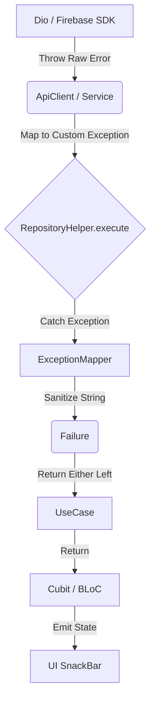

# Strategi Penanganan Error (Error Handling Strategy)

Dokumen ini menjelaskan secara komprehensif filosofi, arsitektur, dan implementasi dari penanganan *error* di dalam proyek Flutter ini. Pendekatan ini dirancang untuk mematuhi prinsip **Clean Architecture**, di mana kode *UI* hanya menerima pesan yang bersahabat, sedangkan kode *Infrastructure* menangkap masalah teknis yang paling kotor sekalipun.

---

## 1. Filosofi: *Zero-Leak Policy*

Prinsip utama dari penanganan *error* di aplikasi ini adalah **Zero-Leak Policy**. Artinya:
> "Tidak boleh ada satu pun pesan *error* berbahasa mesin, kode SQL, atau pesan *third-party SDK* (berbahasa Inggris teknis) yang lolos sampai ke layar pengguna."

Jika sebuah sistem gagal, pengguna hanya boleh melihat dua hal:
1. Pesan *error* spesifik yang sengaja dikirim oleh server (*"Password Anda salah"*).
2. Pesan *error fallback* umum yang ramah (*"Sistem sedang mengalami gangguan. Silakan coba beberapa saat lagi."*).

Sementara itu, **Developer tetap harus bisa melihat error aslinya** di dalam *console* atau Crashlytics.

---

## 2. Kategori Error: `Exception` vs `Failure`

Dalam arsitektur ini, *error* memiliki dua wujud berbeda yang tidak boleh dicampuradukkan:

### A. `Exception` (Kasaran / Dunia Luar)
Ini adalah wujud *error* saat masih berada di lapisan *Infrastructure* (Datasource, ApiClient, SDK Pihak ke-3). Bentuknya masih kasar dan teknis.

Kita membagi *Exception* menjadi 5 kategori utama. Mengapa harus dibagi? Karena masing-masing membutuhkan **reaksi UI yang berbeda**:

| Jenis Exception | Penyebab Umum | Respon UI yang Diharapkan |
|----------------|---------------|---------------------------|
| **`NetworkException`** | Internet mati, DNS down, Timeout | Menampilkan layar/snackBar *"Periksa koneksi internet Anda"*. Tidak perlu mencoba parsing data. |
| **`ServerException`** | Backend menolak request (400, 404, 500) | Menampilkan pesan *error* dari *backend* (misal: *"Email sudah terdaftar"*). Jika 500, tampilkan pesan *maintenance*. |
| **`UnauthorizedException`** | Token kedaluwarsa atau *invalid* | *State management* langsung bereaksi melakukan **Force Logout** dan menendang *user* ke halaman Login. |
| **`CacheException`** | Memori HP penuh, akses *storage* ditolak | *Fallback* halus atau *"Gagal memuat data tersimpan"*. |
| **`ParsingException`** | Format JSON dari backend berubah diam-diam | Mengirimkan log diam-diam ke Crashlytics karena ini adalah *bug* internal developer. |

### B. `Failure` (Halusan / Dunia Dalam)
Ini adalah wujud *error* setelah dibungkus rapi oleh *Repository* untuk dikirimkan ke lapisan *Domain* (UseCase) dan *Presentation* (Cubit/BLoC). 
Kita menggunakan `Either<Failure, T>` (dari *package* Dartz) agar *error* menjadi bagian eksplisit dari nilai yang dikembalikan (bukan melempar *exception* tersembunyi yang membuat aplikasi *crash* jika lupa ditangkap).

---

## 3. Pipa Perjalanan Error (The Error Pipeline)

Bagaimana sebuah *error* teknis dari Google/Backend berubah menjadi pesan UI yang ramah? Inilah alurnya:



### Tahap 1: Garis Depan (`ApiClient` & *Services*)
Di dalam `ApiClient`, semua `DioException` dicegat dan langsung diubah menjadi `CustomException` milik kita.
*Contoh:* Jika `DioExceptionType.connectionTimeout`, langsung dilempar sebagai `NetworkException`.

### Tahap 2: Penangkap Sentral (`RepositoryHelper.execute`)
Di lapisan *Repository*, semua pemanggilan Datasource wajib dibungkus oleh *wrapper* ini.
Fungsinya adalah menangkap semua bentuk *Exception* (termasuk *error alien* dari *library* tak terduga) agar tidak lolos ke UseCase.

```dart
// Contoh penerapan di Repository
Future<Either<Failure, User>> getUser() async {
  return RepositoryHelper.execute(() async {
    return await remoteDatasource.getUser();
  });
}
```

### Tahap 3: Mesin Penggiling Pusat (`ExceptionMapper`)
Setelah `RepositoryHelper` menangkap *Exception*, ia akan memasukkannya ke mesin cuci `ExceptionMapper.toMessage(e)`.
Mesin ini membedah *error*:
- Jika ia `NetworkException`, keluarkan string `"Gagal terhubung ke server."`
- Jika ia `ServerException`, periksa pesan aslinya. Jika ada kata-kata bocor dari mesin (seperti `"sql:"`, `"panic:"`, `"internal error"`), **sensor pesan tersebut** dan ganti dengan `"Sistem sedang gangguan"`.
- Jika error tidak dikenali sama sekali (alien), keluarkan *default fallback*.

### Tahap 4: Presentasi (UI)
Cubit menerima wujud `Failure` yang pesannya sudah matang, dan UI tinggal menampilkannya.

---

## 4. Studi Kasus: Kapan Tidak Boleh Memakai `RepositoryHelper`?

Secara *default*, SEMUA *endpoint* di dalam *Repository* wajib dibungkus oleh `RepositoryHelper.execute`. 
**Kecuali satu kondisi:** Saat *endpoint* tersebut memiliki logika **Custom Fallback**.

**Skenario Fallback:** Jika gagal ambil dari API, jangan langsung lapor *error*, tapi coba ambil dari SQLite (lokal) dulu.

Untuk kasus ini, gunakan blok `try-catch` biasa, namun **manfaatkan perintah `rethrow`** agar tetap terlindungi oleh mesin penyaring.

```dart
Future<Either<Failure, User>> getProfile() async {
  return RepositoryHelper.execute(() async {
    try {
      // 1. Coba API
      return await remoteDatasource.getProfile();
    } catch (e) {
      // 2. Oh API putus! Coba lokal
      final cached = await localDatasource.getCachedProfile();
      if (cached != null) return cached;
      
      // 3. Lokal juga kosong? Lempar ulang error aslinya!
      rethrow; // Akan otomatis ditangkap & dihaluskan oleh RepositoryHelper
    }
  });
}
```

---

## 5. Kesimpulan
Dengan memusatkan logika perubahan *Exception* menjadi *Failure* di satu tempat (`RepositoryHelper` + `ExceptionMapper`), kita membebaskan *developer* dari keharusan menulis ratusan blok `try-catch` kotor di seluruh aplikasi. Cukup konfigurasi mesin penggilingnya satu kali, dan seluruh aplikasi otomatis kebal dari kebocoran teks teknis!
