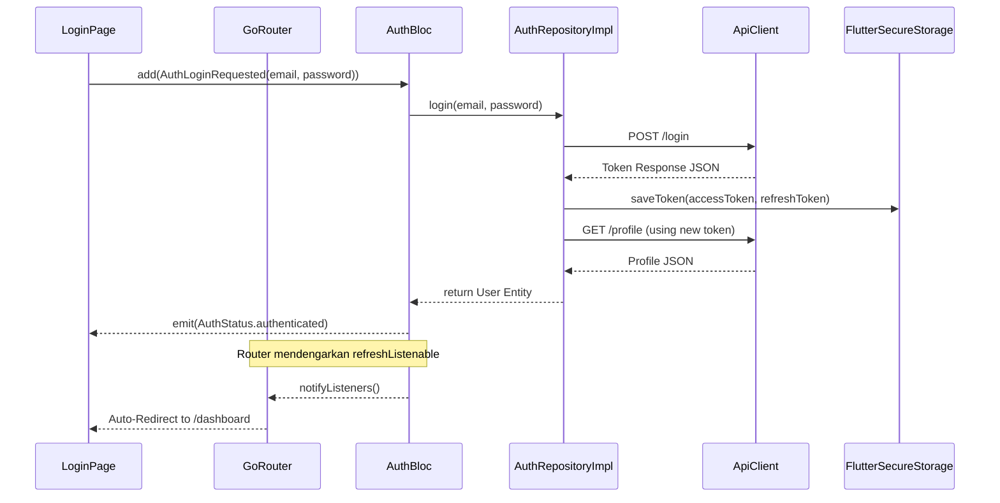
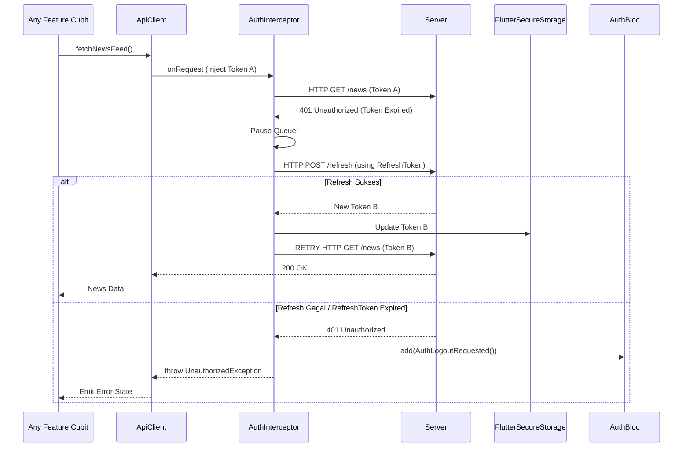
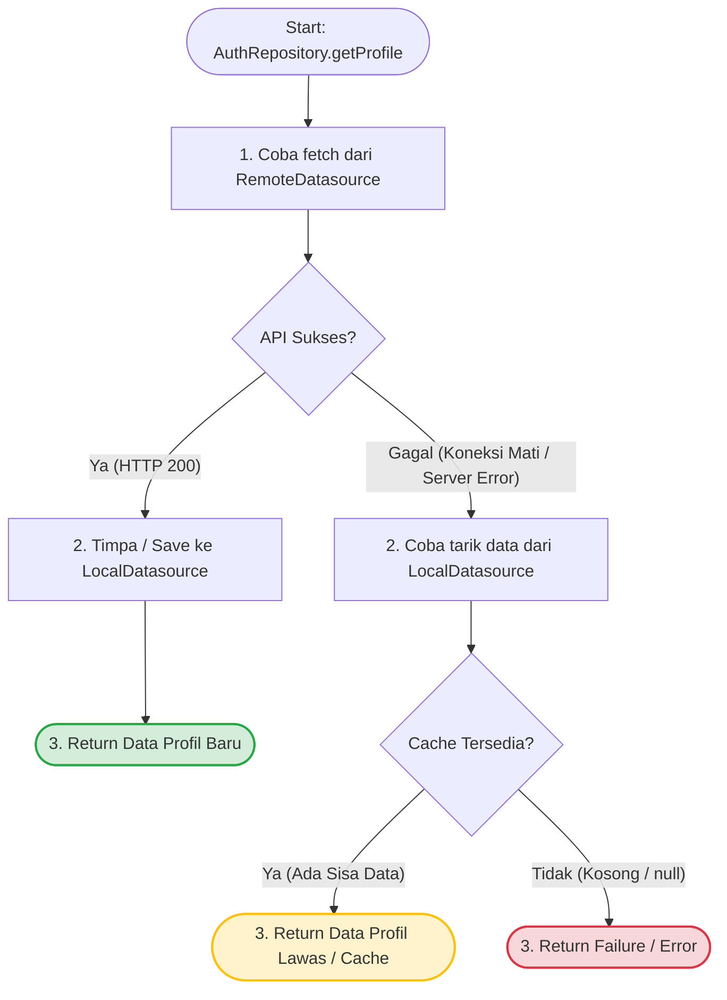
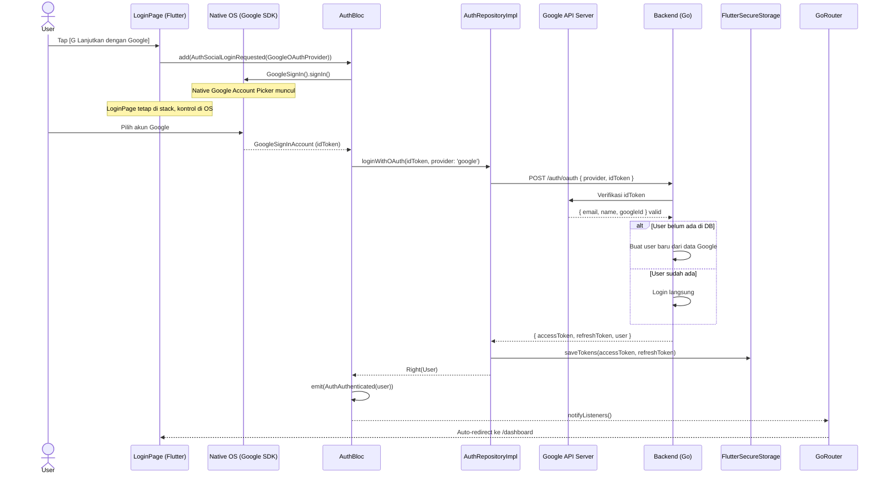
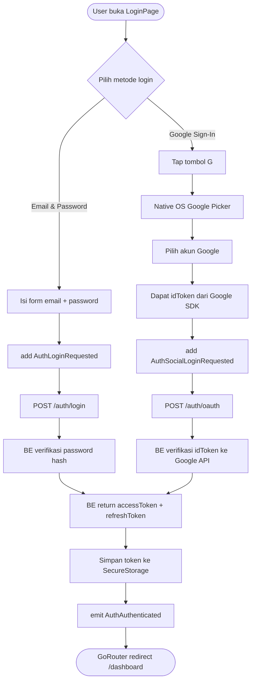
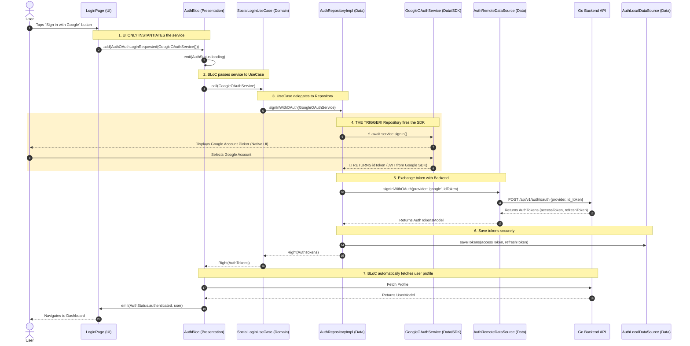
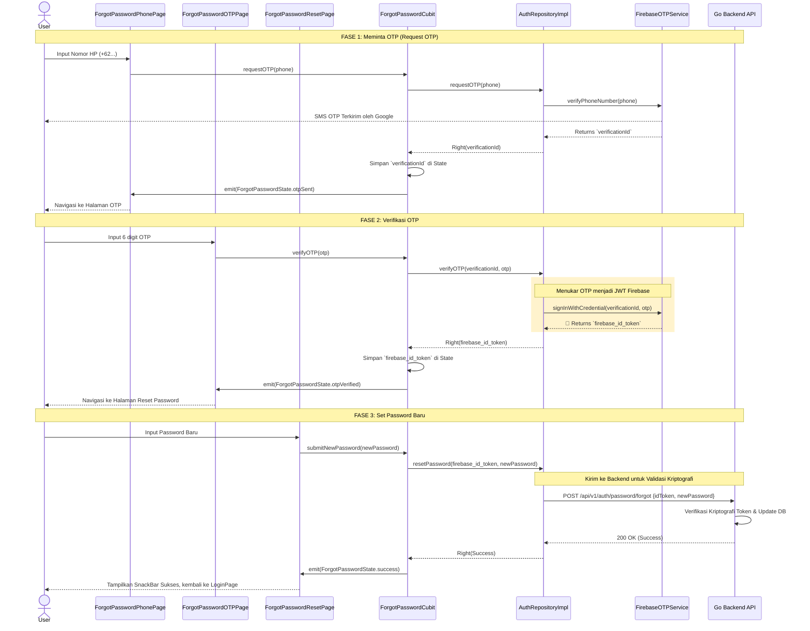

# Authentication Feature

## Overview
Modul Auth bertugas mengelola siklus hidup _user authentication_. 

### 1. State Management (AuthBloc)
Modul otentikasi menggunakan `AuthBloc` yang sengaja dirancang sebagai **Global Singleton (`registerLazySingleton`)**. Kenapa demikian?

#### Mengapa Global Singleton?
Status "Login" seorang pengguna memengaruhi hampir seluruh bagian aplikasi (bukan cuma satu halaman). Kita butuh **satu _Source of Truth_ (Sumber Sentral)** yang otentik.
- Agar **GoRouter** di seluruh penjuru aplikasi bisa mendengarkan apakah dia harus memblokir jalur ke halaman terlarang.
- Agar **Interceptor API** bisa menyuntikkan token dari _session_ yang aktif, atau melakukan _logout_ otomatis bila Refresh Token tertolak.

#### Inisialisasi & Lifecycle
- **Registrasi**: `AuthBloc` didaftarkan di dalam `lib/injection_container.dart` (oleh GetIt) sebagai _LazySingleton_. 
- **Inisialisasi**: Fisik `AuthBloc` ditempatkan ke _Widget Tree_ tertinggi menggunakan `BlocProvider<AuthBloc>.value(value: sl<AuthBloc>())` di dalam file `main.dart`, di dalam `MultiBlocProvider` yang membungkus `MaterialApp.router`.
- **Siklus Hidup (Lifecycle)**: Karena BLoC ini dideklarasikan di puncak UI teratas, ia dikategorikan sebagai **Residen Abadi**. Ia lahir saat aplikasi dibuka dan baru akan mati (hancur) apabila pengguna menutup paksa *(Force Close)* aplikasi. Selama app berjalan, state *(User Profile + Token)* di dalam `AuthBloc` akan terus menetap di RAM.

**Event yang Tersedia**: 
`AuthCheckRequested`, `AuthLoginRequested`, `AuthRegisterRequested`, `AuthLogoutRequested`, `AuthProfileRequested`, `AuthUserUpdated`.

> **`AuthUserUpdated`** adalah event khusus yang dilempar oleh `ProfileCubit` setelah berhasil update profil — agar data User di `AuthBloc` (global) ikut ter-refresh tanpa perlu logout dan login ulang.

### 2. Network & Token
- Penyimpanan Token secara aman via `FlutterSecureStorage` (di `SecureTokenStorage`).
- Interceptor otomatis untuk `dio` agar header `Authorization: Bearer <token>` disuntikkan di setiap permintaan API.
- Terdapat logika penanganan `401 Unauthorized` dengan Refresh Token tersentralisasi di `ApiClient`.

### 3. Profile Management
- Integrasi `ProfileCubit` tingkat komponen (Local cubit) untuk pengeditan dan manipulasi state UI secara *ephemeral*.

---

## Technology Stack

| Teknologi | Package / API | Versi | Peran dalam Fitur |
|---|---|---|---|
| **State Management (Global)** | `flutter_bloc` → `BLoC` | ^9.1.0 | `AuthBloc` sebagai Global Singleton. Mengelola seluruh siklus hidup autentikasi: status login, data user, dan token. |
| **State Management (Local)** | `flutter_bloc` → `Cubit` | ^9.1.0 | `ProfileCubit` untuk mengelola state UI ephemeral di halaman Edit Profile (loading, sukses, gagal). |
| **Dependency Injection** | `get_it` | ^8.0.3 | Mendaftarkan `AuthBloc` sebagai `LazySingleton` dan semua layer (Repository, DataSource, Cubit) agar bisa dipanggil via `sl<T>()`. |
| **Routing & Guard** | `go_router` | ^14.8.1 | Mendengarkan perubahan state `AuthBloc` via `refreshListenable` untuk melakukan redirect otomatis (login → dashboard, atau sebaliknya). |
| **Secure Token Storage** | `flutter_secure_storage` | ^9.2.4 | Menyimpan `accessToken` dan `refreshToken` secara aman di Keychain (iOS) / Keystore (Android). |
| **HTTP Client** | `dio` | ^5.7.0 | Mengirimkan request `POST /login`, `POST /register`, `GET /profile`, dan `POST /refresh-token`. |
| **Auth Interceptor** | `dio` → `Interceptor` | ^5.7.0 | Menyuntikkan header `Authorization: Bearer <token>` secara otomatis di setiap request, dan menangani `401 Unauthorized` dengan mekanisme silent refresh token. |
| **Functional Error Handling** | `dartz` | ^0.10.1 | `Either<Failure, T>` digunakan di seluruh layer Repository untuk merepresentasikan hasil sukses atau gagal tanpa menggunakan `try-catch` di UI. |
| **Social Login (Google)** | `google_sign_in` | ^7.2.0 | Menjalankan SDK Native Google (Android/iOS) untuk memunculkan Account Picker dan mengambil `idToken` secara aman. |

---

## Architecture Sequence Diagrams

### 1. Login & Global Routing Flow
Diagram ini menggambarkan bagaimana eksekusi login mengalir dari layar UI menembus lapisan data terdalam, hingga akhirnya *Global State* merespon dengan melempar *Redirect* melalui GoRouter.



### 2. Auto-Refresh Token Flow (Interceptor)
Mekanisme pertahanan (*defense*) ketika _Access Token_ kadaluarsa. Diagram ini menjelaskan bagaimana Interceptor mencegat (*intercept*) masalah 401 dan secara diam-diam (*silent*) memperbarui sesi pengguna tanpa merusak UX.



### 3. Repository Orchestration Flow (Profile Fallback)
Di dalam `AuthRepositoryImpl`, tersimpan logika cerdas yang bertindak sebagai _Orchestrator_. Saat melempar request profil (misalnya saat _Splash Screen_ atau buka aplikasi di area _blank spot_), aplikasi harus bisa bertahan *(Graceful Degradation)*.

Berikut adalah algoritma _Flowchart_ bagaimana Repository menjembatani kegagalan jaringan dengan menarik data sisa *(fallback)* dari cache lokal:



---

## Login Methods

Aplikasi mendukung dua jenis metode login yang memiliki alur berbeda, namun berakhir di titik yang sama: mendapatkan JWT (accessToken + refreshToken) dari backend.

### Perbandingan Email/Password vs Social Login

| Aspek | Email & Password | Social Login (Google, dll) |
|-------|-----------------|-----------------------------|
| **Credential asal** | User input langsung di form | Provider eksternal (Google, Apple, GitHub) |
| **Yang dikirim ke BE** | `{ email, password }` | `{ provider, idToken }` |
| **Endpoint BE** | `POST /auth/login` | `POST /auth/oauth` |
| **Verifikasi di BE** | Cek hash password di DB | Verifikasi idToken ke server provider |
| **UI Popup** | Tidak ada | Native OS picker (bukan halaman Flutter baru) |
| **Halaman Flutter baru?** | Tidak | Tidak — semua tombol ada di `LoginPage` yang sama |
| **Status Implementasi** | ✅ Done | 🔄 Planned (Google Sign-In first) |

---

## Social Login — Rencana Implementasi

### Filosofi Desain: Extensible OAuth

Social Login dirancang dengan abstraksi `OAuthProvider` agar setiap provider baru (GitHub, Apple, Facebook) cukup menambah satu class implementasi tanpa mengubah BLoC, UseCase, atau Repository.

```
Domain Layer:
  abstract OAuthProvider
    └── getIdToken() → Future<String>

Data Layer:
  GoogleOAuthProvider  implements OAuthProvider
  GithubOAuthProvider  implements OAuthProvider  (future)
  AppleOAuthProvider   implements OAuthProvider  (future, App Store required)

UseCase:
  SocialLoginUseCase.call(OAuthProvider provider)
    → provider.getIdToken()
    → repository.loginWithOAuth(idToken, providerName)

AuthBloc:
  add(AuthSocialLoginRequested(provider: GoogleOAuthProvider()))
  add(AuthSocialLoginRequested(provider: GithubOAuthProvider()))   // future
```

> [!IMPORTANT]
> **Apple Sign-In wajib ada** jika app dipublish di App Store dan menawarkan social login provider lain. Ini adalah aturan App Store Review Guidelines — app bisa direject jika tidak ada.

### Diagram 4 — Google Sign-In Flow

Berbeda dengan login email/password yang langsung mengirim credential ke backend, Google Sign-In memerlukan langkah perantara: mendapatkan `idToken` dari Google terlebih dahulu.



### Diagram 5 — Perbandingan Alur: Email vs Google



### Kebutuhan Setup per Platform

#### Flutter Side
- Tambah package `google_sign_in: ^6.x.x` di `pubspec.yaml`
- Tambah event `AuthSocialLoginRequested` di `AuthBloc`
- Buat `GoogleOAuthProvider` di Data Layer
- Buat `SocialLoginUseCase` di Domain Layer
- Tambah tombol Google di `LoginPage` (di bawah tombol login biasa)

#### Android
- Tambah SHA-1 fingerprint di Google Cloud Console
- Tambah `google-services.json` di `android/app/`
- Update `build.gradle` dengan Google Services plugin

#### iOS
- Tambah `REVERSED_CLIENT_ID` ke `Info.plist`
- Pastikan URL Scheme terdaftar

#### Backend (Go)
- Endpoint baru: `POST /api/v1/auth/oauth`
- Tambah library verifikasi Google ID Token
- Logic upsert user: buat jika belum ada, login jika sudah ada
- Return format sama dengan login biasa: `{ accessToken, refreshToken, user }`

#### Google Cloud Console
- Buat project baru atau gunakan yang existing
- Enable "Google Sign-In API"
- Buat OAuth 2.0 Client ID untuk Android dan iOS
- Daftarkan SHA-1 fingerprint

---

## Social Login Architecture Flow
Unlike the standard login flow where raw data (`email` and `password` strings) is passed from the UI down to the data layer, the Social Login flow passes a **Behavioral Object** (`OAuthService`). 

The UI creates the `OAuthService` object (e.g., `GoogleOAuthService`), but **does not execute it**. The object travels through the layers until it reaches the `AuthRepository`, which is responsible for "pulling the trigger" (`service.signIn()`) to execute the native SDK logic and fetch the token.



---

## Forgot Password (Lupa Password) — Rencana Implementasi

Fitur **Lupa Password** menggunakan mekanisme pendelegasian keamanan melalui **Firebase Phone Auth (OTP SMS)**. Dengan cara ini, aplikasi Flutter dan Backend Go tidak perlu mengelola server SMS gateway atau menyimpan kode OTP.

### Alur Arsitektur Kriptografi

1.  **Aplikasi Flutter (Client)**: Bertugas meminta SMS ke Firebase, memunculkan form input angka OTP, dan mengirimkan kode tersebut ke Firebase SDK untuk divalidasi.
2.  **Firebase SDK (Google)**: Jika OTP benar, SDK ini mencetak sebuah `idToken` (surat lulus verifikasi yang ditandatangani secara digital oleh Google).
3.  **Backend Go (Server)**: Menerima `idToken` dari Flutter, memverifikasi tanda tangannya menggunakan kunci publik Google, lalu mengizinkan ubah password jika token valid.

### Sequence Diagram — Lupa Password Flow (Clean Architecture)

Mengikuti standar *Clean Architecture* aplikasi ini, fitur yang bersifat *ephemeral* (berlangsung sementara di satu halaman) tidak boleh mengotori *Global State* (`AuthBloc`). Oleh karena itu, fitur ini akan dilayani oleh **`ForgotPasswordCubit`** lokal dan dijembatani oleh *UseCase*.

**Lapisannya:** `UI` ➔ `ForgotPasswordCubit` ➔ `UseCase` ➔ `AuthRepositoryImpl` ➔ `FirebaseOTPService` & `ApiClient`.



### Kebutuhan Setup Flutter
- Penambahan package `firebase_auth` ke `pubspec.yaml`.
- Menggunakan `TextField` dengan `autofillHints: const [AutofillHints.oneTimeCode]` agar OTP dari SMS bisa otomatis dibaca oleh *keyboard* iOS dan Android tanpa perlu *permission* baca SMS.
- Registrasi SHA-1 & SHA-256 Android di Firebase Console.
- Konfigurasi APNs & Background Modes di iOS untuk penerimaan *Silent Push* dari Firebase (sebagai langkah anti-spam).
