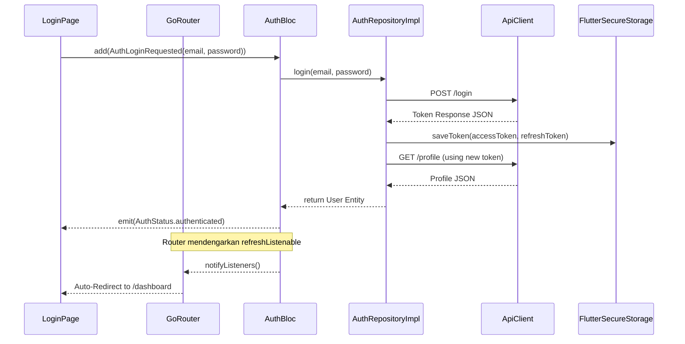
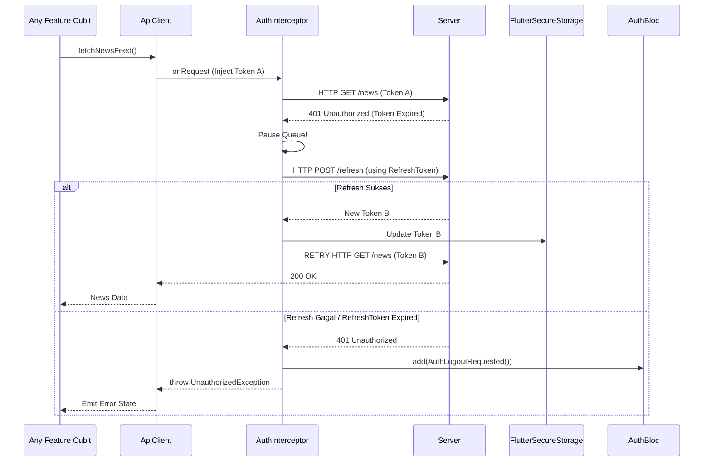

# Authentication Feature

## Overview
Modul Auth bertugas mengelola siklus hidup _user authentication_. 

### 1. State Management (AuthBloc)
- Bertindak sebagai _Global Singleton_ yang mengatur status login secara global.
- Event yang ada: `AuthCheckRequested`, `AuthLoginRequested`, `AuthRegisterRequested`, `AuthLogoutRequested`.
- Didaftarkan di `main.dart` untuk memastikan navigasi _GoRouter_ mengetahui kapan harus mencegah akses masuk (`redirect`).

### 2. Network & Token
- Penyimpanan Token secara aman via `FlutterSecureStorage` (di `SecureTokenStorage`).
- Interceptor otomatis untuk `dio` agar header `Authorization: Bearer <token>` disuntikkan di setiap permintaan API.
- Terdapat logika penanganan `401 Unauthorized` dengan Refresh Token tersentralisasi di `ApiClient`.

### 3. Profile Management
- Integrasi `ProfileCubit` tingkat komponen (Local cubit) untuk pengeditan dan manipulasi state UI secara *ephemeral*.

---

## Architecture Sequence Diagrams

### 1. Login & Global Routing Flow
Diagram ini menggambarkan bagaimana eksekusi login mengalir dari layar UI menembus lapisan data terdalam, hingga akhirnya *Global State* merespon dengan melempar *Redirect* melalui GoRouter.

### 2. Auto-Refresh Token Flow (Interceptor)
Mekanisme pertahanan (*defense*) ketika _Access Token_ kadaluarsa. Diagram ini menjelaskan bagaimana Interceptor mencegat (*intercept*) masalah 401 dan secara diam-diam (*silent*) memperbarui sesi pengguna tanpa merusak UX.

