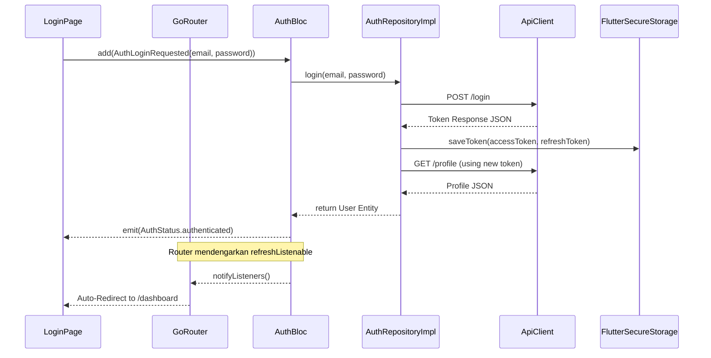
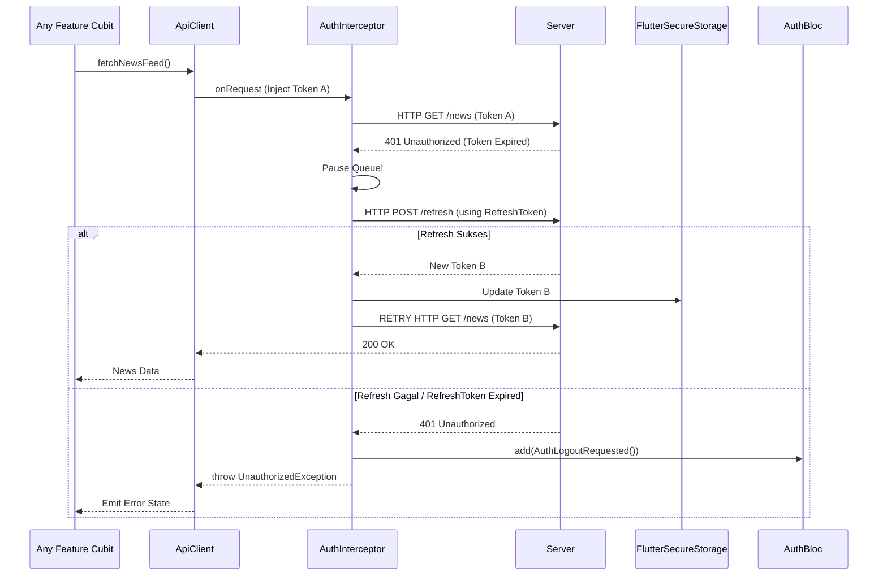

# Authentication Feature

## Overview
Modul Auth bertugas mengelola siklus hidup _user authentication_. 

### 1. State Management (AuthBloc)
Modul otentikasi menggunakan `AuthBloc` yang sengaja dirancang sebagai **Global Singleton (`registerLazySingleton`)**. Kenapa demikian?

#### Mengapa Global Singleton?
Status "Login" seorang pengguna memengaruhi hampir seluruh bagian aplikasi (bukan cuma satu halaman). Kita butuh **satu _Source of Truth_ (Sumber Sentral)** yang otentik.
- Agar **GoRouter** di seluruh penjuru aplikasi bisa mendengarkan apakah dia harus memblokir jalur ke halaman terlarang.
- Agar **Interceptor API** bisa menyuntikkan token dari _session_ yang aktif, atau melakukan _logout_ otomatis bila Refresh Token tertolak.

#### Inisialisasi & Lifecycle
- **Registrasi**: `AuthBloc` didaftarkan di dalam `lib/injection_container.dart` (oleh GetIt) sebagai _LazySingleton_. 
- **Inisialisasi**: Fisik `AuthBloc` ditiupkan rohnya ke _Widget Tree_ _tertinggi_ (di akar layar) menggunakan `BlocProvider(create: (_) => sl<AuthBloc>())` di dalam file `main.dart`, persis membungkus `MaterialApp.router`.
- **Siklus Hidup (Lifecycle)**: Karena BLoC ini dideklarasikan di puncak UI teratas, ia dikategorikan sebagai **Residen Abadi**. Ia lahir saat aplikasi dibuka dan baru akan mati (hancur) apabila pengguna menutup paksa *(Force Close)* aplikasi. Selama app berjalan, state *(User Profile + Token)* di dalam `AuthBloc` akan terus menetap di RAM.

**Event yang Tersedia**: 
`AuthCheckRequested`, `AuthLoginRequested`, `AuthRegisterRequested`, `AuthLogoutRequested`.

### 2. Network & Token
- Penyimpanan Token secara aman via `FlutterSecureStorage` (di `SecureTokenStorage`).
- Interceptor otomatis untuk `dio` agar header `Authorization: Bearer <token>` disuntikkan di setiap permintaan API.
- Terdapat logika penanganan `401 Unauthorized` dengan Refresh Token tersentralisasi di `ApiClient`.

### 3. Profile Management
- Integrasi `ProfileCubit` tingkat komponen (Local cubit) untuk pengeditan dan manipulasi state UI secara *ephemeral*.

---

## Architecture Sequence Diagrams

### 1. Login & Global Routing Flow
Diagram ini menggambarkan bagaimana eksekusi login mengalir dari layar UI menembus lapisan data terdalam, hingga akhirnya *Global State* merespon dengan melempar *Redirect* melalui GoRouter.

### 2. Auto-Refresh Token Flow (Interceptor)
Mekanisme pertahanan (*defense*) ketika _Access Token_ kadaluarsa. Diagram ini menjelaskan bagaimana Interceptor mencegat (*intercept*) masalah 401 dan secara diam-diam (*silent*) memperbarui sesi pengguna tanpa merusak UX.

### 3. Repository Orchestration Flow (Profile Fallback)
Di dalam `AuthRepositoryImpl`, tersimpan logika cerdas yang bertindak sebagai _Orchestrator_. Saat melempar request profil (misalnya saat _Splash Screen_ atau buka aplikasi di area _blank spot_), aplikasi harus bisa bertahan *(Graceful Degradation)*.

Berikut adalah algoritma _Flowchart_ bagaimana Repository menjembatani kegagalan jaringan dengan menarik data sisa *(fallback)* dari cache lokal:

