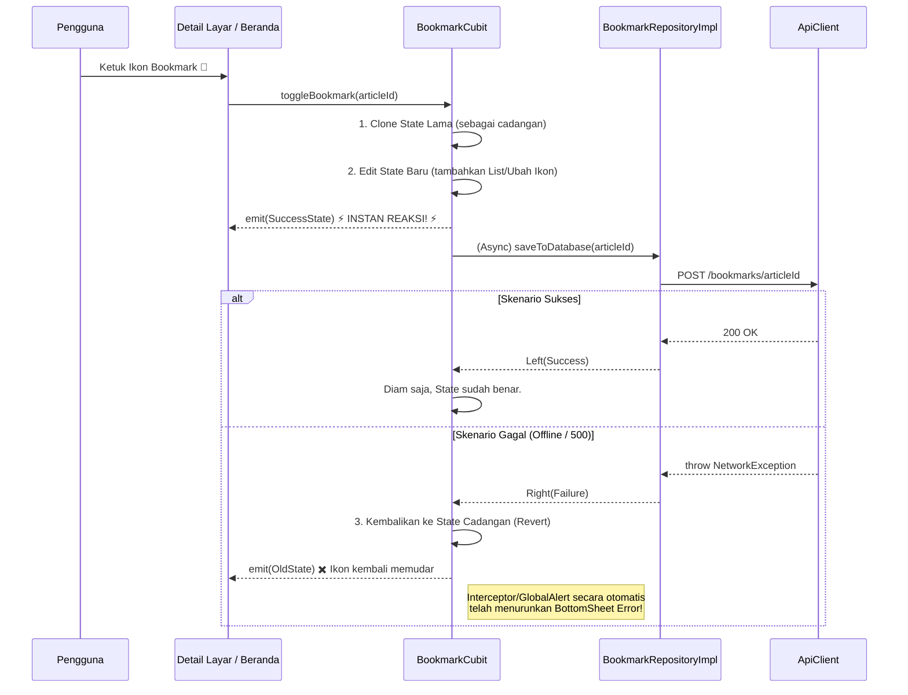

# Bookmarks & Detail Feature

## Overview
Modul Bookmark dan Baca Artikel dirancang dengan mengutamakan performa **UX yang instan dan reaktif**. Berbeda dengan _Auth_ yang menggunakan pola keamanan ketat, Bookmark menerapkan interaksi psikologis instan kepada User.

### 1. State Management (BookmarkCubit)
- Beroperasi sebagai pengelola status koleksi (_List_) spesifik milik _User_.
- Didirikan *(initialized)* bersamaan dengan `DashboardPage` agar data tersinkronisasi murni di dalam sesi, dan dihancurkan jika keluar aplikasi.
- Sanggup menyuguhkan **Optimistic Updating**: Sistem memanipulasi _state_ UI secara sepihak sebelum Server merespon. 

### 2. Article Detail (ArticleDetailCubit)
- Halaman detail ini dibuat terbalik dengan BLoC pada umumnya. Dibuat sebagai `Factory` (lahir saat URL `/article` dipanggil, dan mati saat dilabeli Pop).
- Menyediakan rendering teks atau konten *Markdown* tanpa menyandera RAM terlalu lama.

---

## Architecture Sequence Diagrams

### 1. Optimistic Updating Flow (Toggle Bookmark)
Fitur *Bookmark* di NewsApp dituntut memberikan rasa cepat. Tidak boleh ada lingkaran *Loading* (Spinner) di ikon _Bookmark_ saat ditekan. 
Di sinilah `BookmarkCubit` bertaruh dengan jaringan: ia langsung me-refresh ikon UI detik itu juga, dan diam-diam *(async)* melempar permintaan ke server. Jika gagal, state ditarik mundur *(Revert)*.

