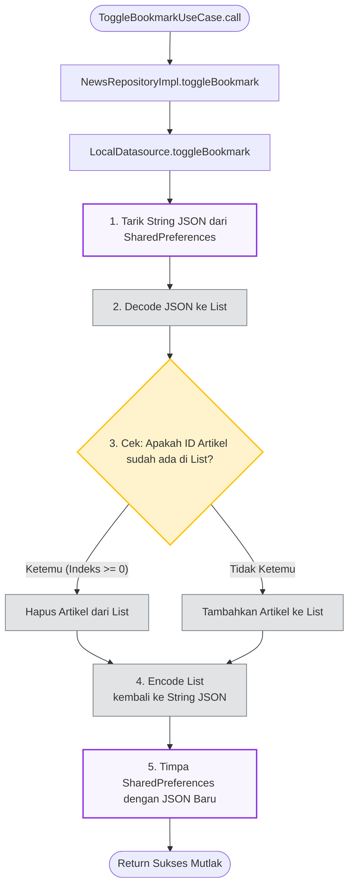

# Bookmarks & Detail Feature

## Overview
Modul Bookmark dirancang dengan filosofi **100% Offline-First**. Penyimpanan artikel favorit tidak memerlukan koneksi internet maupun sinkronisasi (*API Call*) ke backend. Data hidup secara independen di dalam perangkat pengguna.

### 1. State Management (BookmarkCubit)
- Beroperasi sebagai pengelola *List* kumpulan artikel.
- Karena bersifat lokal, fitur *Bookmark* memberikan rasa Instan 0 detik *Delay* (tanpa Spinner Loading sama sekali).
- Diinisialisasi di `app_router.dart` (`DashboardPage`) agar status "Tersimpan/Tidak" tersinkronisasi mulus saat pengguna berpindah tab antar *News* dan *Explore*.

### 2. Article Detail (ArticleDetailCubit)
- Halaman Detail dikonstruksi secara *Factory* (Lahir ketika rute `/article` dibuka, musnah ketika di-*pop*), menghemat beban RAM.
- Memanggil `isBookmarked` setiap kali memuat halaman untuk mewarnai tombol *Bookmark AppBar*.

---

## Architecture Flow Diagrams

### 1. Repository Orchestration Flow (Toggle Bookmark)
Karena tidak melibatkan `RemoteDatasource`, *Repository* merutekan instruksi `ToggleBookmarkUseCase` langsung menuju *Storage* perangkat (Memory Flash HP) melalui jembatan **`NewsLocalDatasource`** (`SharedPreferences`).

Proses *Toggle* (_Switch_ Nyala/Mati) dieksekusi menggunakan manipulasi *Array JSON* di dalam memori tanpa perlu *database* berat seperti SQLite. Berikut adalah desain algoritmanya:

