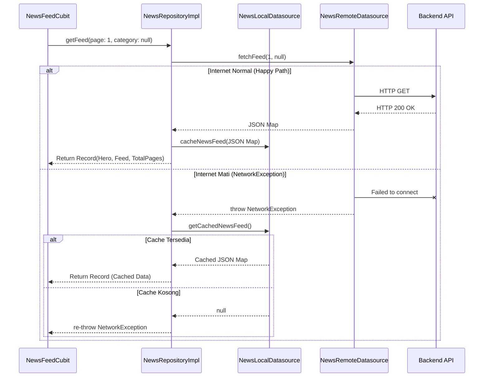

# News & Explore Features

## Overview
Modul News dan Explore adalah jantung dari penemuan konten dalam aplikasi ini. 

### 1. News Tab (Dashboard)
News tab bertugas menampilkan berita dengan kombinasi berbagai Cubit:
- `CategoryCubit`: Mengatur filter kategori
- `TrendingCubit`: Menampilkan carousel trending news
- `NewsFeedCubit`: Menampilkan list berita utama dengan *Load More*

### 2. Explore Tab
Explore tab dirancang sebagai aggregator asinkron paralel. Tidak menggunakan Repository khusus, melainkan memakai ulang `GetNewsFeedUseCase`.
- Diatur oleh single orchestrator `ExploreCubit`.
- Memanggil 3 kategori berita berbeda (Tech, Business, Sports) secara bersamaan.
- UI menampilkan efek *Pop-In* dinamis berdasarkan rekayasa _delay_ simulasi asinkronus jaringan.

---

## 3. Offline-First & Caching Strategy

Dokumen ini menjelaskan strategi *Graceful Degradation* untuk fitur News Feed sehingga aplikasi tetap bisa menampilkan data dan tidak kosong melompong saat perangkat pengguna offline atau jaringan bermasalah.

### 3.1 Konsep Utama
Alih-alih menyimpan seluruh database berita (yang akan memakan banyak Storage memori pengguna), aplikasi **hanya menyimpan (cache) halaman pertama (Page 1) dari feed berita utama (Kategori 'All')**. 

*   **Target Penyimpanan**: `SharedPreferences` (dalam bentuk JSON Text / String).
*   **Triggers**:
    *   **Write**: Saat HTTP response sukses dari endpoint `getFeed(page: 1, category: null)`.
    *   **Read**: Saat `ApiClient` melempar `NetworkException` dalam upaya memuat endpoint `getFeed(page: 1, category: null)`.

### 3.2 Alur Eksekusi (Orchestration)
Implementasi ini ditangani langsung di repositori data (`NewsRepositoryImpl`), menjadikannya sebagai _Smart Orchestrator_.



### 3.3 Komponen yang Terlibat

#### A. `NewsLocalDatasource` (Baru)
Antarmuka baru yang berinteraksi dengan `SharedPreferences`:
```dart
abstract class NewsLocalDatasource {
  Future<void> cacheNewsFeed(Map<String, dynamic> rawJson);
  Future<Map<String, dynamic>?> getCachedNewsFeed();
}
```
*Gunakan `jsonEncode` untuk menyimpan dan `jsonDecode` saat mengambil data.*

#### B. `NewsRepositoryImpl` (Modifikasi)
Repository menyuntikkan Local Datasource dan mencegat `NetworkException` khusus untuk pencarian `page == 1 && category == null`.

### 3.4 Keuntungan Pendekatan Ini
1. **Performa Tinggi**: Ukuran string JSON 1 halaman berita (< 200KB) sangat kecil untuk diurai (parse).
2. **Efisiensi Penyimpanan**: User tidak dibebani ukuran app membengkak seiring waktu karena data selalu ditimpa (overwrite).
3. **User Experience**: Layar tidak pernah blank saat pertama buka app sambil masuk ke dalam lift bus train atau daerah susah sinyal.
