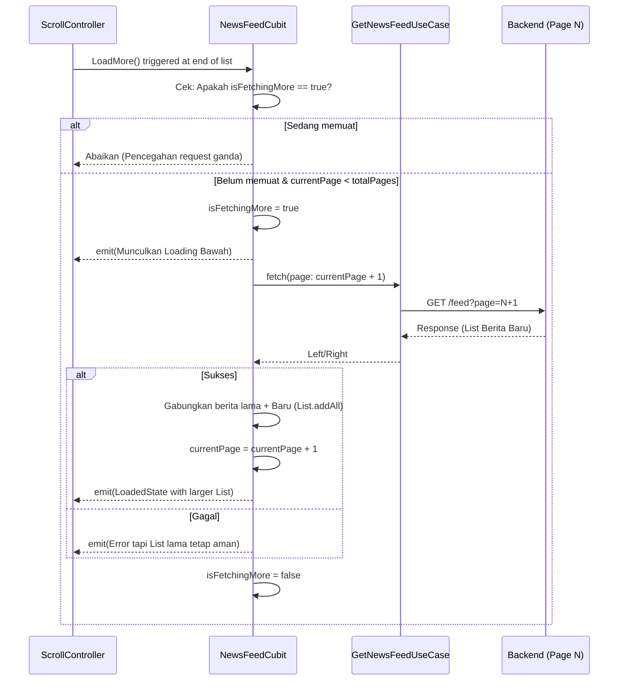
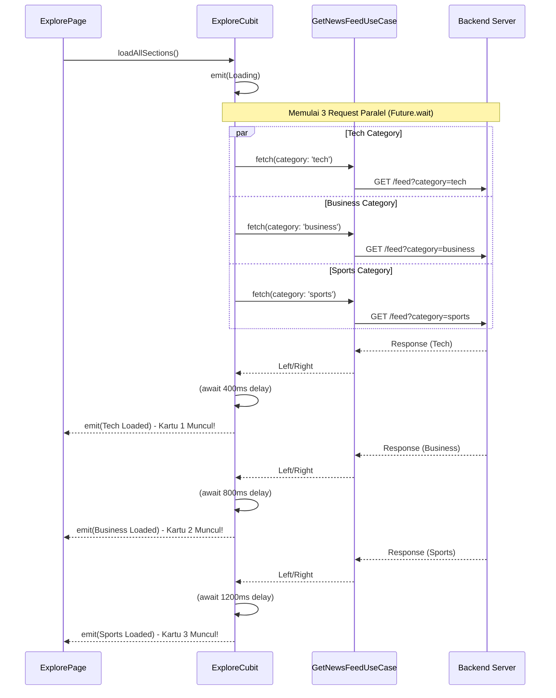
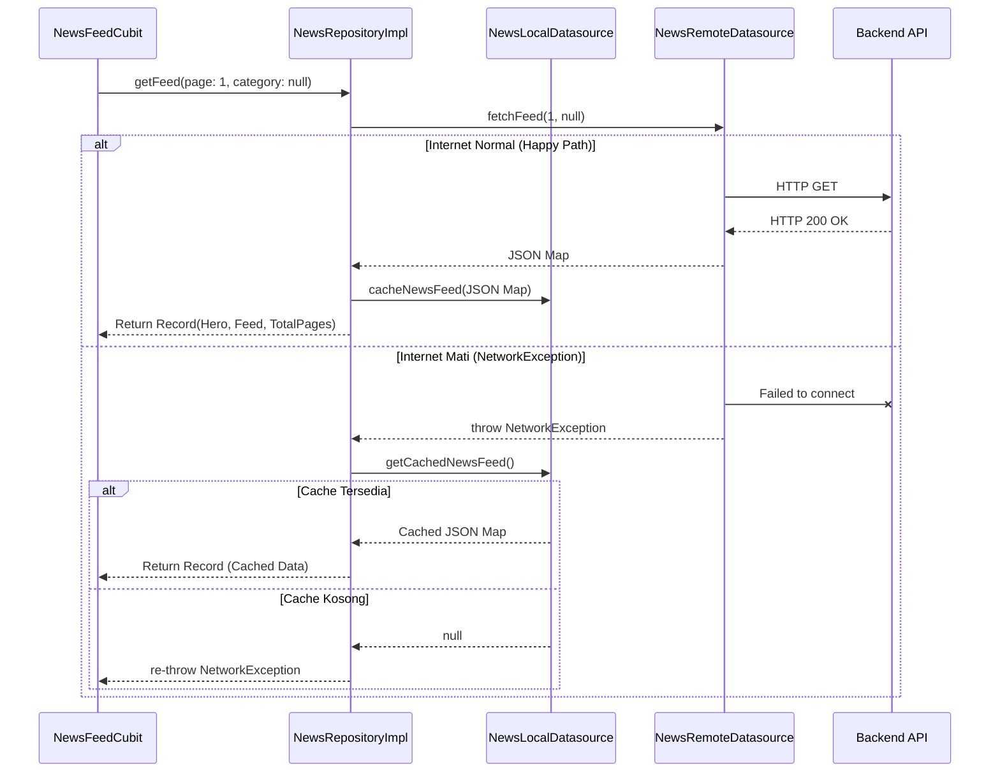

# News & Explore Features

## Overview
Modul News dan Explore adalah jantung dari penemuan konten dalam aplikasi ini. 

### 1. News Tab (Dashboard)
News tab bertugas menampilkan berita dengan kombinasi berbagai Cubit:
- `CategoryCubit`: Mengatur filter kategori
- `TrendingCubit`: Menampilkan carousel trending news
- `NewsFeedCubit`: Menampilkan list berita utama dengan mekanisme Pagination (*Load More*).

#### 1.1 Diagram: Pagination Flow (Load More)
Ini adalah siklus bagaimana `NewsFeedCubit` bertumbuh secara bertahap menjaga efisiensi RAM, memuat halaman baru hanya jika pengguna melakukan *scroll* mendalam.



### 2. Explore Tab
Explore tab dirancang sebagai aggregator asinkron paralel. Tidak menggunakan Repository khusus, melainkan memakai ulang `GetNewsFeedUseCase`.
- Diatur oleh single orchestrator `ExploreCubit`.
- Memanggil 3 kategori berita berbeda (Tech, Business, Sports) secara bersamaan.
- UI menampilkan efek *Pop-In* dinamis berdasarkan rekayasa _delay_ simulasi asinkronus jaringan.

#### 2.1 Diagram: Staggered Parallel Orchestration
Ini adalah visualisasi bagaimana `ExploreCubit` memanggil 3 request ke server **secara bersamaan (paralel)** agar cepat, tetapi menyajikan hasilnya ke layar secara **berurutan (kaskade)** untuk efek UX *Pop-In* menggunakan *Artificial Delay*.



---

## 3. Strategi Siklus Hidup (Initialization & Lifecycle)

Pertanyaan penting dalam arsitektur berskala besar: *"Di mana Cubit dan UseCase ini diciptakan, dan mengapa ditaruh di sana?"*
NewsApp menerapkan manajemen memori yang ketat dengan kombinasi GetIt (Pabrik) dan BlocProvider (Siklus Hidup).

#### A. Warga Abadi: `UseCases` (GetNewsFeedUseCase, dkk)
- **Registrasi**: Didaftarkan sebagai **`registerLazySingleton`** di `injection_container.dart`.
- **Alasan**: `UseCase` itu wujudnya murni hanya kumpulan Fungsi/Rumus Bisnis tanpa wujud UI. Karena ia bersih dari variabel *State*, tidak masuk akal memboroskan RAM untuk mencetak `UseCase` berulang-ulang setiap kali buka layar. Cukup 1 untuk seluruh aplikasi.

#### B. Warga Sementara: Sepasukan `Cubits` (NewsFeedCubit, ExploreCubit, dkk)
- **Registrasi Pabrik**: Didaftarkan sebagai **`registerFactory`** di `injection_container.dart`. Ini berarti bentuknya hanya cetak biru. GetIt tidak akan menaruhnya di Memori Utama.
- **Inisialisasi Fisik (Lahir)**: Berpasukan Cubit ini (bersama dengan *Trending, Category,* dan *Bookmark*) ditiupkan roh fisiknya serentak di dalam **`app_router.dart`** yang membungkus `/dashboard` menggunakan `MultiBlocProvider`.
- **Alasan Mengapa di Router Dashboard?**
  Berbalik dengan `AuthBloc` yang hidup abadi di atas, kumpulan Cubit Berita ini HARUS bersifat Fana (Terbatas). Kenapa?
  1. Mereka memuat **Data Rahasia Sesi (State UI)** seperti daftar artikel, halaman 5, dan cache beranda.
  2. Saat User Log Out (kembali ke `/login`), seluruh Rute `/dashboard` akan DITEBAS dari tumpukan router.
  3. Konsekuensi luar biasanya: Semua tumpukan Cubit ini akan ikut gugur, dan _Garbage Collector_ HP akan menguras RAM hingga kosong bersih. Tidak ada lagi data lama yang tersisa jika sewaktu-waktu ada User baru _Login_!

---

## 4. Offline-First & Caching Strategy

Dokumen ini menjelaskan strategi *Graceful Degradation* untuk fitur News Feed sehingga aplikasi tetap bisa menampilkan data dan tidak kosong melompong saat perangkat pengguna offline atau jaringan bermasalah.

### 3.1 Konsep Utama
Alih-alih menyimpan seluruh database berita (yang akan memakan banyak Storage memori pengguna), aplikasi **hanya menyimpan (cache) halaman pertama (Page 1) dari feed berita utama (Kategori 'All')**. 

*   **Target Penyimpanan**: `SharedPreferences` (dalam bentuk JSON Text / String).
*   **Triggers**:
    *   **Write**: Saat HTTP response sukses dari endpoint `getFeed(page: 1, category: null)`.
    *   **Read**: Saat `ApiClient` melempar `NetworkException` dalam upaya memuat endpoint `getFeed(page: 1, category: null)`.

### 3.2 Alur Eksekusi (Orchestration)
Implementasi ini ditangani langsung di repositori data (`NewsRepositoryImpl`), menjadikannya sebagai _Smart Orchestrator_.



### 3.3 Komponen yang Terlibat

#### A. `NewsLocalDatasource` (Baru)
Antarmuka baru yang berinteraksi dengan `SharedPreferences`:
```dart
abstract class NewsLocalDatasource {
  Future<void> cacheNewsFeed(Map<String, dynamic> rawJson);
  Future<Map<String, dynamic>?> getCachedNewsFeed();
}
```
*Gunakan `jsonEncode` untuk menyimpan dan `jsonDecode` saat mengambil data.*

#### B. `NewsRepositoryImpl` (Modifikasi)
Repository menyuntikkan Local Datasource dan mencegat `NetworkException` khusus untuk pencarian `page == 1 && category == null`.

### 3.4 Keuntungan Pendekatan Ini
1. **Performa Tinggi**: Ukuran string JSON 1 halaman berita (< 200KB) sangat kecil untuk diurai (parse).
2. **Efisiensi Penyimpanan**: User tidak dibebani ukuran app membengkak seiring waktu karena data selalu ditimpa (overwrite).
3. **User Experience**: Layar tidak pernah blank saat pertama buka app sambil masuk ke dalam lift bus train atau daerah susah sinyal.
