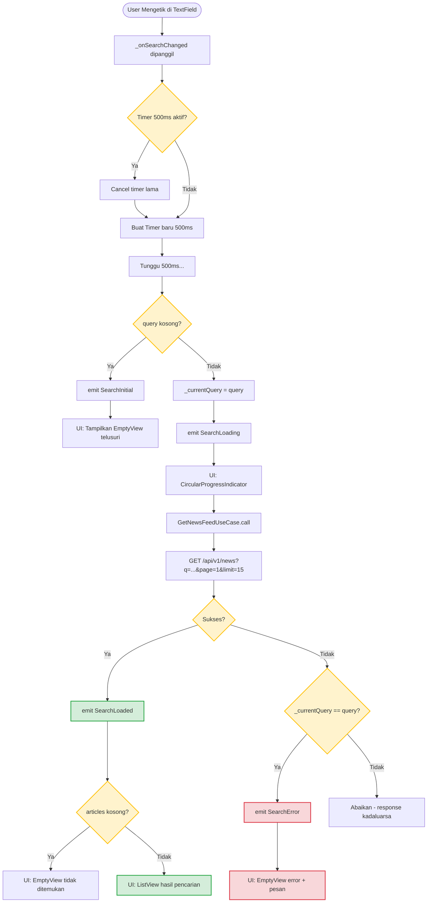
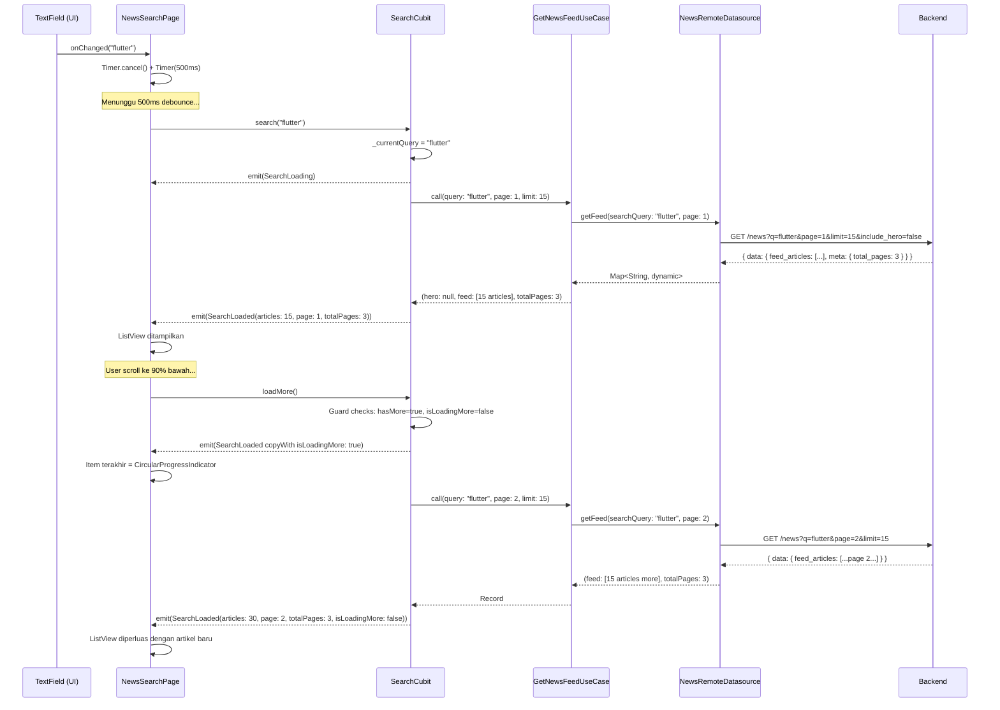

# Search Feature

## Overview
Fitur Search memungkinkan pengguna mencari berita berdasarkan kata kunci secara real-time. Fitur ini **tidak memiliki datasource atau repository tersendiri** — melainkan **menggunakan ulang (`GetNewsFeedUseCase` + `NewsRemoteDatasource`)** dengan parameter `searchQuery` opsional yang diteruskan sebagai query string `?q=` ke backend.

Dua keputusan desain utama yang membentuk modul ini:
1. **Debounce 500ms** — dilakukan di UI layer (`NewsSearchPage`) menggunakan `dart:async`'s `Timer`, bukan di dalam Cubit.
2. **Pagination / Load More** — hasil pencarian mendukung *infinite scroll* menggunakan `scrollController` dan method `loadMore()`.

---

## 1. State Machine (SearchCubit)

`SearchCubit` menyimpan 4 state berbeda yang masing-masing merepresentasikan fase terpisah dari pengalaman pencarian:

| State | Kondisi | UI yang Dirender |
|-------|---------|-----------------|
| `SearchInitial` | Belum ada kueri atau field dikosongkan | EmptyView: "Telusuri Berita" |
| `SearchLoading` | Request sedang berlangsung ke API | `CircularProgressIndicator` tengah layar |
| `SearchLoaded` | API sukses, artikel tersedia | `ListView.separated` dengan kartu artikel |
| `SearchError` | API gagal (network/server error) | EmptyView: "Pencarian Gagal" + pesan error |

> [!NOTE]
> Tidak ada state `SearchEmpty` terpisah. State "tidak ditemukan" dihandle di dalam `SearchLoaded` dengan pengecekan `articles.isEmpty`.

### State Class Detail

```dart
// SearchLoaded membawa metadata pagination
class SearchLoaded extends SearchState {
  final List<Article> articles;
  final int currentPage;
  final int totalPages;
  final bool isLoadingMore;   // Loading paginasi bawah (bukan loading awal)

  bool get hasMore => currentPage < totalPages;

  SearchLoaded copyWith({...});   // Immutable update
}
```

---

## 2. SearchCubit — Implementasi

`SearchCubit` memiliki dua public method:

### 2.1 `search(String query)`

Dipanggil oleh UI **setelah** debounce 500ms berlalu. Menangani 3 kasus:

| Kondisi Input | Aksi |
|--------------|------|
| `query.trim().isEmpty` | Emit `SearchInitial` — reset ke layar kosong |
| Query valid | Simpan `_currentQuery`, emit `SearchLoading`, call `GetNewsFeedUseCase` |
| Response sukses | Emit `SearchLoaded(articles, currentPage: 1, totalPages)` |

**Parameter ke UseCase:**
```dart
GetNewsFeedParams(
  searchQuery: query,
  page: 1,
  limit: 15,          // Pencarian pakai limit 15, bukan 10 seperti feed biasa
  includeHero: false, // Tidak butuh hero article pada tampilan list pencarian
)
```

**Guard untuk Race Condition:**
```dart
// Jika user mengetik cepat, hanya hasil query _terakhir_ yang di-emit
if (_currentQuery == query) {
  emit(SearchError(e.toString()));
}
```

> [!IMPORTANT]
> `_currentQuery` di-set **sebelum** `emit(SearchLoading())`. Ini menjamin bahwa jika ada dua request paralel (karena debounce cepat), hanya hasil yang cocok dengan kueri aktif yang akan men-trigger `SearchError`. Response yang "kadaluarsa" (dari kueri sebelumnya) akan diabaikan.

### 2.2 `loadMore()`

Dipanggil oleh `ScrollController` saat pengguna scroll mencapai 90% dari bawah list.

**Guard checks (urutan penting):**
```dart
if (current is! SearchLoaded) return;   // Jangan load saat belum ada hasil
if (!current.hasMore) return;           // Jangan load saat semua halaman sudah dimuat
if (current.isLoadingMore) return;      // Jangan double-request
```

Setelah load berhasil, artikel **digabung** (bukan diganti):
```dart
articles: [...current.articles, ...result.feed],  // Append, bukan replace
```

---

## 3. Debounce — Di UI Layer, Bukan Cubit

Tidak seperti pattern umum yang meletakkan debounce di dalam Cubit/BLoC, implementasi ini **memilih menaruh debounce di `_NewsSearchPageState`** menggunakan `dart:async Timer`:

```dart
Timer? _debounce;

void _onSearchChanged(String query) {
  if (_debounce?.isActive ?? false) _debounce!.cancel();  // Reset timer
  _debounce = Timer(const Duration(milliseconds: 500), () {
    context.read<SearchCubit>().search(query);
  });
}
```

**Alasan keputusan ini:**

| Aspek | Di UI (✅ dipilih) | Di Cubit |
|-------|-------------------|---------|
| **Testability Cubit** | Cubit murni — tidak perlu mock Timer | Cubit butuh fake clock/Timer mock |
| **Lifecycle keamanan** | `dispose()` cancel timer otomatis mencegah memory leak | Cubit dispose harus handle sendiri |
| **Separation of concern** | Debounce = UI concern (throtling input) | Cubit = business logic concern |

`_debounce?.cancel()` dipanggil di `dispose()`:
```dart
@override
void dispose() {
  _searchController.dispose();
  _scrollController.dispose();
  _debounce?.cancel();   // Mencegah callback dipanggil setelah widget destroyed
  super.dispose();
}
```

---

## 4. Architecture Flow Diagrams

### 4.1 Flowchart: Full Search Lifecycle



### 4.2 Sequence Diagram: Search + Pagination



---

## 5. API Integration

Search menggunakan endpoint yang **sama** dengan News Feed, hanya menambahkan query param `q`:

```
GET /api/v1/news?q={searchQuery}&page={page}&limit=15&include_hero=false
Auth: Bearer {access_token}
```

> [!NOTE]
> `include_hero=false` — search tidak membutuhkan artikel hero/featured. Semua artikel diperlakukan setara dalam daftar pencarian untuk memaksimalkan jumlah hasil yang ditampilkan per halaman.

**Parameter perbedaan Search vs News Feed:**

| Parameter | News Feed | Search |
|-----------|-----------|--------|
| `q` | Tidak ada | `?q={keyword}` |
| `limit` | `10` | `15` |
| `include_hero` | `true` | `false` |
| `page` | Dimulai dari 1, naik via `loadMore` | Dimulai dari 1, naik via `loadMore` |
| `category` | Opsional (filter kategori) | Tidak dipakai |

---

## 6. UI/UX Specifications

### 6.1 Search Bar

- `TextField` di dalam `Container` dengan background `AppTheme.surfaceCard`
- Tidak ada back button karena ini adalah **root tab** (bukan halaman push)
- `autofocus: true` — keyboard otomatis muncul saat tab Cari dibuka
- Suffix icon `close_rounded` untuk clear input (memanggil `_onSearchChanged('')` yang trigger emit `SearchInitial`)
- Hint text: `'Cari berita (mis. politik, olahraga)...'`

### 6.2 Kartu Artikel (`_SearchListCard`)

Setiap hasil pencarian ditampilkan dalam layout **horizontal row**:

| Elemen | Detail |
|--------|--------|
| **Kategori** | Uppercase, warna `primaryLight`, letter spacing 1.2 |
| **Judul** | Max 3 baris, font weight 700 |
| **Waktu** | `DateHelper.timeAgo()` — relatif ke waktu sekarang |
| **Thumbnail** | 90×90px, `CachedNetworkImage`, fallback `surfaceElevated` |

Tap kartu → `context.push('/article/${article.slug}')` — menggunakan `Article.displayImage` getter (`thumbnailUrl ?? imageUrl`).

### 6.3 State Views

| State | Icon | Title | Pesan |
|-------|------|-------|-------|
| `SearchInitial` | `manage_search_rounded` | Telusuri Berita | "Ketikkan kata kunci untuk mencari berita." |
| `SearchLoaded(empty)` | `search_off_rounded` | Tidak Ditemukan | "Tidak ada berita yang cocok dengan kata kunci." |
| `SearchError` | `error_outline_rounded` | Pencarian Gagal | `state.message` dari exception |

### 6.4 Scroll Listener

`ScrollController` melakukan trigger `loadMore()` saat posisi scroll mencapai **90% dari `maxScrollExtent`**:

```dart
void _onScroll() {
  if (_scrollController.position.pixels >=
      _scrollController.position.maxScrollExtent * 0.9) {
    context.read<SearchCubit>().loadMore();
  }
}
```

> [!TIP]
> Threshold 90% (bukan 100%) memberikan waktu bagi cubit untuk memulai request sebelum user benar-benar mencapai ujung list, sehingga animasi pagination terasa mulus tanpa jeda.

---

## 7. Dependency & Lifecycle

`SearchCubit` terdaftar sebagai **`registerFactory`** di `injection_container.dart`:

```dart
sl.registerFactory(() => SearchCubit(sl()));
// sl() di sini adalah GetNewsFeedUseCase (LazySingleton)
```

`SearchCubit` disediakan (di-provide) **bersama semua News Cubits lainnya** di `app_router.dart` saat route `/dashboard` dibuka:

```dart
// app_router.dart
BlocProvider(create: (_) => sl<SearchCubit>()),
```

> [!NOTE]
> `SearchCubit` satu-satunya News Cubit yang **tidak** dipanggil method apapun saat inisialisasi (tidak ada `..load()` atau `..loadBookmarks()`). Ia memulai hidup dalam state `SearchInitial` dan menunggu input pengguna.

**Lifecycle:**
- **Lahir**: Saat route `/dashboard` dibuka (user login / kembali ke dashboard)
- **Reset**: Otomatis saat `DashboardPage` di-dispose (user logout → seluruh dashboard ditebas oleh GoRouter redirect)
- **Tidak persistent**: State pencarian (`SearchLoaded`) tidak dipertahankan saat user berpindah tab lalu kembali ke tab Cari — tab kembali ke `SearchInitial`

---

## 8. Catatan Implementasi & Keterbatasan

| Hal | Detail |
|-----|--------|
| **Search History** | Belum diimplementasikan. Tidak ada riwayat kueri tersimpan. |
| **Minimum char** | Tidak ada validasi minimum karakter — query 1 karakter pun akan dikirim ke API (setelah debounce). |
| **Caching** | Hasil pencarian **tidak di-cache** ke `SharedPreferences`. Berbeda dengan News Feed halaman 1. |
| **Error recovery** | Setelah error, user harus mengetik ulang untuk mencoba lagi — tidak ada tombol "Coba Lagi". |
| **Category filter** | Search tidak bisa difilter per kategori. Parameter `category` tidak digunakan di `SearchCubit`. |
