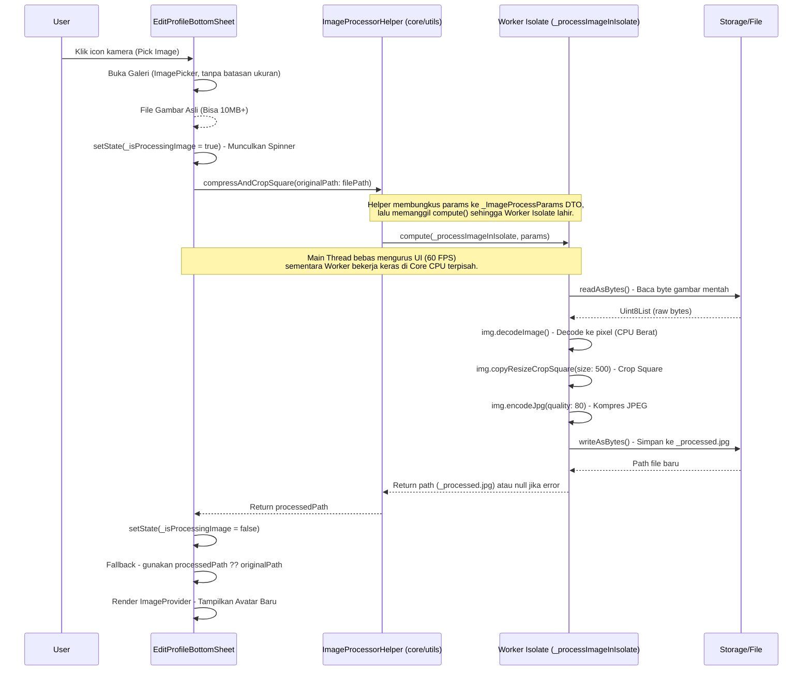
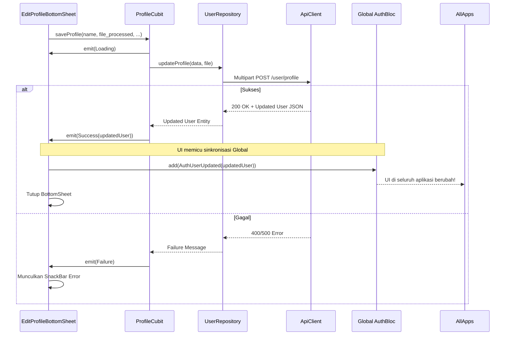
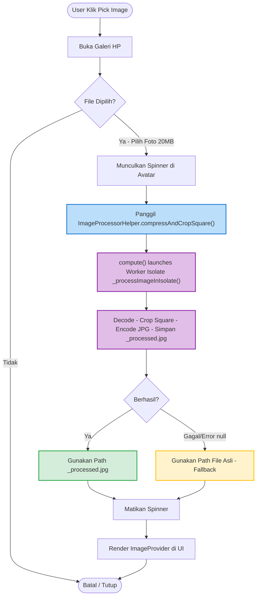

# Update Profile Feature

## Overview
Modul Update Profile memungkinkan pengguna memperbarui informasi pribadi (nama, bio, preferensi) serta foto profil (avatar). Fitur ini memiliki tantangan teknis khusus pada pengolahan foto resolusi tinggi, di mana kita menggunakan arsitektur Isolate untuk memanipulasi _pixel_ gambar secara _Asynchronous_ tanpa membekukan (_freeze_) UI.

### 1. State Management (ProfileCubit)
- Menggunakan `ProfileCubit` yang bersifat _ephemeral_ (sementara), dibuat ketika `EditProfileBottomSheet` dibuka, dan dihancurkan ketika ditutup.
- Setelah sukses menyimpan data via API, Cubit ini mengirimkan event ke _Global State_ (`AuthBloc`) agar _Source of Truth_ (data profil di seluruh aplikasi) ter-update secara _real-time_.

### 2. High-Resolution Image Processing (Isolate via ImageProcessorHelper)
Pemrosesan gambar resolusi tinggi diimplementasikan menggunakan arsitektur berlapis sesuai prinsip _Clean Architecture_:

- **UI Layer** (`EditProfileBottomSheet`): Bersifat "bodoh" (_Dumb UI_). Hanya memanggil `ImageProcessorHelper.compressAndCropSquare()` dan menerima hasilnya. Tidak tahu cara kerja kompresi sama sekali.
- **Core Utility Layer** (`lib/core/utils/image_processor.dart`): Satu-satunya kelas yang bertanggung jawab atas manipulasi pixel. Mengandung:
  - `_ImageProcessParams`: DTO (Data Transfer Object) untuk membungkus konfigurasi (path, targetSize, quality) menjadi satu argumen tunggal yang bisa dikirim ke `compute()`.
  - `_processImageInIsolate()`: Fungsi _Top-Level_ (di luar class) yang dijalankan Worker Isolate. Wajib _Top-Level_ karena `compute()` hanya bisa menjalankan fungsi yang tidak terikat ke instance manapun.
  - `ImageProcessorHelper.compressAndCropSquare()`: Static method yang menjadi pintu masuk publik bagi seluruh fitur lain di aplikasi.

Pemisahan ini memastikan:
1. **Reusability**: Fitur lain (misal: upload foto artikel) bisa langsung pakai `ImageProcessorHelper` yang sama.
2. **Testability**: Logika kompresi bisa di-_unit test_ secara independen tanpa Widget.
3. **Single Responsibility**: UI hanya tahu tampilan. Core hanya tahu algoritma.

---

## Architecture Sequence Diagrams

### 1. High-Resolution Image Processing Flow (via ImageProcessorHelper + Isolate)
Diagram ini menjelaskan bagaimana UI mendelegasikan pemrosesan gambar ke `ImageProcessorHelper` (Core Utility), yang kemudian menjalankan tugasnya di Worker Isolate.

### 2. Profile Update & Global State Synchronization Flow
Diagram ini menggambarkan siklus pengiriman data gambar + form ke server, dan bagaimana suksesnya _update_ tersebut disinkronkan ke `AuthBloc` global.

---

## Flowchart: Image Picker & Fallback Logic

