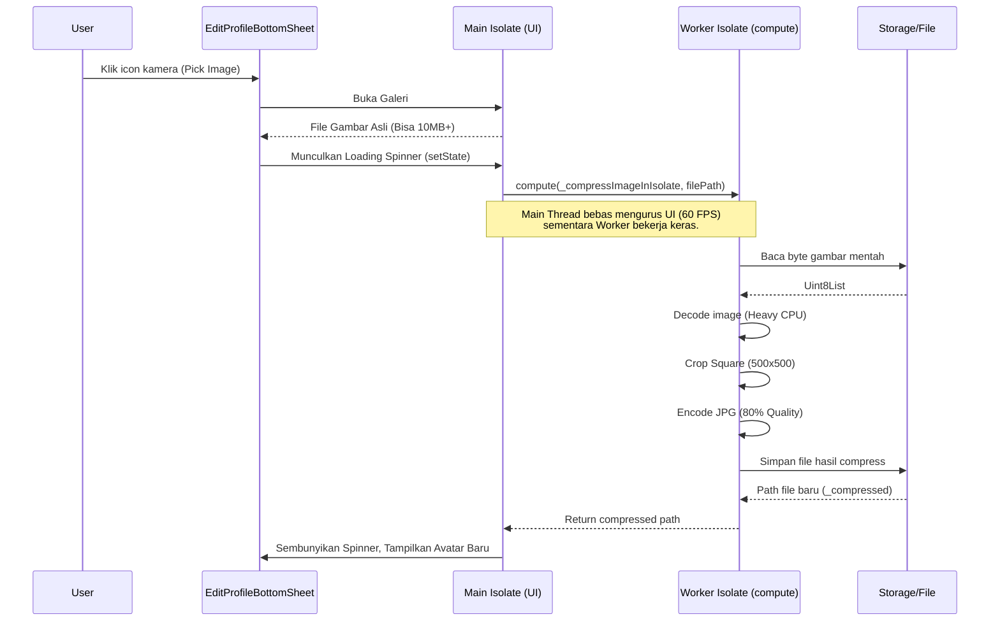
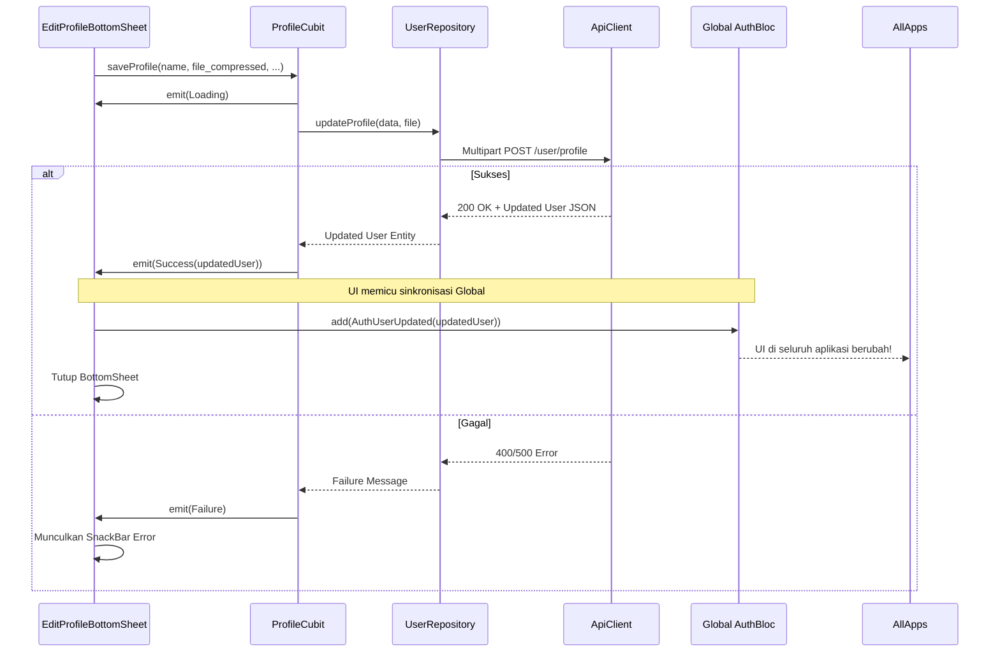

# Update Profile Feature

## Overview
Modul Update Profile memungkinkan pengguna memperbarui informasi pribadi (nama, bio, preferensi) serta foto profil (avatar). Fitur ini memiliki tantangan teknis khusus pada pengolahan foto resolusi tinggi, di mana kita menggunakan arsitektur Isolate untuk memanipulasi _pixel_ gambar secara _Asynchronous_ tanpa membekukan (_freeze_) UI.

### 1. State Management (ProfileCubit)
- Menggunakan `ProfileCubit` yang bersifat _ephemeral_ (sementara), dibuat ketika `EditProfileBottomSheet` dibuka, dan dihancurkan ketika ditutup.
- Setelah sukses menyimpan data via API, Cubit ini mengirimkan event ke _Global State_ (`AuthBloc`) agar _Source of Truth_ (data profil di seluruuh aplikasi) ter-update secara _real-time_.

### 2. High-Resolution Image Processing (Isolate)
- Kita secara sengaja menghapus batasan `maxWidth` dan `imageQuality` pada `ImagePicker` agar pengguna dapat memilih foto beresolusi penuh.
- Proses kompresi dan _cropping_ (pemotongan persegi) sangat berat bagi CPU. Oleh karena itu, tugas ini dilempar ke luar dari _Main Thread_ menggunakan fungsi `compute()`, sehingga menciptakan _Isolate_ independen.
- Hal ini menjamin animasi loading UI tetap berjalan mulus di 60 FPS tanpa patah-patah (*Jank*).

---

## Architecture Sequence Diagrams

### 1. High-Resolution Image Processing Flow (Isolate)
Diagram ini menjelaskan bagaimana proses pemindahan kerja CPU dari UI Thread ke Isolate ketika pengguna memilih file foto yang besar.



### 2. Profile Update & Global State Synchronization Flow
Diagram ini menggambarkan siklus pengiriman data gambar + form ke server, dan bagaimana suksesnya _update_ tersebut disinkronkan ke `AuthBloc` global.



---

## Flowchart: Image Picker & Fallback Logic

```mermaid
flowchart TD
    Start([User Klik Pick Image]) --> PickGallery[Buka Galeri HP]
    
    PickGallery --> HasFile{File Dipilih?}
    HasFile -- "Tidak" --> End([Batal / Tutup])
    HasFile -- "Ya (Pilih Foto 20MB)" --> ShowLoading[Munculkan Spinner di Avatar]
    
    ShowLoading --> RunIsolate[Jalankan compute(Isolate)]
    RunIsolate --> IsolateProcess[Decode -> Crop -> Encode]
    
    IsolateProcess --> IsSuccess{Berhasil Kompres?}
    
    IsSuccess -- "Ya" --> UseCompressed[Gunakan Path '_compressed.jpg']
    IsSuccess -- "Gagal/Error" --> UseOriginal[Gunakan Path File Asli (Fallback)]
    
    UseCompressed --> HideLoading
    UseOriginal --> HideLoading
    
    HideLoading[Matikan Spinner] --> RenderUI[Render ImageProvider di UI]
    RenderUI --> End
    
    classDef isolate fill:#e1bee7,stroke:#8e24aa,stroke-width:2px;
    classDef success fill:#d4edda,stroke:#28a745,stroke-width:2px;
    classDef fallback fill:#fff3cd,stroke:#ffc107,stroke-width:2px;
    
    class RunIsolate,IsolateProcess isolate;
    class UseCompressed success;
    class UseOriginal fallback;
```
