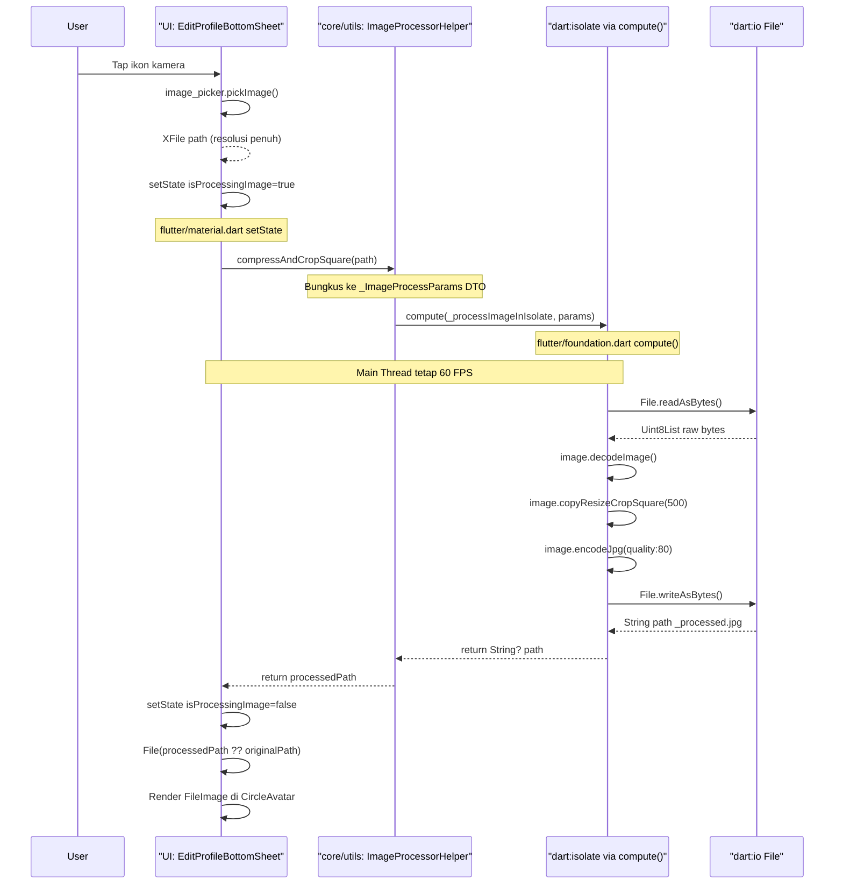
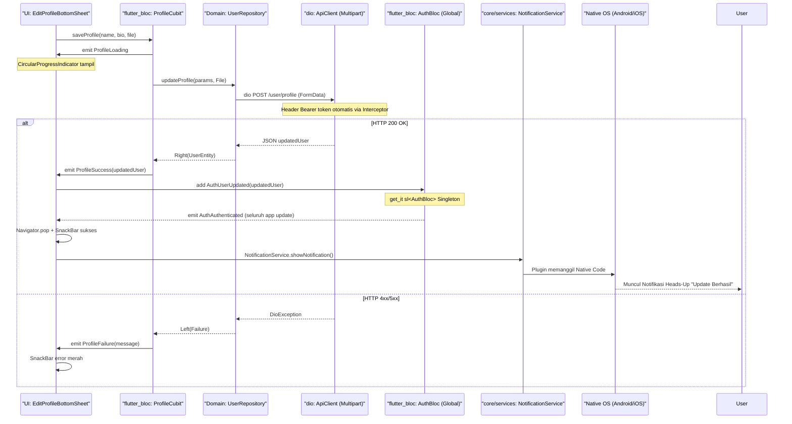
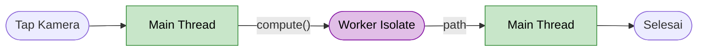
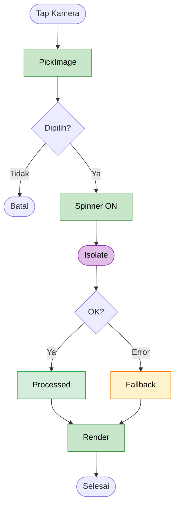
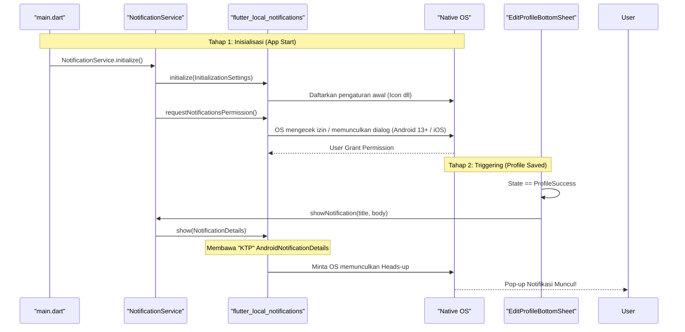

# Update Profile Feature

## Overview
Modul Update Profile memungkinkan pengguna memperbarui informasi pribadi (nama, bio, preferensi) serta foto profil (avatar). Fitur ini memiliki tantangan teknis khusus pada pengolahan foto resolusi tinggi, di mana kita menggunakan arsitektur Isolate untuk memanipulasi _pixel_ gambar secara _Asynchronous_ tanpa membekukan (_freeze_) UI.

### 1. State Management (ProfileCubit)
- Menggunakan `ProfileCubit` yang bersifat _ephemeral_ (sementara), dibuat ketika `EditProfileBottomSheet` dibuka, dan dihancurkan ketika ditutup.
- Setelah sukses menyimpan data via API, Cubit ini mengirimkan event ke _Global State_ (`AuthBloc`) agar _Source of Truth_ (data profil di seluruh aplikasi) ter-update secara _real-time_.

### 2. High-Resolution Image Processing (Isolate via ImageProcessorHelper)
Pemrosesan gambar resolusi tinggi diimplementasikan menggunakan arsitektur berlapis sesuai prinsip _Clean Architecture_:

- **UI Layer** (`EditProfileBottomSheet`): Bersifat "bodoh" (_Dumb UI_). Hanya memanggil `ImageProcessorHelper.compressAndCropSquare()` dan menerima hasilnya. Tidak tahu cara kerja kompresi sama sekali.
- **Core Utility Layer** (`lib/core/utils/image_processor.dart`): Satu-satunya kelas yang bertanggung jawab atas manipulasi pixel. Mengandung:
  - `_ImageProcessParams`: DTO (Data Transfer Object) untuk membungkus konfigurasi (path, targetSize, quality) menjadi satu argumen tunggal yang bisa dikirim ke `compute()`.
  - `_processImageInIsolate()`: Fungsi _Top-Level_ (di luar class) yang dijalankan Worker Isolate. Wajib _Top-Level_ karena `compute()` hanya bisa menjalankan fungsi yang tidak terikat ke instance manapun.
  - `ImageProcessorHelper.compressAndCropSquare()`: Static method yang menjadi pintu masuk publik bagi seluruh fitur lain di aplikasi.

Pemisahan ini memastikan:
1. **Reusability**: Fitur lain (misal: upload foto artikel) bisa langsung pakai `ImageProcessorHelper` yang sama.
2. **Testability**: Logika kompresi bisa di-_unit test_ secara independen tanpa Widget.
3. **Single Responsibility**: UI hanya tahu tampilan. Core hanya tahu algoritma.

---

## Technology Stack

| Teknologi | Package / API | Versi | Peran dalam Fitur |
|---|---|---|---|
| **Image Picker** | `image_picker` | ^1.1.2 | Membuka galeri HP dan mengambil path file gambar yang dipilih user. Sengaja tanpa batasan `maxWidth` agar mengambil resolusi penuh. |
| **Image Processing** | `image` (pub.dev) | ^4.3.0 | Pure-Dart library untuk manipulasi pixel: decode JPEG/PNG, crop persegi (`copyResizeCropSquare`), dan encode ulang ke JPEG dengan quality tertentu. Berjalan di atas CPU (Software), bukan GPU/Hardware. |
| **Isolate / Concurrency** | `flutter/foundation.dart` → `compute()` | Built-in Flutter | Fungsi bawaan Flutter yang melempar sebuah fungsi Top-Level ke Worker Isolate (Core CPU terpisah), sehingga Main Thread (UI) tidak pernah freeze selama pemrosesan gambar berjalan. |
| **Data Transfer Object** | Dart (`class`) | Built-in Dart | `_ImageProcessParams` — class DTO untuk membungkus multi-parameter menjadi satu argumen tunggal. Wajib karena `compute()` hanya menerima satu parameter. |
| **State Management (Local)** | `flutter_bloc` → `Cubit` | ^9.1.0 | `ProfileCubit` mengelola state UI ephemeral: loading, sukses, dan gagal saat request update profil ke API. |
| **State Management (Global)** | `flutter_bloc` → `BLoC` | ^9.1.0 | `AuthBloc` sebagai Global Singleton. Menerima event `AuthUserUpdated` dari UI setelah profil sukses diperbarui, sehingga seluruh aplikasi ikut ter-update. |
| **Dependency Injection** | `get_it` | ^8.0.3 | `ProfileCubit` diinstansiasi via `sl<ProfileCubit>()` di dalam `BlocProvider` pada saat BottomSheet dibuka. |
| **Network (Upload)** | `dio` | ^5.7.0 | Multipart POST request untuk mengupload file gambar hasil kompresi (`_processed.jpg`) beserta data form profil ke server. |
| **File System** | `dart:io` → `File` | Built-in Dart | Membaca byte mentah file asli (`readAsBytes()`) dan menulis hasil kompresi ke file baru (`writeAsBytes()`). Digunakan di dalam Worker Isolate. |
| **Cached Image Display** | `cached_network_image` | ^3.4.1 | Menampilkan avatar profil dari URL (CDN server) dengan caching otomatis, sebagai fallback saat belum ada file lokal yang dipilih. |
| **Local Notifications** | `flutter_local_notifications` | ^17.0.0+ | Memberikan notifikasi sistem (Heads-up) ketika profil berhasil diperbarui, dieksekusi melalui pemanggilan Native API (Android Channels / iOS Permissions). |


## Architecture Sequence Diagrams

### 1. High-Resolution Image Processing Flow (via ImageProcessorHelper + Isolate)
Diagram ini menjelaskan bagaimana UI mendelegasikan pemrosesan gambar ke `ImageProcessorHelper` (Core Utility), yang kemudian menjalankan tugasnya di Worker Isolate.



### 2. Profile Update & Global State Synchronization Flow



---

## Flowchart: Image Processing Flow

### Overview



### Detail



**Keterangan node:**

| Node | Teknologi | Keterangan |
|---|---|---|
| **PickImage** | `image_picker` | Buka galeri, ambil file resolusi penuh |
| **Spinner ON** | `flutter/material.dart setState` | `_isProcessingImage = true` |
| **Isolate** | `flutter/foundation.dart compute()` | `ImageProcessorHelper.compressAndCropSquare()` → decode → crop 500px → encode JPG 80% → `dart:io writeAsBytes` |
| **Processed** | `dart:io File` | Gunakan `_processed.jpg` |
| **Fallback** | `dart:io File` | Gunakan file asli jika Isolate error |
| **Render** | `flutter/widgets.dart FileImage` | Tampil di `CircleAvatar` |

---

## Architecture Sequence Diagrams: Local Notification

### 3. Local Notification Initialization & Trigger Flow

Diagram ini menjelaskan bagaimana proses pendaftaran birokrasi _Native_ (Channel & Permission) dilakukan di awal aplikasi, lalu dipicu oleh UI saat profil berhasil diubah.



---

## Flowchart: Local Notification Algorithm

### Overview Logic
Flowchart ini menggambarkan logika kondisional yang terjadi di balik layar saat menginisialisasi dan menembakkan notifikasi lokal, termasuk penanganan izin OS.

```mermaid
flowchart TD
    A([Aplikasi Dibuka]) --> B[Inisialisasi Plugin]
    B --> C{Cek Platform OS}
    
    C -- "Android < 13" --> D[Siapkan Channel (KTP)]
    C -- "Android >= 13" --> E{Sudah Diberi Izin?}
    C -- "iOS" --> F{Sudah Diberi Izin?}
    
    E -- Belum --> G[Minta Izin POST_NOTIFICATIONS]
    F -- Belum --> H[Minta Izin Alert/Badge/Sound]
    
    G --> I{User Mengizinkan?}
    H --> I
    
    E -- Sudah --> D
    F -- Sudah --> D
    I -- Ya --> D
    I -- Tidak --> Z([Notifikasi Mati Secara Silent])
    
    D --> J([Standby Menunggu Aksi])
    J --> K[User Menyimpan Profil]
    K --> L{Status Update?}
    L -- Sukses --> M[Panggil showNotification]
    L -- Gagal --> J
    
    M --> N{Status Channel Settings?}
    N -- Dimatikan User --> Z
    N -- Menyala --> O[OS Munculkan Heads-Up!]
    
    classDef init fill:#e1bee7,stroke:#8e24aa,color:#000
    classDef check fill:#fff3cd,stroke:#f57c00,color:#000
    classDef action fill:#c8e6c9,stroke:#388e3c,color:#000
    classDef stop fill:#ffcdd2,stroke:#d32f2f,color:#000
    
    class B,D,M init
    class C,E,F,I,L,N check
    class O action
    class Z stop
```
